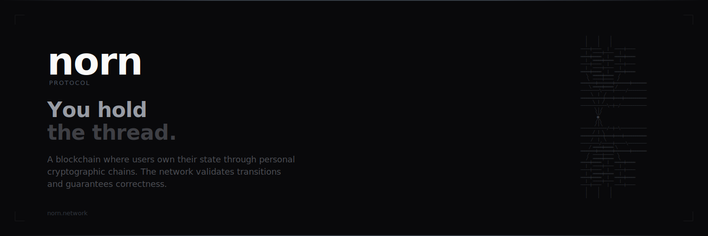
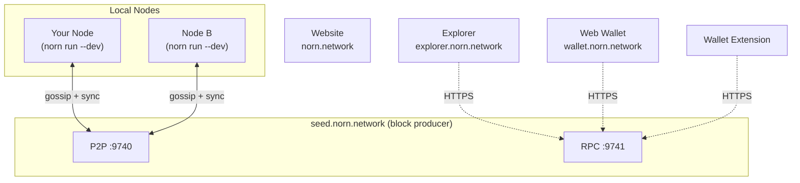

<p align="center">
  
</p>

<p>
  <a href="https://github.com/augmnt/norn-protocol/actions/workflows/ci.yml"></a>
  <a href="LICENSE"></a>
  <a href="https://www.rust-lang.org/"></a>
  <a href="https://github.com/augmnt/norn-protocol/releases/tag/v0.18.3"></a>
</p>

---

## What is Norn?

Norn is a thread-centric blockchain protocol that reimagines the relationship between users and the chain. Rather than forcing every transaction through global consensus -- the bottleneck that limits every existing blockchain -- Norn puts state ownership back in your hands. **You hold the thread.**

Users own their state through personal cryptographic chains called *Threads*. Transfers are signed by the sender and validated by the network. Clients can independently verify their balances using Merkle proofs. The chain validates state transitions and guarantees correctness -- it doesn't hold your money.

For complex multi-party logic, off-chain smart contracts called *Looms* provide WebAssembly-powered programmability with on-chain fraud proof guarantees. The result is a protocol with zero-fee transfers, fast finality, and cryptographic state verification -- where the chain exists only to keep everyone honest.

## Key Properties

- **Zero-fee transfers** -- Transfers carry no protocol fee. Only periodic commitments to the anchor chain carry a small dynamic fee.
- **Fast finality** -- Transactions confirm in ~3 second blocks on the Weave.
- **Phone-runnable full nodes** -- The anchor chain processes only commitments and fraud proofs, keeping on-chain state minimal. A full node runs on a modern smartphone.
- **State verification** -- Clients independently verify balances via Merkle proofs against the on-chain state root.
- **Fraud-proof security** -- Cheating is detectable and punishable through economic penalties. Honest behavior is the Nash equilibrium.

## Installation

### From Git (latest)

```bash
cargo install --git https://github.com/augmnt/norn-protocol norn-node
```

### From Source

```bash
git clone https://github.com/augmnt/norn-protocol
cd norn-protocol
cargo install --path norn-node
```

After installation, the `norn` command is available:

```bash
norn --version
norn wallet create --name mywallet
norn run --dev   # Joins the devnet, syncs blocks, persists to SQLite
```

## Architecture

Norn's architecture consists of six core components:

| Component | Description |
|-----------|-------------|
| **Threads** | Personal state chains -- each user maintains their own signed history of state transitions, stored locally on their device. |
| **Knots** | Atomic state transitions -- signed transfers that update Thread state, validated by the network. |
| **Weave** | The anchor chain -- a minimal HotStuff BFT blockchain that processes commitments, registrations, and fraud proofs. |
| **Looms** | Off-chain smart contracts -- WebAssembly programs that execute off-chain with on-chain fraud proof guarantees. |
| **Spindles** | Watchtower services -- monitor the Weave on behalf of offline users and submit fraud proofs when misbehavior is detected. |
| **Relays** | P2P message buffers -- asynchronous message delivery between Threads via the libp2p protocol stack. |


## Running a Node

### Network Architecture

Norn uses a **seed node** as the canonical block producer and bootstrap peer. All other nodes connect to the seed to sync blocks, submit transactions, and hold their local thread state.



- **Seed node**: The source of truth. Produces blocks, serves the explorer, web wallet, and wallet extension.
- **Local nodes**: Connect to the seed as peers. Hold your thread locally, sync blocks from the network, and gossip transactions to the seed for inclusion in blocks.

### Quick Start (Join the Devnet)

```bash
norn run --dev
```

That's it. This will:
1. Connect to `seed.norn.network` as a peer (automatic)
2. Sync all existing blocks from the network
3. Store your thread and chain state locally (SQLite, persistent)
4. Gossip any transactions you submit to the seed for inclusion in blocks

Your wallet CLI works against your local node by default (`--rpc-url http://localhost:9741`), and transactions will propagate to the entire network.

### Running the Seed Node

The seed node runs with `--no-bootstrap` since it IS the bootstrap peer:

```bash
norn run --dev --no-bootstrap --rpc-addr 0.0.0.0:9741 --data-dir /var/lib/norn/norn-data
```

### Network Modes

Norn supports three network modes, selectable via `--network` flag or `network_id` in `norn.toml`:

| Mode | Chain ID | Faucet | Use Case |
|------|----------|--------|----------|
| `dev` | `norn-dev` | Enabled (60s cooldown) | Local development, solo validator |
| `testnet` | `norn-testnet-1` | Enabled (1hr cooldown) | Public testing, multi-node |
| `mainnet` | `norn-mainnet` | Disabled | Production deployment |

### Common Flags

| Flag | Description |
|------|-------------|
| `--dev` | Dev mode: faucet, solo validator, SQLite storage, auto-bootstrap to devnet seed |
| `--no-bootstrap` | Run as the seed node (no outbound peers) |
| `--storage <TYPE>` | Override storage: `sqlite` (default for --dev), `memory`, `rocksdb` |
| `--boot-node <MULTIADDR>` | Add a custom bootstrap peer |
| `--rpc-addr <ADDR:PORT>` | Bind RPC server (default `127.0.0.1:9741`) |
| `--data-dir <PATH>` | Data directory (default `~/.norn/data`) |
| `--reset-state` | Wipe data directory before starting |

### Public Endpoints

| Service | URL |
|---------|-----|
| Website | [norn.network](https://norn.network) |
| RPC | `https://seed.norn.network` |
| WebSocket | `wss://seed.norn.network` |
| Explorer | [explorer.norn.network](https://explorer.norn.network) |
| Web Wallet | [wallet.norn.network](https://wallet.norn.network) |
| P2P Bootstrap | `/ip4/164.90.182.133/tcp/9740` |

## Repository Structure

| Crate / Package | Description |
|-----------------|-------------|
| `norn-types` | Shared type definitions (Thread, Knot, Weave, Loom, consensus, fraud proof, genesis, network message types) |
| `norn-crypto` | Cryptographic operations (Ed25519 keys, BLAKE3 hashing, Merkle trees, BIP-39 seeds, SLIP-0010 HD derivation, XChaCha20 encryption) |
| `norn-thread` | Thread management (Thread chain, Knot creation/validation, state management, version tracking) |
| `norn-storage` | Storage abstraction (KvStore trait with memory, SQLite, and RocksDB backends; Merkle, Thread, and Weave stores) |
| `norn-relay` | P2P networking (libp2p behaviour, protocol codec, peer discovery, relay service, state sync, Spindle registry) |
| `norn-weave` | Anchor chain (block production, commitment processing, HotStuff consensus, dynamic fees, fraud proof verification, staking) |
| `norn-loom` | Smart contract runtime (Wasm runtime, host functions, gas metering, Loom lifecycle, dispute resolution) |
| `norn-spindle` | Watchtower service (Weave monitoring, fraud proof construction, rate limiting, service orchestration) |
| `norn-sdk` | Contract SDK for writing Norn loom smart contracts (`#![no_std]`, targets `wasm32-unknown-unknown`) |
| `norn-node` | Full node binary (CLI, node configuration, genesis handling, JSON-RPC server with API key auth, wallet CLI, NornNames, NT-1 tokens, Loom smart contracts with execution, Prometheus metrics endpoint, fraud proof submission, spindle watchtower integration) |
| `sdk/typescript` | TypeScript SDK (`@norn-protocol/sdk`) — wallet primitives, transaction builders, RPC client, WebSocket subscriptions |
| `explorer/` | [Block explorer](#explorer) — Next.js 15 web app for browsing blocks, transactions, accounts, tokens, and contracts |
| `wallet/` | [Web wallet](#web-wallet) — Next.js 15 passkey-secured browser wallet for managing NORN, tokens, names, and contracts |
| `wallet-extension/` | [Wallet extension](#wallet-extension) — Chrome extension for sending/receiving NORN, managing accounts, and registering names |
| `website/` | [Website](#website) — norn.network marketing site and documentation hub |

## Getting Started

### Prerequisites

- [Rust](https://www.rust-lang.org/tools/install) (stable toolchain)

### Build

```bash
cargo build --workspace
```

### Test

```bash
cargo test --workspace
```

### Lint

```bash
cargo clippy --workspace -- -D warnings
cargo fmt --check
```

### Run the Demo

```bash
cargo run --example demo -p norn-node
```

## Wallet CLI

The `norn` binary includes a full-featured wallet CLI with 41 subcommands for key management, transfers, NornNames, custom tokens, Loom smart contracts (deploy, upload, execute, query, join, leave), Thread inspection, and encrypted keystore backup.

```bash
# Create a new wallet
norn wallet create --name alice

# List wallets
norn wallet list

# Check balance (native NORN or custom token by symbol)
norn wallet balance --address <ADDRESS>
norn wallet balance --token MTK

# Send tokens (by address or NornName)
norn wallet transfer --to <ADDRESS_OR_NAME> --amount <AMOUNT>
norn wallet transfer --to <ADDRESS_OR_NAME> --amount 100 --token MTK
# Or use the `send` alias
norn wallet send --to <ADDRESS_OR_NAME> --amount <AMOUNT>

# Register a NornName (costs 1 NORN, burned)
norn wallet register-name --name alice

# Resolve a NornName to its owner address
norn wallet resolve --name alice

# List names owned by the active wallet
norn wallet names

# Configure wallet (network, RPC URL)
norn wallet config --network testnet
norn wallet config --rpc-url http://my-node:9741

# Check node connectivity
norn wallet node-info

# View current fees
norn wallet fees

# View validator set
norn wallet validators

# Active wallet dashboard
norn wallet whoami
```

### Token Management

```bash
# Create a custom fungible token (costs 10 NORN, burned)
norn wallet create-token --name "My Token" --symbol MTK --decimals 8 --max-supply 1000000 --initial-supply 1000

# Mint tokens (creator only)
norn wallet mint-token --token MTK --to 0x<ADDRESS> --amount 500

# Burn tokens (any holder)
norn wallet burn-token --token MTK --amount 100

# Query token metadata
norn wallet token-info MTK

# List all registered tokens
norn wallet list-tokens

# View all token balances for the active wallet
norn wallet token-balances
```

The `--token` flag on `balance` and `transfer` accepts token symbols (e.g., `MTK`), `NORN`/`native` for the native token, or a 64-character hex token ID.

Wallets are stored in `~/.norn/wallets/` with Argon2id key derivation and XChaCha20-Poly1305 authenticated encryption.

## NornNames

NornNames is Norn's native **consensus-level** name system, mapping human-readable names to owner addresses as a user-friendly alternative to hex addresses. Names are included in `WeaveBlock`s and propagate to all nodes via P2P gossip, making them globally visible across the network.

### Naming Rules

| Rule | Constraint |
|------|-----------|
| Length | 3--32 characters |
| Character set | Lowercase ASCII letters (`a-z`), digits (`0-9`), hyphens (`-`) |
| Hyphens | Must not start or end with a hyphen |
| Uniqueness | Globally unique, first-come first-served |

**Valid names:** `alice`, `bob-42`, `my-validator`, `norn-relay-1`

**Invalid names:** `ab` (too short), `-alice` (leading hyphen), `bob-` (trailing hyphen), `Alice` (uppercase), `my name` (spaces)

### Registration Cost

Registering a NornName costs **1 NORN**, which is **permanently burned** (debited from the registrant, not credited to anyone), reducing the circulating supply.

### Wallet CLI Usage

```bash
# Register a NornName for the active wallet (submitted to mempool, included in next block)
norn wallet register-name --name alice

# Resolve a NornName to its owner address
norn wallet resolve --name alice

# List names owned by the active wallet
norn wallet names
```

Names work seamlessly in transfers -- pass a NornName instead of a hex address:

```bash
norn wallet send --to alice --amount 10
```

The wallet resolves `alice` to the owner's address via `norn_resolveName` before constructing the transfer.

For full technical details, see the [Protocol Specification, Section 28](docs/Norn_Protocol_Specification_v2.0.md#28-nornnames-name-registry).

## NT-1 Fungible Token Standard

Norn supports **protocol-level custom fungible tokens** via the NT-1 standard. Tokens are consensus-level: definitions, mints, and burns are included in `WeaveBlock`s and propagate to all nodes via P2P gossip.

### Token Operations

| Operation | Who | Fee | Effect |
|-----------|-----|-----|--------|
| **Create** | Anyone | 10 NORN (burned) | Registers a new token with metadata; optionally mints initial supply to creator |
| **Mint** | Token creator only | None | Creates new tokens, credits to recipient |
| **Burn** | Any holder | None | Destroys tokens from burner's balance |

**Token ID** is deterministic: `BLAKE3(creator ++ name ++ symbol ++ decimals ++ max_supply ++ timestamp)`.

**Symbol uniqueness** is enforced at the consensus level -- no two tokens can share the same ticker.

### Token Rules

| Rule | Constraint |
|------|-----------|
| Name length | 1--64 printable ASCII characters |
| Symbol length | 1--12 uppercase alphanumeric characters |
| Decimals | 0--18 |
| Max supply | 0 = unlimited, otherwise enforced on mint |

### Wallet CLI Usage

```bash
# Create a token
norn wallet create-token --name "Wrapped Bitcoin" --symbol WBTC --decimals 8 --max-supply 21000000 --initial-supply 0

# Mint tokens to a recipient (creator only)
norn wallet mint-token --token WBTC --to 0x<ADDRESS> --amount 1000

# Transfer custom tokens
norn wallet transfer --to 0x<ADDRESS> --amount 100 --token WBTC

# Burn tokens from your own balance
norn wallet burn-token --token WBTC --amount 50

# Query token info (by symbol or hex token ID)
norn wallet token-info WBTC

# List all tokens on the network
norn wallet list-tokens

# View all non-zero token holdings for the active wallet
norn wallet token-balances
```

### RPC Methods

| Method | Parameters | Returns | Auth |
|--------|-----------|---------|------|
| `norn_createToken` | `hex` (hex-encoded borsh `TokenDefinition`) | `SubmitResult` | Yes |
| `norn_mintToken` | `hex` (hex-encoded borsh `TokenMint`) | `SubmitResult` | Yes |
| `norn_burnToken` | `hex` (hex-encoded borsh `TokenBurn`) | `SubmitResult` | Yes |
| `norn_getTokenInfo` | `token_id` (hex) | `Option<TokenInfo>` | No |
| `norn_getTokenBySymbol` | `symbol` | `Option<TokenInfo>` | No |
| `norn_listTokens` | `limit`, `offset` | `Vec<TokenInfo>` | No |

For full technical details, see the [Protocol Specification, Section 28b](docs/Norn_Protocol_Specification_v2.0.md#28b-nt-1-fungible-token-standard).

## Loom Smart Contracts

Norn supports **off-chain smart contracts** called Looms -- WebAssembly programs that execute off-chain with on-chain fraud proof guarantees. Loom deployments are consensus-level: registrations are included in `WeaveBlock`s and propagate to all nodes via P2P gossip.

### Loom Operations

| Operation | Who | Fee | Effect |
|-----------|-----|-----|--------|
| **Deploy** | Anyone | 50 NORN (burned) | Registers a new loom with metadata on the network |
| **Upload Bytecode** | Loom operator | None | Uploads .wasm bytecode to the node and calls `init()` |
| **Execute** | Any participant | None | Runs the contract with input data, mutates state |
| **Query** | Anyone | None | Read-only contract execution, no state change |
| **Join** | Anyone | None | Join a loom as a participant |
| **Leave** | Participant | None | Leave a loom |

**Loom ID** is deterministic: `BLAKE3(name ++ operator ++ timestamp)`.

### Naming Rules

| Rule | Constraint |
|------|-----------|
| Length | 3--64 characters |
| Character set | Lowercase ASCII letters (`a-z`), digits (`0-9`), hyphens (`-`) |
| Hyphens | Must not start or end with a hyphen |

### Contract SDK

The `norn-sdk` crate provides the building blocks for writing loom contracts in Rust, targeting `wasm32-unknown-unknown`. Contracts export `init()`, `execute(ptr, len)`, and `query(ptr, len)` functions.

```bash
# Build a contract (see examples/counter/ for a working example)
cargo build --target wasm32-unknown-unknown --release --manifest-path examples/counter/Cargo.toml
```

### Wallet CLI Usage

```bash
# Deploy a loom (costs 50 NORN, burned)
norn wallet deploy-loom --name my-contract

# Upload bytecode to a deployed loom
norn wallet upload-bytecode --loom-id <LOOM_ID> --bytecode path/to/contract.wasm

# Execute a loom contract
norn wallet execute-loom --loom-id <LOOM_ID> --input 01

# Query a loom contract (read-only)
norn wallet query-loom --loom-id <LOOM_ID>

# Join/leave a loom
norn wallet join-loom --loom-id <LOOM_ID>
norn wallet leave-loom --loom-id <LOOM_ID>

# Query loom metadata
norn wallet loom-info <LOOM_ID>

# List all deployed looms
norn wallet list-looms
```

### RPC Methods

| Method | Parameters | Returns | Auth |
|--------|-----------|---------|------|
| `norn_deployLoom` | `hex` (hex-encoded borsh `LoomRegistration`) | `SubmitResult` | Yes |
| `norn_uploadLoomBytecode` | `loom_id` (hex), `bytecode_hex` | `SubmitResult` | Yes |
| `norn_executeLoom` | `loom_id` (hex), `input_hex`, `sender_hex` | `ExecutionResult` | Yes |
| `norn_queryLoom` | `loom_id` (hex), `input_hex` | `QueryResult` | No |
| `norn_joinLoom` | `loom_id` (hex), `participant_hex`, `pubkey_hex` | `SubmitResult` | Yes |
| `norn_leaveLoom` | `loom_id` (hex), `participant_hex` | `SubmitResult` | Yes |
| `norn_getLoomInfo` | `loom_id` (hex) | `Option<LoomInfo>` | No |
| `norn_listLooms` | `limit`, `offset` | `Vec<LoomInfo>` | No |

For full technical details, see the [Protocol Specification](docs/Norn_Protocol_Specification_v2.0.md).

## Token Economics

NORN has a fixed maximum supply of **1,000,000,000 NORN** (1 billion), enforced at the protocol level.

| Category | % | Amount | Vesting |
|---|---|---|---|
| Founder & Core Team | 15% | 150,000,000 | 4-year linear, 1-year cliff |
| Ecosystem Development | 20% | 200,000,000 | Controlled release over 5 years |
| Validator Rewards | 30% | 300,000,000 | Block rewards over 10+ years |
| Community & Grants | 15% | 150,000,000 | Governance-controlled |
| Treasury Reserve | 10% | 100,000,000 | DAO-governed after decentralization |
| Initial Liquidity | 5% | 50,000,000 | Available at launch |
| Testnet Participants | 5% | 50,000,000 | Airdrop at mainnet launch |

**Deflationary mechanics:** NornNames registration burns 1 NORN per name. NT-1 token creation burns 10 NORN per token. Loom deployment burns 50 NORN per contract. Future fee burning (EIP-1559-style) planned.

For full details, see the [Protocol Specification](docs/Norn_Protocol_Specification_v2.0.md).

## Explorer

The **Norn Explorer** is a block explorer web app for browsing the Norn network — blocks, transactions, accounts, tokens, and smart contracts. Built with Next.js 15, React 19, shadcn/ui, and the `@norn-protocol/sdk`.

**Live instance:** [explorer.norn.network](https://explorer.norn.network)

To run locally:

```bash
cd sdk/typescript && npm install && npm run build  # Build SDK first
cd ../../explorer
npm install
npm run dev
```

Open [http://localhost:3000](http://localhost:3000). By default it connects to `seed.norn.network`. To point at a local node, create `.env.local`:

```env
NEXT_PUBLIC_RPC_URL=http://localhost:9741
NEXT_PUBLIC_WS_URL=ws://localhost:9741
```

**Key pages:**

| Route | Description |
|-------|-------------|
| `/` | Dashboard with network stats, recent blocks, and transactions |
| `/blocks` | Paginated block list |
| `/block/[height]` | Block detail with metadata and activity counts |
| `/transactions` | Live transaction feed with pending transactions |
| `/address/[address]` | Account balances, transaction history, registered names |
| `/tokens` | Token registry with supply information |
| `/contracts` | Deployed smart contracts |

Real-time updates are powered by WebSocket subscriptions — blocks and transactions stream in as they are produced.

See [`explorer/README.md`](explorer/README.md) for full setup instructions, environment variables, and troubleshooting.

## Web Wallet

The **Norn Web Wallet** is a self-custodial browser wallet secured by WebAuthn passkeys. No extensions to install -- just visit the URL and authenticate with Face ID, Touch ID, or Windows Hello.

**Live instance:** [wallet.norn.network](https://wallet.norn.network)

**Features:**

- Passkey authentication (Face ID / Touch ID / Windows Hello)
- Self-custodial -- private keys derived on-the-fly, never stored
- Cross-device sync via iCloud Keychain or Google Password Manager
- Send & receive NORN to addresses or NornNames
- Create, mint, and burn NT-1 tokens
- Register NornNames
- Deploy, execute, and query Loom smart contracts
- Transaction history with detail views
- Devnet faucet
- Optional 24-word recovery phrase backup
- Auto-lock with configurable timeout

To run locally:

```bash
cd sdk/typescript && npm install && npm run build  # Build SDK first
cd ../../wallet
npm install
npm run dev
```

Open [http://localhost:3002](http://localhost:3002). By default it connects to `seed.norn.network`. To point at a local node, create `.env.local`:

```env
NEXT_PUBLIC_RPC_URL=http://localhost:9741
NEXT_PUBLIC_WS_URL=ws://localhost:9741
```

See the [Web Wallet documentation](https://norn.network/docs/wallet-web) for security model details, browser support, and setup instructions.

## Wallet Extension

The **Norn Wallet** is a Chrome browser extension for managing NORN on the Norn Protocol. Send and receive tokens, browse activity, register NornNames, and manage multiple accounts — all from the browser toolbar.

```bash
cd wallet-extension
npm install
npm run build
```

Then load the `wallet-extension/dist` directory as an unpacked extension in `chrome://extensions` (Developer mode).

**Features:**

- Create new wallets or import from private key hex / CLI export
- Send NORN to addresses or NornNames (e.g. `alice`)
- Receive with QR code
- Browse NT-1 tokens and transaction history
- Register NornNames (1 NORN fee)
- Multi-account support with auto-lock
- Configurable RPC endpoint (defaults to `seed.norn.network`)

**Importing a CLI wallet:**

```bash
# In terminal — export your CLI wallet's private key
norn wallet export <wallet-name> --show-private-key

# Then paste the 64-char hex into the extension's "Import from CLI" page
```

See [`wallet-extension/README.md`](wallet-extension/README.md) for full setup instructions, page reference, and security details.

## Website

The **Norn website** at [norn.network](https://norn.network) serves as the project's landing page and documentation hub. Built with Next.js 15 and MDX.

To run locally:

```bash
cd website
npm install
npm run dev
```

## TypeScript SDK

The `@norn-protocol/sdk` package provides wallet primitives, transaction builders, an RPC client, and WebSocket subscription helpers for building TypeScript/JavaScript applications on Norn.

```bash
cd sdk/typescript
npm install
npm run build
```

The Explorer, Web Wallet, and Wallet Extension all depend on this SDK via local file link. Build it first before running any of them.

```typescript
import { Wallet, NornClient } from "@norn-protocol/sdk";

const wallet = Wallet.generate();
const client = new NornClient("http://localhost:9944");
const balance = await client.getBalance(wallet.address);
```

## Documentation

- [Documentation Hub](https://norn.network/docs) -- Guides, tutorials, and API reference
- [White Paper](docs/Norn_Protocol_White_Paper.md) -- Design philosophy, architecture overview, and protocol comparison
- [Protocol Specification v2.0](docs/Norn_Protocol_Specification_v2.0.md) -- Complete technical specification

## Contributing

Contributions are welcome. See [CONTRIBUTING.md](CONTRIBUTING.md) for guidelines.

## License

This project is licensed under the [MIT License](LICENSE).
