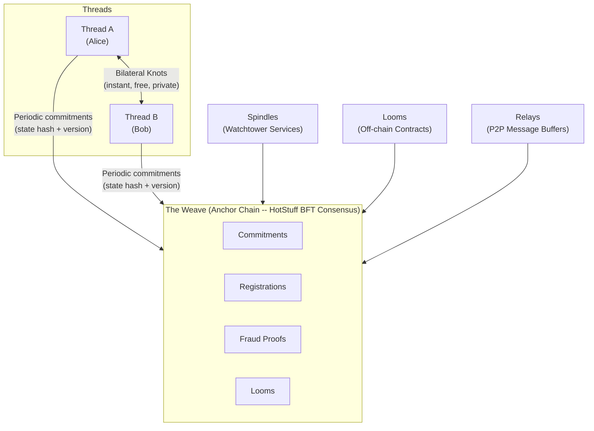

# Norn Protocol

[](https://github.com/augmnt/norn-protocol/actions/workflows/ci.yml)
[](LICENSE)
[](https://www.rust-lang.org/)
[](https://github.com/augmnt/norn-protocol/releases/tag/v0.3.0)

**Your thread. Your fate. The chain just watches.**

---

## What is Norn?

Norn is a radically minimal blockchain protocol that reimagines the relationship between users and the chain. Rather than forcing every transaction through global consensus -- the bottleneck that limits every existing blockchain -- Norn treats the chain as a **courtroom**, not a bank.

Users transact directly with each other using cryptographic signatures, maintaining their own personal state histories called *Threads*. The chain intervenes only when there is a dispute, processing fraud proofs rather than transactions. This architectural inversion moves the vast majority of economic activity off-chain by design, with the anchor chain serving as a minimal, efficient arbiter of last resort.

For complex multi-party logic, off-chain smart contracts called *Looms* provide WebAssembly-powered programmability with on-chain fraud proof guarantees. The result is a protocol where bilateral exchange is instant, free, and private -- and the chain exists only to keep everyone honest.

## Key Properties

- **Unlimited bilateral throughput** -- Two parties can exchange value as fast as they can sign messages. No block size limit, no gas auction, no mempool congestion.
- **Phone-runnable full nodes** -- The anchor chain processes only commitments and fraud proofs, keeping on-chain state minimal. A full node runs on a modern smartphone.
- **Zero-fee P2P transfers** -- Bilateral transactions incur no on-chain fee. Only periodic commitments to the anchor chain carry a small dynamic fee.
- **Privacy by default** -- The chain never sees transaction details, balances, or counterparties. It sees only cryptographic commitments.
- **Instant bilateral finality** -- A transaction is final the moment both parties sign. No confirmation time, no block wait.
- **Fraud-proof security** -- Cheating is detectable and punishable through economic penalties. Honest behavior is the Nash equilibrium.

## Installation

### From Git (latest)

```bash
cargo install --git https://github.com/augmnt/norn-protocol norn-node
```

### From Source

```bash
git clone https://github.com/augmnt/norn-protocol
cd norn-protocol
cargo install --path norn-node
```

After installation, the `norn` command is available:

```bash
norn --version
norn wallet create
norn run --dev
```

## Architecture

Norn's architecture consists of six core components:

| Component | Description |
|-----------|-------------|
| **Threads** | Personal state chains -- each user maintains their own signed history of state transitions, stored locally on their device. |
| **Knots** | Atomic state transitions -- bilateral or multilateral agreements that tie Threads together, signed by all participants. |
| **Weave** | The anchor chain -- a minimal HotStuff BFT blockchain that processes commitments, registrations, and fraud proofs. |
| **Looms** | Off-chain smart contracts -- WebAssembly programs that execute off-chain with on-chain fraud proof guarantees. |
| **Spindles** | Watchtower services -- monitor the Weave on behalf of offline users and submit fraud proofs when misbehavior is detected. |
| **Relays** | P2P message buffers -- asynchronous message delivery between Threads via the libp2p protocol stack. |



## Network Modes

Norn supports three network modes, selectable via `--network` flag or `network_id` in `norn.toml`:

| Mode | Chain ID | Faucet | Use Case |
|------|----------|--------|----------|
| `dev` | `norn-dev` | Enabled (60s cooldown) | Local development, solo validator |
| `testnet` | `norn-testnet-1` | Enabled (1hr cooldown) | Public testing, multi-node |
| `mainnet` | `norn-mainnet` | Disabled | Production deployment |

```bash
# Dev mode (default)
norn run --dev

# Testnet mode
norn run --dev --network testnet

# Mainnet mode (requires genesis file)
norn run --network mainnet --genesis genesis/mainnet.json
```

## Repository Structure

| Crate | Description |
|-------|-------------|
| `norn-types` | Shared type definitions (Thread, Knot, Weave, Loom, consensus, fraud proof, genesis, network message types) |
| `norn-crypto` | Cryptographic operations (Ed25519 keys, BLAKE3 hashing, Merkle trees, BIP-39 seeds, SLIP-0010 HD derivation, XChaCha20 encryption) |
| `norn-thread` | Thread management (Thread chain, Knot creation/validation, state management, version tracking) |
| `norn-storage` | Storage abstraction (KvStore trait with memory, SQLite, and RocksDB backends; Merkle, Thread, and Weave stores) |
| `norn-relay` | P2P networking (libp2p behaviour, protocol codec, peer discovery, relay service, state sync, Spindle registry) |
| `norn-weave` | Anchor chain (block production, commitment processing, HotStuff consensus, dynamic fees, fraud proof verification, staking) |
| `norn-loom` | Smart contract runtime (Wasm runtime, host functions, gas metering, Loom lifecycle, dispute resolution) |
| `norn-spindle` | Watchtower service (Weave monitoring, fraud proof construction, rate limiting, service orchestration) |
| `norn-node` | Full node binary (CLI, node configuration, genesis handling, JSON-RPC server with API key auth, wallet CLI, NornNames, Prometheus metrics endpoint, fraud proof submission, spindle watchtower integration) |

## Getting Started

### Prerequisites

- [Rust](https://www.rust-lang.org/tools/install) (stable toolchain)

### Build

```bash
cargo build --workspace
```

### Test

```bash
cargo test --workspace
```

### Lint

```bash
cargo clippy --workspace -- -D warnings
cargo fmt --check
```

### Run the Demo

```bash
cargo run --example demo -p norn-node
```

## Wallet CLI

The `norn` binary includes a full-featured wallet CLI with 24 subcommands for key management, transfers, NornNames, Thread inspection, and encrypted keystore backup.

```bash
# Create a new wallet
norn wallet create --name alice

# List wallets
norn wallet list

# Check balance
norn wallet balance --address <ADDRESS>

# Send tokens (by address or NornName)
norn wallet transfer --to <ADDRESS_OR_NAME> --amount <AMOUNT>
# Or use the `send` alias
norn wallet send --to <ADDRESS_OR_NAME> --amount <AMOUNT>

# Register a NornName (costs 1 NORN, burned)
norn wallet register-name --name alice

# Resolve a NornName to its owner address
norn wallet resolve --name alice

# List names owned by the active wallet
norn wallet names

# Configure wallet (network, RPC URL)
norn wallet config --network testnet
norn wallet config --rpc-url http://my-node:9741

# Check node connectivity
norn wallet node-info

# View current fees
norn wallet fees

# View validator set
norn wallet validators

# Active wallet dashboard
norn wallet whoami
```

Wallets are stored in `~/.norn/wallets/` with Argon2id key derivation and XChaCha20-Poly1305 authenticated encryption.

## Token Economics

NORN has a fixed maximum supply of **1,000,000,000 NORN** (1 billion), enforced at the protocol level.

| Category | % | Amount | Vesting |
|---|---|---|---|
| Founder & Core Team | 15% | 150,000,000 | 4-year linear, 1-year cliff |
| Ecosystem Development | 20% | 200,000,000 | Controlled release over 5 years |
| Validator Rewards | 30% | 300,000,000 | Block rewards over 10+ years |
| Community & Grants | 15% | 150,000,000 | Governance-controlled |
| Treasury Reserve | 10% | 100,000,000 | DAO-governed after decentralization |
| Initial Liquidity | 5% | 50,000,000 | Available at launch |
| Testnet Participants | 5% | 50,000,000 | Airdrop at mainnet launch |

**Deflationary mechanics:** NornNames registration burns 1 NORN per name. Future fee burning (EIP-1559-style) planned.

For full details, see the [Protocol Specification](docs/Norn_Protocol_Specification_v2.0.md).

## Documentation

- [White Paper](docs/Norn_Protocol_White_Paper.md) -- Design philosophy, architecture overview, and protocol comparison
- [Protocol Specification v2.0](docs/Norn_Protocol_Specification_v2.0.md) -- Complete technical specification

## Contributing

Contributions are welcome. See [CONTRIBUTING.md](CONTRIBUTING.md) for guidelines.

## License

This project is licensed under the [MIT License](LICENSE).
