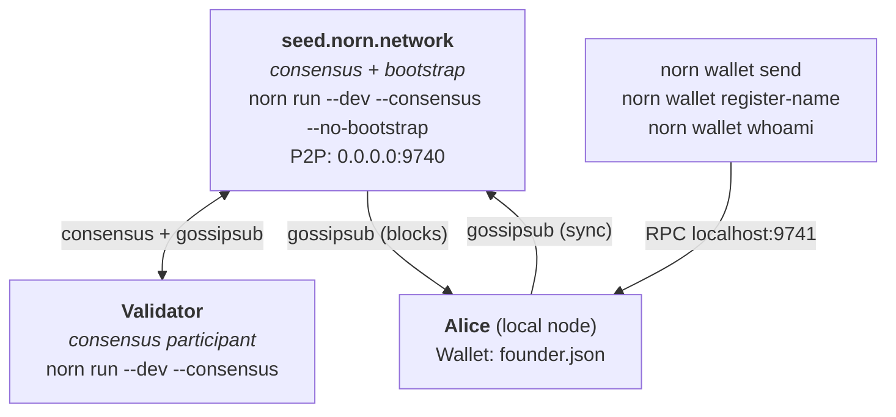

# Norn Network Architecture

> How the devnet works: node roles, genesis, transfer propagation, and wallet interaction.

---

## Genesis Executes on Every Node Independently

The genesis block is **not** created on one machine and distributed to others. Every node running `--dev` independently calls `devnet_genesis()` which is **deterministic** — it always produces the same `GenesisConfig`, the same genesis block hash, and the same founder allocation (10M NORN to `0x557d...0003`).

This means:
- Every `--dev` node starts with identical genesis state
- The `genesis_hash` is used as a **chain identity** — nodes reject peers with different genesis hashes
- No node is "special" for genesis — they all derive the same starting point

**Source:** `norn-node/src/genesis.rs:80-102` (`devnet_genesis()`), `norn-node/src/node.rs:92-101` (genesis config priority)

---

## The 3 Node Roles

### 1. Seed Node — `seed.norn.network`

**Command:** `norn run --dev --consensus --no-bootstrap --storage sqlite --rpc-addr 0.0.0.0:9741`

**Role:** Bootstrap peer and consensus participant

| Aspect | Detail |
|--------|--------|
| Purpose | Stay online 24/7 so other nodes can find the network; participate in consensus |
| P2P | Listens on `0.0.0.0:9740`, accepts incoming connections |
| RPC | `0.0.0.0:9741` (public, serves explorer and wallets) |
| Bootstrap | `--no-bootstrap` — doesn't try to connect to anyone else |
| Validator | Yes (HotStuff BFT consensus with `--consensus`) |
| Storage | SQLite (persistent across restarts) |
| Wallet | None — no wallet on this machine |
| Genesis | Creates its own identical genesis block on startup |

**What it does NOT do:**
- Does not receive wallet commands (no wallet installed)
- Does not initiate connections (waits for others to connect)

### 2. Validator Node — `104.248.241.39`

**Command:** `norn run --dev --consensus --keypair-seed <SEED> --storage sqlite --rpc-addr 0.0.0.0:9741`

**Role:** Consensus participant — validates and votes on blocks

| Aspect | Detail |
|--------|--------|
| Purpose | Participate in HotStuff BFT consensus, validate blocks |
| P2P | Listens on `0.0.0.0:9740`, connects to seed on startup |
| RPC | `0.0.0.0:9741` |
| Bootstrap | Connects to `seed.norn.network:9740` (`DEFAULT_BOOT_NODES`) |
| Validator | Yes (HotStuff BFT consensus with `--consensus`) |
| Storage | SQLite (persistent across restarts) |
| Wallet | None |
| Genesis | Creates its own identical genesis block on startup |

### 3. Local Node (Alice/Bob)

**Command:** `norn run --dev`

**Role:** Participant — initiates transactions and manages wallets

| Aspect | Detail |
|--------|--------|
| Purpose | Send transfers, register names, manage wallets, sync blocks |
| P2P | Listens on `0.0.0.0:9740`, connects to seed on startup |
| RPC | `127.0.0.1:9741` (wallet CLI connects here) |
| Bootstrap | Connects to `seed.norn.network:9740` (`DEFAULT_BOOT_NODES`) |
| Validator | Solo mode (produces local blocks for testing; not part of devnet consensus) |
| Storage | SQLite by default (or `--storage memory` for ephemeral) |
| Wallet | `~/.norn/wallets/` — holds your private keys |
| Genesis | Creates its own identical genesis block on startup |

This is where you run all `norn wallet` commands. The wallet talks to Alice's local node via RPC (`localhost:9741`). The local node handles the transaction and gossips it to the network.

---

## How They Connect



**Connection flow on startup:**
1. Alice starts → connects to `seed.norn.network:9740` via TCP
2. Bob starts → connects to `seed.norn.network:9740` via TCP
3. If both are on the same LAN, mDNS discovers them → direct peer connection
4. All three nodes subscribe to gossipsub topics: `norn/blocks`, `norn/commitments`, `norn/fraud-proofs`, `norn/general`
5. Messages propagate through the gossipsub mesh (auto-relayed by intermediate peers)

**Source:** `norn-relay/src/protocol.rs:15-24` (topic names), `norn-types/src/constants.rs:60,66` (ports, boot nodes)

---

## Transfer Flow: Alice → Bob

When Alice runs `norn wallet send --to <bob-addr> --amount 10`:

```
Step 1: WALLET (Alice's machine)
  └─ Signs transfer knot with Alice's keypair
  └─ Sends to Alice's local node via RPC (localhost:9741)

Step 2: LOCAL NODE RPC HANDLER (Alice's node)
  └─ apply_transfer(): debits Alice, credits Bob
  └─ Queues BlockTransfer in mempool (for block inclusion)
  └─ Broadcasts KnotProposal via P2P gossipsub

Step 3: P2P GOSSIP (gossipsub mesh)
  └─ KnotProposal reaches seed node + Bob's node
  └─ Each peer: apply_peer_transfer() — credits Bob only (no debit)
  └─ Each peer: queues BlockTransfer in their mempool

Step 4: BLOCK PRODUCTION (every ~3 seconds, ALL validators)
  └─ Alice's node produces block with BlockTransfer → broadcast
  └─ Seed node produces block with BlockTransfer → broadcast
  └─ Bob's node produces block with BlockTransfer → broadcast
  └─ All peers: apply transfers from blocks with knot_id dedup

Step 5: BALANCE VISIBLE
  └─ Alice: balance decreased by 10 NORN
  └─ Bob: balance increased by 10 NORN (via gossip + block)
  └─ Seed: both balances updated (via gossip + block)
```

**Key implementation detail:** Both `from` and `to` addresses are auto-registered via `auto_register_if_needed()` before `apply_transfer()`. Missing sender registration causes silent transfer failures.

**Source:** `norn-node/src/state_manager.rs:167-169` (`has_transfer()` dedup)

---

## Name Registration Flow: Bob Registers "bob"

When Bob runs `norn wallet register-name --name bob`:

```
Step 1: WALLET (Bob's machine)
  └─ Creates NameRegistration (name, owner, fee, signature)
  └─ Sends to Bob's local node via RPC (localhost:9741)

Step 2: LOCAL NODE RPC HANDLER (Bob's node)
  └─ Validates name format + signature
  └─ Adds to WeaveEngine mempool
  └─ Broadcasts NornMessage::NameRegistration via P2P gossipsub

Step 3: P2P GOSSIP
  └─ NameRegistration reaches seed node + Alice's node
  └─ Each peer's WeaveEngine adds to mempool

Step 4: BLOCK PRODUCTION
  └─ Bob's node: register_name() — deducts 1 NORN fee, records name
  └─ Seed + Alice: apply_peer_name_registration() — no fee deduction
  └─ Dedup: if name already applied from peer block, logged at debug

Step 5: NAME RESOLVABLE
  └─ All nodes: `norn wallet resolve --name bob` → Bob's address
```

**Source:** `norn-node/src/state_manager.rs:542-632` (`register_name()`), `norn-node/src/state_manager.rs:637-682` (`apply_peer_name_registration()`)

---

## Consensus Mode

The devnet seed and validator nodes run with `--consensus`, which activates **HotStuff BFT consensus**. In this mode:

- A **single leader** proposes each block (determined by round-robin view rotation)
- All validators must **vote** on proposals through Prepare → PreCommit → Commit phases
- Blocks are **finalized** only with a 2f+1 quorum of votes
- If the leader fails, a **view change** is triggered after 9 seconds (3x block time), rotating leadership to the next validator
- State sync verifies block signatures before applying synced blocks

**Solo mode** (`--dev` without `--consensus`) is still available for local development. In solo mode, the node produces blocks independently without consensus — useful for testing but not suitable for production.

**Source:** `norn-types/src/constants.rs:32` (`BLOCK_TIME_TARGET = 3s`), `norn-weave/src/consensus.rs` (HotStuff BFT), `norn-node/src/node.rs` (timeout detection)

---

## Where Wallets Live

Each machine that runs wallet commands has its own keystore:

```
~/.norn/wallets/
  ├── config.json        ← active wallet name, default RPC URL
  └── <name>.json        ← encrypted keystore (Argon2id v3)
```

- The wallet is **purely local** — private keys never leave the machine
- Wallet commands connect to `localhost:9741` (the local node's RPC)
- The wallet signs transactions locally, then sends signed bytes to the node
- The node validates and broadcasts — it never sees the private key
- Override the target node with `--rpc-url http://<other-node>:9741`

---

## Upgrade & Reset Rules

| Scenario | `--reset-state` needed? | Why |
|----------|------------------------|-----|
| Code-only fix (logic change) | No | Data format unchanged |
| `SCHEMA_VERSION` bump | **Yes, all nodes** | Stored blocks have new format |
| `PROTOCOL_VERSION` bump | **Yes, all nodes** | P2P wire format changed |
| One node reset, others not | Old state may sync back | Reset all nodes together |

When resetting, reset **all** nodes before any reconnect. Otherwise old blocks propagate back through P2P gossip, restoring the state you just wiped.

**Source:** `norn-node/src/cli.rs:37-38,122-132` (`--reset-state` handling), `norn-relay/src/protocol.rs` (`PROTOCOL_VERSION`), `norn-node/src/state_store.rs` (`SCHEMA_VERSION`)
