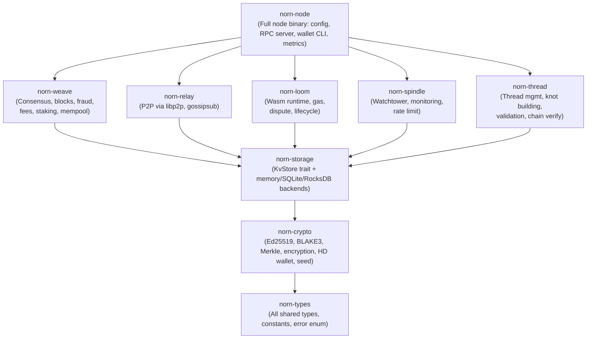
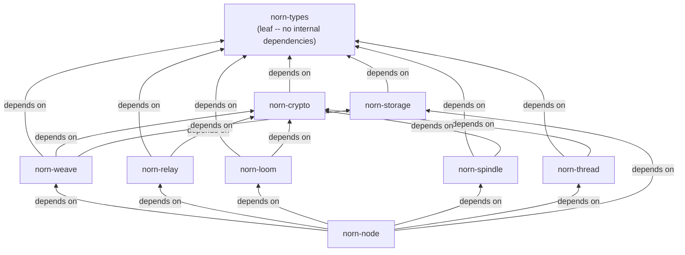

# Norn Protocol Specification v2.0

**Your thread. Your fate. The chain just watches.**

| Field        | Value                         |
|--------------|-------------------------------|
| Version      | 2.0                           |
| Status       | Living Document               |
| Date         | 2026-02-08                    |
| Code Version | 0.10.0                        |
| Supersedes   | v1.0                          |
| Authors      | Norn Protocol Contributors    |

---

## Table of Contents

1. [Introduction](#1-introduction)
2. [Design Philosophy](#2-design-philosophy)
3. [Architecture Overview](#3-architecture-overview)
4. [Primitive Types](#4-primitive-types)
5. [Thread Model](#5-thread-model)
6. [Knot System](#6-knot-system)
7. [Transfer Payloads](#7-transfer-payloads)
8. [Loom Interaction Payloads](#8-loom-interaction-payloads)
9. [Thread State](#9-thread-state)
10. [Thread Headers](#10-thread-headers)
11. [Commitment Updates](#11-commitment-updates)
12. [Thread Registration](#12-thread-registration)
13. [Weave Layer](#13-weave-layer)
14. [Weave Blocks](#14-weave-blocks)
15. [Consensus (HotStuff BFT)](#15-consensus-hotstuff-bft)
16. [Fee Mechanism](#16-fee-mechanism)
17. [Staking & Validators](#17-staking--validators)
18. [Fraud Proofs](#18-fraud-proofs)
19. [Loom System](#19-loom-system)
20. [Network & Relay Layer](#20-network--relay-layer)
21. [Spindle (Watchtower)](#21-spindle-watchtower)
22. [Cryptography](#22-cryptography)
23. [Storage Layer](#23-storage-layer)
24. [Node Configuration & RPC](#24-node-configuration--rpc)
25. [Genesis Configuration](#25-genesis-configuration)
26. [Error Taxonomy](#26-error-taxonomy)
27. [Wallet CLI](#27-wallet-cli)
28. [NornNames (Name Registry)](#28-nornnames-name-registry)
28a. [Block-Level Transfer Sync](#28a-block-level-transfer-sync)
28b. [NT-1 Fungible Token Standard](#28b-nt-1-fungible-token-standard)
29. [Protocol Constants](#29-protocol-constants)
30. [Token Economics](#30-token-economics)
31. [Crate Map](#31-crate-map)
32. [Changelog (v1.0 to v2.0)](#32-changelog-v10-to-v20)

---

## 1. Introduction

Norn is a thread-centric Layer 1 blockchain protocol. Unlike account-based or UTXO-based systems, Norn organizes state into **threads** -- autonomous, owner-controlled chains of state transitions called **knots**. Thread state is replicated across the network for availability, but only the owner's signature can authorize changes. A global ordering layer, the **Weave**, provides transaction ordering, finality, fraud proofs, and cross-thread coordination through **looms**.

Norn is implemented as a Rust workspace comprising 9 crates. This specification is the authoritative reference derived directly from the codebase.

### 1.1 Scope

This document specifies:

- All on-chain data structures and their exact Rust representations
- The knot lifecycle and validation rules
- The Weave consensus layer (HotStuff BFT)
- The Loom cross-thread coordination system
- The network protocol and message formats
- The JSON-RPC interface
- The wallet CLI and encrypted keystore format
- Protocol constants and error codes

### 1.2 Conventions

- All struct definitions are shown as Rust code reflecting the actual `norn-types` crate.
- Serialization uses `borsh` (Binary Object Representation Serializer for Hashing) for wire format and storage.
- JSON serialization uses `serde` for RPC and keystore files.
- Features marked `[PLANNED]` exist as type definitions but lack full runtime implementation.
- Features marked `[FUTURE]` do not yet exist in the codebase.

---

## 2. Design Philosophy

### 2.1 Core Principles

1. **Thread sovereignty.** Each thread is owned and controlled by a single keypair. No external actor can mutate a thread's state without the owner's cryptographic consent.

2. **Sender authorization.** Transfers require the sender's cryptographic signature. The network validates state transitions and applies them.

3. **Cryptographic ownership, network validation.** Thread state is replicated across validators for availability. The Weave orders transactions, validates state transitions, and maintains Merkle roots for state verification. Only the thread owner's signature can authorize changes.

4. **Optimistic finality.** Commitments are assumed valid unless proven fraudulent within a challenge window (24 hours). This keeps Weave throughput high.

5. **Composability through looms.** Cross-thread coordination (DEXs, bridges, multi-party protocols) happens in looms -- sandboxed Wasm runtimes anchored to the Weave.

### 2.2 Non-Goals

- Norn does not provide a global VM (no EVM, no Move).
- Norn does not enforce global state ordering across unrelated threads.

---

## 3. Architecture Overview



### 3.1 Crate Dependency Flow



---

## 4. Primitive Types

All primitive types are defined in `norn-types/src/primitives.rs`.

```rust
/// 32-byte BLAKE3 hash.
pub type Hash = [u8; 32];

/// 32-byte Ed25519 public key.
pub type PublicKey = [u8; 32];

/// 64-byte Ed25519 signature.
pub type Signature = [u8; 64];

/// 20-byte address derived from BLAKE3(pubkey)[0..20].
pub type Address = [u8; 20];

/// Token identifier -- 32-byte hash of the token definition.
pub type TokenId = [u8; 32];

/// Unique identifier for a thread -- same as the creator's address.
pub type ThreadId = Address;

/// Unique identifier for a knot -- BLAKE3 hash of all fields except signatures.
pub type KnotId = Hash;

/// Unique identifier for a loom.
pub type LoomId = [u8; 32];

/// Version number for knots within a thread (monotonically increasing).
pub type Version = u64;

/// Amount of tokens (native uses 12 decimals).
pub type Amount = u128;

/// Unix timestamp in seconds.
pub type Timestamp = u64;

/// The native token ID (all zeros).
pub const NATIVE_TOKEN_ID: TokenId = [0u8; 32];
```

### 4.1 Key Design Decisions

| Type | Size | Rationale |
|------|------|-----------|
| `Amount = u128` | 16 bytes | `u64::MAX` = ~1.8 x 10^19. Max supply = 10^9 NORN x 10^12 decimals = 10^21 nits, which exceeds `u64::MAX`. Therefore `u128` is required. |
| `Address = [u8; 20]` | 20 bytes | Derived as `BLAKE3(pubkey)[0..20]`. 160 bits provides birthday-attack resistance of ~2^80. |
| `ThreadId = Address` | 20 bytes | A thread is identified by its creator's address. One address, one thread. |
| `Timestamp = u64` | 8 bytes | Unix seconds (not milliseconds). Sufficient until year ~584 billion. |
| `NATIVE_TOKEN_ID = [0u8; 32]` | 32 bytes | All-zero sentinel. Not a BLAKE3 hash -- just a convention. |

### 4.2 SignedAmount

For internal accounting where both debits and credits must be represented:

```rust
pub struct SignedAmount {
    /// True if the amount is negative.
    pub negative: bool,
    /// Absolute value of the amount.
    pub value: Amount,
}
```

---

## 5. Thread Model

A **thread** is the fundamental unit of identity and state in Norn. Each thread:

- Is created by generating an Ed25519 keypair.
- Has a `ThreadId` equal to the creator's `Address` (BLAKE3(pubkey)[0..20]).
- Maintains its own chain of state transitions (knots).
- Commits periodic state hashes to the Weave.
- Can participate in looms for cross-thread coordination.

### 5.1 Thread Lifecycle

1. **Key generation.** Generate an Ed25519 keypair. Derive the address.
2. **Registration.** Submit a `Registration` to the Weave, announcing the thread's existence and initial state hash.
3. **Operation.** Submit signed transactions (transfers, token operations). Each transaction modifies the relevant `ThreadState`.
4. **Commitment.** Periodically submit a `CommitmentUpdate` to the Weave with the current state hash.
5. **Finality.** After `COMMITMENT_FINALITY_DEPTH` blocks (10) without a fraud proof, the commitment is final.

### 5.2 Thread Ownership

Threads are **non-transferable**. The thread ID is permanently bound to the creator's address. This is enforced structurally: `ThreadId = Address = BLAKE3(pubkey)[0..20]`.

---

## 6. Knot System

A **knot** is the fundamental unit of state transition. Knots record signed state changes between thread participants.

### 6.1 KnotType

```rust
pub enum KnotType {
    /// Simple two-party token transfer.
    Transfer,
    /// Multi-party transfer (up to MAX_MULTI_TRANSFERS).
    MultiTransfer,
    /// Interaction with a loom (deposit, withdraw, state update).
    LoomInteraction,
}
```

### 6.2 ParticipantState

A snapshot of a participant's thread state at a point in time:

```rust
pub struct ParticipantState {
    /// The participant's thread ID.
    pub thread_id: ThreadId,
    /// The participant's public key.
    pub pubkey: PublicKey,
    /// Version number of the thread at this point.
    pub version: Version,
    /// Hash of the thread state at this point.
    pub state_hash: Hash,
}
```

### 6.3 Knot

```rust
pub struct Knot {
    /// Unique identifier: BLAKE3(all fields except signatures).
    pub id: KnotId,
    /// The type of this knot.
    pub knot_type: KnotType,
    /// Timestamp when the knot was created.
    pub timestamp: Timestamp,
    /// Optional expiry timestamp.
    pub expiry: Option<Timestamp>,
    /// Each participant's state BEFORE the knot.
    pub before_states: Vec<ParticipantState>,
    /// Each participant's state AFTER the knot.
    pub after_states: Vec<ParticipantState>,
    /// The operation payload.
    pub payload: KnotPayload,
    /// Signatures from all participants (one per participant, in order).
    pub signatures: Vec<Signature>,
}
```

### 6.4 KnotPayload

```rust
pub enum KnotPayload {
    Transfer(TransferPayload),
    MultiTransfer(MultiTransferPayload),
    LoomInteraction(LoomInteractionPayload),
}
```

### 6.5 Knot Validation Rules

A knot is valid if and only if all of the following hold:

1. **ID integrity.** `id == BLAKE3(borsh(all fields except id and signatures))`.
2. **Signature count.** `signatures.len() == before_states.len()`.
3. **Signature validity.** Each `signatures[i]` is a valid Ed25519 signature by `before_states[i].pubkey` over the knot ID.
4. **Version continuity.** For each participant `i`: `after_states[i].version == before_states[i].version + 1`.
5. **State hash consistency.** Each `before_states[i].state_hash` matches the actual current state hash of the participant's thread.
6. **Timestamp validity.** `timestamp <= now + MAX_TIMESTAMP_DRIFT` (300 seconds). If there is a previous knot, `timestamp >= previous.timestamp`.
7. **Expiry.** If `expiry` is `Some(t)`, then `t > now`.
8. **Payload consistency.** The payload must be internally consistent (correct amounts, valid addresses, etc.).
9. **Balance sufficiency.** For transfer payloads, the sender must have sufficient balance for the token and amount.
10. **Memo size.** If a memo is present, `memo.len() <= MAX_MEMO_SIZE` (256 bytes).

### 6.6 Knot Signing Protocol

1. **Sender** constructs the knot with their `before_state` (thread ID, public key, version, state hash), fills the `payload` (transfer details), computes the `id` as `BLAKE3(all fields except signatures)`, and signs it.
2. **Submission** -- the signed knot is submitted to the network via RPC (`norn_submitKnot`).
3. **Validation** -- the node validates the signature, checks balance sufficiency, verifies the before-state hash (if non-zero) matches the current thread state, and applies the transfer to both threads.

---

## 7. Transfer Payloads

### 7.1 TransferPayload

```rust
pub struct TransferPayload {
    /// Token being transferred.
    pub token_id: TokenId,
    /// Amount being transferred.
    pub amount: Amount,
    /// Sender's address (thread ID).
    pub from: Address,
    /// Recipient's address (thread ID).
    pub to: Address,
    /// Optional memo (max MAX_MEMO_SIZE bytes).
    pub memo: Option<Vec<u8>>,
}
```

Note: `from` and `to` are `Address` (20 bytes), not `PublicKey`. This matches the thread-centric model where addresses identify threads.

### 7.2 MultiTransferPayload

```rust
pub struct MultiTransferPayload {
    /// List of individual transfers.
    pub transfers: Vec<TransferPayload>,
}
```

Constraints:
- `transfers.len() <= MAX_MULTI_TRANSFERS` (64).
- Each individual `TransferPayload` must satisfy the same rules as a standalone transfer.
- All transfers in a multi-transfer are atomic -- either all succeed or none do.

---

## 8. Loom Interaction Payloads

### 8.1 LoomInteractionType

```rust
pub enum LoomInteractionType {
    /// Deposit tokens into a loom.
    Deposit,
    /// Withdraw tokens from a loom.
    Withdraw,
    /// Update loom state.
    StateUpdate,
}
```

### 8.2 LoomInteractionPayload

```rust
pub struct LoomInteractionPayload {
    /// The loom being interacted with.
    pub loom_id: LoomId,
    /// Type of interaction.
    pub interaction_type: LoomInteractionType,
    /// Token involved (for deposits/withdrawals).
    pub token_id: Option<TokenId>,
    /// Amount involved (for deposits/withdrawals).
    pub amount: Option<Amount>,
    /// Opaque loom-specific data.
    pub data: Vec<u8>,
}
```

For `Deposit` and `Withdraw` interactions, `token_id` and `amount` must be `Some`. For `StateUpdate`, they are typically `None` and the `data` field carries the loom-specific payload.

---

## 9. Thread State

### 9.1 ThreadState

The full mutable state of a thread. Thread state is maintained by every validator in memory (with persistence to disk) and anchored on-chain via its BLAKE3 hash in the sparse Merkle tree.

```rust
pub struct ThreadState {
    /// Balances per token. Key: TokenId, Value: Amount.
    pub balances: BTreeMap<TokenId, Amount>,
    /// Assets held (e.g., NFTs or other non-fungible items).
    pub assets: BTreeMap<TokenId, Vec<u8>>,
    /// Loom memberships. Key: LoomId, Value: loom-specific data.
    pub looms: BTreeMap<LoomId, Vec<u8>>,
    /// Replay-protection nonce, incremented with each knot.
    pub nonce: u64,
}
```

### 9.2 State Operations

```rust
impl ThreadState {
    /// Get the balance for a specific token.
    pub fn balance(&self, token_id: &TokenId) -> Amount;

    /// Check if the thread has at least the specified balance.
    pub fn has_balance(&self, token_id: &TokenId, amount: Amount) -> bool;

    /// Credit tokens to this thread. Returns error on overflow.
    pub fn credit(&mut self, token_id: TokenId, amount: Amount)
        -> Result<(), NornError>;

    /// Debit tokens from this thread. Returns false if insufficient balance.
    pub fn debit(&mut self, token_id: &TokenId, amount: Amount) -> bool;
}
```

Key behaviors:
- `credit()` returns `Result<(), NornError>` to prevent `Amount` overflow (checked addition).
- `debit()` returns `false` on insufficient balance. Zero-balance entries are removed from the map.
- An empty `ThreadState` is the default initial state (`ThreadState::new()`).

---

## 10. Thread Headers

### 10.1 ThreadHeader

The fixed-size header committed to the Weave for each thread. Contains the essential state needed to verify knot chains.

```rust
pub struct ThreadHeader {
    /// The thread's unique ID (same as the creator's address).
    pub thread_id: ThreadId,
    /// The creator's public key.
    pub owner: PublicKey,
    /// Current version counter (incremented per knot involving this thread).
    pub version: Version,
    /// Hash of the current thread state (balances, assets, looms).
    pub state_hash: Hash,
    /// Hash of the last knot applied to this thread (zeros if none).
    pub last_knot_hash: Hash,
    /// Hash of the previous committed header (zeros for genesis).
    pub prev_header_hash: Hash,
    /// Timestamp of this commitment.
    pub timestamp: Timestamp,
    /// Signature by the thread owner over this header.
    pub signature: Signature,
}
```

Size: `THREAD_HEADER_SIZE` = 208 bytes (fixed).

The header forms a chain: each header references the previous via `prev_header_hash`, creating an auditable history of commitments.

---

## 11. Commitment Updates

### 11.1 CommitmentUpdate

A commitment update is the primary message a thread submits to the Weave. It attests to the thread's current state after processing some number of knots.

```rust
pub struct CommitmentUpdate {
    /// The thread submitting the commitment.
    pub thread_id: ThreadId,
    /// The thread owner's public key.
    pub owner: PublicKey,
    /// New version number after this commitment.
    pub version: Version,
    /// Hash of the new thread state.
    pub state_hash: Hash,
    /// Hash of the previous commitment (zeros for genesis).
    pub prev_commitment_hash: Hash,
    /// Number of knots since the last commitment.
    pub knot_count: u64,
    /// Timestamp of this commitment.
    pub timestamp: Timestamp,
    /// Signature by the thread owner.
    pub signature: Signature,
}
```

### 11.2 Commitment Validation Rules

1. **Signature validity.** The signature must be valid for the `owner` public key over the commitment data.
2. **Thread existence.** The `thread_id` must be registered on the Weave.
3. **Version monotonicity.** `version > previous_commitment.version`.
4. **Chain linkage.** `prev_commitment_hash` must match the hash of the previous commitment for this thread (or zeros for the first commitment).
5. **Freshness.** `timestamp` must be within `MAX_COMMITMENT_AGE` (86,400 seconds / 24 hours) of the current Weave time.
6. **Knot limit.** Threads must commit before exceeding `MAX_UNCOMMITTED_KNOTS` (1,000 knots).

---

## 12. Thread Registration

### 12.1 Registration

```rust
pub struct Registration {
    /// The thread being registered.
    pub thread_id: ThreadId,
    /// The thread owner's public key.
    pub owner: PublicKey,
    /// Initial state hash.
    pub initial_state_hash: Hash,
    /// Timestamp of registration.
    pub timestamp: Timestamp,
    /// Signature by the thread owner.
    pub signature: Signature,
}
```

### 12.2 Registration Rules

1. **Uniqueness.** A `thread_id` can only be registered once.
2. **Address binding.** `thread_id` must equal `BLAKE3(owner)[0..20]`.
3. **Signature validity.** The signature must be valid for the `owner` public key.

---

## 13. Weave Layer

The Weave is the global ordering and finality layer. It does **not** execute thread logic. It stores:

- Commitment hashes from threads
- Thread registrations
- Loom anchors
- Fraud proof submissions

### 13.1 WeaveState

```rust
pub struct WeaveState {
    /// Current block height.
    pub height: u64,
    /// Hash of the latest block.
    pub latest_hash: Hash,
    /// Merkle root of all registered threads.
    pub threads_root: Hash,
    /// Total number of registered threads.
    pub thread_count: u64,
    /// Current fee state.
    pub fee_state: FeeState,
}
```

### 13.2 FeeState

```rust
pub struct FeeState {
    /// Base fee per commitment in base units.
    pub base_fee: Amount,
    /// Fee multiplier (scaled by 1000 -- 1000 = 1.0x).
    pub fee_multiplier: u64,
    /// Total fees collected in the current epoch.
    pub epoch_fees: Amount,
}
```

---

## 14. Weave Blocks

### 14.1 WeaveBlock

```rust
pub struct WeaveBlock {
    /// Block height.
    pub height: u64,
    /// Hash of this block.
    pub hash: Hash,
    /// Hash of the previous block.
    pub prev_hash: Hash,
    /// Merkle root of all commitment updates in this block.
    pub commitments_root: Hash,
    /// Merkle root of all registrations in this block.
    pub registrations_root: Hash,
    /// Merkle root of all loom anchors in this block.
    pub anchors_root: Hash,
    /// Commitment updates included in this block.
    pub commitments: Vec<CommitmentUpdate>,
    /// Thread registrations included in this block.
    pub registrations: Vec<Registration>,
    /// Loom anchors included in this block.
    pub anchors: Vec<LoomAnchor>,
    /// Fraud proof submissions included in this block.
    pub fraud_proofs: Vec<FraudProofSubmission>,
    /// Merkle root of all fraud proofs in this block.
    pub fraud_proofs_root: Hash,
    /// Transfers included in this block (for cross-node balance sync).
    pub transfers: Vec<BlockTransfer>,
    /// Merkle root of all transfers in this block.
    pub transfers_root: Hash,
    /// Token definitions created in this block (NT-1).
    pub token_definitions: Vec<TokenDefinition>,
    /// Merkle root of all token definitions in this block.
    pub token_definitions_root: Hash,
    /// Token mint operations in this block (NT-1).
    pub token_mints: Vec<TokenMint>,
    /// Merkle root of all token mints in this block.
    pub token_mints_root: Hash,
    /// Token burn operations in this block (NT-1).
    pub token_burns: Vec<TokenBurn>,
    /// Merkle root of all token burns in this block.
    pub token_burns_root: Hash,
    /// Loom deployments in this block.
    pub loom_deploys: Vec<LoomRegistration>,
    /// Merkle root of all loom deployments in this block.
    pub loom_deploys_root: Hash,
    /// Block timestamp.
    pub timestamp: Timestamp,
    /// Block proposer's public key.
    pub proposer: PublicKey,
    /// Validator signatures.
    pub validator_signatures: Vec<ValidatorSignature>,
}
```

### 14.2 ValidatorSignature

```rust
pub struct ValidatorSignature {
    /// The validator's public key.
    pub validator: PublicKey,
    /// Signature over the block hash.
    pub signature: Signature,
}
```

### 14.3 LoomAnchor

```rust
pub struct LoomAnchor {
    /// The loom being anchored.
    pub loom_id: LoomId,
    /// Hash of the loom's current state.
    pub state_hash: Hash,
    /// Block height at which this anchor was created.
    pub block_height: u64,
    /// Timestamp of this anchor.
    pub timestamp: Timestamp,
    /// Signature by the loom operator.
    pub signature: Signature,
}
```

### 14.4 Block Production

Blocks are produced at a target interval of `BLOCK_TIME_TARGET` (3 seconds). Each block may include up to `MAX_COMMITMENTS_PER_BLOCK` (10,000) commitment updates plus any number of registrations, loom anchors, fraud proofs, transfers, token definitions, token mints, and token burns.

Block hash is computed as `BLAKE3(borsh(block without hash and signatures))`.

Merkle roots (`commitments_root`, `registrations_root`, `anchors_root`, `fraud_proofs_root`, `transfers_root`, `token_definitions_root`, `token_mints_root`, `token_burns_root`) are computed from the respective transaction lists using the sparse Merkle tree implementation in `norn-crypto`.

---

## 15. Consensus (HotStuff BFT)

Norn uses a 3-phase HotStuff BFT consensus protocol for Weave block finality.

### 15.1 Phases

```rust
pub enum ConsensusPhase {
    /// First phase: prepare.
    Prepare,
    /// Second phase: pre-commit.
    PreCommit,
    /// Third phase: commit.
    Commit,
}
```

### 15.2 Vote

```rust
pub struct Vote {
    /// The view number this vote is for.
    pub view: u64,
    /// The block hash being voted on.
    pub block_hash: Hash,
    /// The voter's public key.
    pub voter: PublicKey,
    /// Signature over (view, block_hash).
    pub signature: Signature,
}
```

### 15.3 QuorumCertificate

A quorum certificate (QC) is formed when 2f+1 validators vote for the same block at the same phase:

```rust
pub struct QuorumCertificate {
    /// The view number.
    pub view: u64,
    /// The block hash.
    pub block_hash: Hash,
    /// The phase this QC certifies.
    pub phase: ConsensusPhase,
    /// The votes forming the quorum.
    pub votes: Vec<Vote>,
}
```

### 15.4 ConsensusMessage

```rust
pub enum ConsensusMessage {
    /// Proposal from the leader with a block and its justification.
    Prepare {
        view: u64,
        block_hash: Hash,
        block_data: Vec<u8>,
        justify: Option<QuorumCertificate>,
    },
    /// Vote for the prepare phase.
    PrepareVote(Vote),
    /// Pre-commit message from leader with prepare QC.
    PreCommit {
        view: u64,
        prepare_qc: QuorumCertificate,
    },
    /// Vote for the pre-commit phase.
    PreCommitVote(Vote),
    /// Commit message from leader with pre-commit QC.
    Commit {
        view: u64,
        precommit_qc: QuorumCertificate,
    },
    /// Vote for the commit phase.
    CommitVote(Vote),
    /// Request to change view (timeout).
    ViewChange(TimeoutVote),
    /// New view message from the new leader.
    NewView {
        view: u64,
        proof: ViewChangeProof,
    },
}
```

### 15.5 View Changes

When a view times out (the leader fails to produce a block), validators send `TimeoutVote` messages:

```rust
pub struct TimeoutVote {
    /// The view that timed out.
    pub view: u64,
    /// The voter's public key.
    pub voter: PublicKey,
    /// The highest QC this voter knows about.
    pub highest_qc_view: u64,
    /// Signature over (view, highest_qc_view).
    pub signature: Signature,
}
```

A `ViewChangeProof` is assembled from 2f+1 timeout votes:

```rust
pub struct ViewChangeProof {
    /// The view being changed from.
    pub old_view: u64,
    /// The new view.
    pub new_view: u64,
    /// Timeout votes from 2f+1 validators.
    pub timeout_votes: Vec<TimeoutVote>,
    /// The highest QC known by any voter.
    pub highest_qc: Option<QuorumCertificate>,
}
```

### 15.6 Consensus Flow

1. **Prepare.** The leader proposes a block with a justifying QC from the previous round.
2. **PrepareVote.** Validators validate the block and send `PrepareVote` to the leader.
3. **PreCommit.** The leader forms a prepare-QC and broadcasts it.
4. **PreCommitVote.** Validators respond with `PreCommitVote`.
5. **Commit.** The leader forms a precommit-QC and broadcasts it.
6. **CommitVote.** Validators respond; once a commit-QC is formed, the block is finalized.

If the leader fails, validators issue `ViewChange` to rotate leadership.

### 15.7 Solo Mode

For development and single-validator deployments, `norn-node` supports **solo mode** (`validator.solo_mode = true`), where the node produces blocks directly without the full HotStuff protocol.

---

## 16. Fee Mechanism

### 16.1 Fee Computation

```
fee = base_fee * fee_multiplier / 1000 * commitment_count
```

Where:
- `base_fee` is in base units (nits, 10^-12 NORN).
- `fee_multiplier` is scaled by 1000 (1000 = 1.0x, 2000 = 2.0x).

### 16.2 Dynamic Fee Adjustment

After each block, the fee multiplier is adjusted based on utilization:

```
if 2 * utilized > capacity:
    fee_multiplier += fee_multiplier / 8    (increase 12.5%)
elif 2 * utilized < capacity:
    fee_multiplier -= fee_multiplier / 8    (decrease 12.5%)
// else (exactly 50%): no change

fee_multiplier = clamp(fee_multiplier, 100, 10000)
```

Where:
- `utilized` = number of commitments in the block.
- `capacity` = `MAX_COMMITMENTS_PER_BLOCK`.
- All arithmetic is integer-only (`utilized: u64`, `capacity: u64`).
- The multiplier is clamped to [100, 10000], representing [0.1x, 10.0x].

### 16.3 Fee State Tracking

The `FeeState` tracks `epoch_fees` (total fees collected in the current epoch) for redistribution to validators. At block production time:

1. The fee per commitment is computed via `compute_fee()`.
2. Fees are deducted from each committer's balance (logged as a warning if insufficient, does not fail the block).
3. The total fee is accumulated in `epoch_fees`.
4. The dynamic fee multiplier is updated via `update_fee_state()` based on block utilization.

---

## 17. Staking & Validators

### 17.1 Validator

```rust
pub struct Validator {
    /// Validator's public key.
    pub pubkey: PublicKey,
    /// Validator's address.
    pub address: Address,
    /// Stake amount.
    pub stake: Amount,
    /// Whether the validator is currently active.
    pub active: bool,
}
```

### 17.2 ValidatorSet

```rust
pub struct ValidatorSet {
    /// Active validators ordered by stake (descending).
    pub validators: Vec<Validator>,
    /// Total stake across all active validators.
    pub total_stake: Amount,
    /// Current epoch number.
    pub epoch: u64,
}
```

Key methods:

| Method | Formula | Description |
|--------|---------|-------------|
| `max_faults()` | `(n - 1) / 3` | Maximum Byzantine faults tolerable |
| `quorum_size()` | `2f + 1` | Required votes for a quorum |
| `contains(pubkey)` | -- | Check membership |
| `get(pubkey)` | -- | Look up a validator |

### 17.3 StakeOperation

```rust
pub enum StakeOperation {
    Stake {
        pubkey: PublicKey,
        amount: Amount,
        timestamp: Timestamp,
        signature: Signature,
    },
    Unstake {
        pubkey: PublicKey,
        amount: Amount,
        timestamp: Timestamp,
        signature: Signature,
    },
}
```

Unstaking is subject to a bonding period (configurable via genesis parameters).

### 17.4 Slashing

Slashing percentages are configurable via genesis configuration, not hardcoded. When a fraud proof is validated, the offending thread's associated validator stake may be slashed.

---

## 18. Fraud Proofs

Fraud proofs are the mechanism by which invalid commitments are challenged. They are submitted to the Weave and included in blocks.

### 18.1 FraudProof

```rust
pub enum FraudProof {
    /// Two knots with the same version for the same thread.
    DoubleKnot {
        thread_id: ThreadId,
        knot_a: Box<Knot>,
        knot_b: Box<Knot>,
    },

    /// A commitment references a state that is stale or skips knots.
    StaleCommit {
        thread_id: ThreadId,
        commitment: Box<ThreadHeader>,
        missing_knots: Vec<Knot>,
    },

    /// A loom state transition that violates the loom's rules.
    InvalidLoomTransition {
        loom_id: LoomId,
        knot: Box<Knot>,
        reason: String,
    },
}
```

### 18.2 FraudProofSubmission

Every fraud proof is wrapped in a submission envelope:

```rust
pub struct FraudProofSubmission {
    /// The fraud proof itself.
    pub proof: FraudProof,
    /// Who submitted the fraud proof.
    pub submitter: PublicKey,
    /// Timestamp of submission.
    pub timestamp: Timestamp,
    /// Signature by the submitter.
    pub signature: Signature,
}
```

### 18.3 Fraud Proof Rules

| Proof Type | Verification |
|------------|-------------|
| `DoubleKnot` | Both `knot_a` and `knot_b` must have valid signatures from the same thread owner, with the same version number but different knot IDs. |
| `StaleCommit` | The `commitment` header must be on-chain. The `missing_knots` must be valid knots that should have been included in the commitment but were not. |
| `InvalidLoomTransition` | The `knot` must contain a loom interaction that violates the loom's transition rules. The `reason` describes the violation. |

### 18.4 Fraud Proof Window

- `FRAUD_PROOF_WINDOW` = 86,400 seconds (24 hours) -- unified for both thread and loom fraud proofs.
- `FRAUD_PROOF_MIN_STAKE` = 1 NORN -- minimum stake required to submit a fraud proof.

---

## 19. Loom System

Looms provide cross-thread coordination. They are sandboxed Wasm runtimes that can enforce arbitrary multi-party protocols (DEXs, payment channels, bridges, etc.).

### 19.1 LoomConfig

```rust
pub struct LoomConfig {
    /// Unique identifier for this loom.
    pub loom_id: LoomId,
    /// Human-readable name.
    pub name: String,
    /// Maximum number of participants.
    pub max_participants: usize,
    /// Minimum number of participants for the loom to be active.
    pub min_participants: usize,
    /// Tokens accepted by this loom.
    pub accepted_tokens: Vec<TokenId>,
    /// Opaque loom-specific configuration data.
    pub config_data: Vec<u8>,
}
```

### 19.2 Participant

```rust
pub struct Participant {
    /// Participant's public key.
    pub pubkey: PublicKey,
    /// Participant's address (thread ID).
    pub address: Address,
    /// Timestamp when the participant joined.
    pub joined_at: Timestamp,
    /// Whether the participant is currently active.
    pub active: bool,
}
```

### 19.3 Loom

```rust
pub struct Loom {
    /// Loom configuration.
    pub config: LoomConfig,
    /// Loom operator's public key.
    pub operator: PublicKey,
    /// Current participants.
    pub participants: Vec<Participant>,
    /// Hash of the current loom state.
    pub state_hash: Hash,
    /// Current loom state version.
    pub version: Version,
    /// Whether the loom is currently active.
    pub active: bool,
    /// Timestamp of last state update.
    pub last_updated: Timestamp,
}
```

### 19.4 LoomRegistration

```rust
pub struct LoomRegistration {
    /// The loom configuration.
    pub config: LoomConfig,
    /// The loom operator's public key.
    pub operator: PublicKey,
    /// Timestamp of registration.
    pub timestamp: Timestamp,
    /// Signature by the operator.
    pub signature: Signature,
}
```

### 19.5 LoomBytecode

```rust
pub struct LoomBytecode {
    /// The loom this bytecode belongs to.
    pub loom_id: LoomId,
    /// Hash of the Wasm bytecode.
    pub wasm_hash: Hash,
    /// The Wasm bytecode itself.
    pub bytecode: Vec<u8>,
}
```

### 19.6 LoomStateTransition

```rust
pub struct LoomStateTransition {
    /// The loom ID.
    pub loom_id: LoomId,
    /// Hash of the state before the transition.
    pub prev_state_hash: Hash,
    /// Hash of the state after the transition.
    pub new_state_hash: Hash,
    /// Inputs to the transition.
    pub inputs: Vec<u8>,
    /// Outputs of the transition.
    pub outputs: Vec<u8>,
}
```

### 19.7 LoomChallenge

```rust
pub struct LoomChallenge {
    /// The loom ID.
    pub loom_id: LoomId,
    /// The disputed state transition.
    pub transition: LoomStateTransition,
    /// The challenger's public key.
    pub challenger: PublicKey,
    /// Timestamp of the challenge.
    pub timestamp: Timestamp,
    /// Signature by the challenger.
    pub signature: Signature,
}
```

### 19.8 Loom Runtime

The loom runtime is implemented in `norn-loom` using `wasmtime` for Wasm execution. Key components:

| Module | Purpose |
|--------|---------|
| `runtime.rs` | Wasmtime-based Wasm VM instance management |
| `host.rs` | Host functions exposed to loom Wasm modules |
| `gas.rs` | Gas metering and fuel accounting |
| `lifecycle.rs` | Loom creation, activation, deactivation |
| `state.rs` | Loom state management and snapshots |
| `dispute.rs` | Dispute resolution for challenged transitions |
| `sdk.rs` | SDK helpers for loom developers |

### 19.9 Loom Constants

| Constant | Value |
|----------|-------|
| `MAX_LOOM_PARTICIPANTS` | 1,000 |
| `MIN_LOOM_PARTICIPANTS` | 2 |
| `MAX_LOOM_STATE_SIZE` | 1,048,576 bytes (1 MB) |

---

## 20. Network & Relay Layer

### 20.1 NornMessage

The top-level protocol message envelope:

```rust
pub enum NornMessage {
    /// A knot proposal broadcast to the network.
    KnotProposal(Box<Knot>),
    /// A knot response (validated knot).
    KnotResponse(Box<Knot>),
    /// A commitment update for the weave.
    Commitment(CommitmentUpdate),
    /// A thread registration.
    Registration(Registration),
    /// A relay message.
    Relay(RelayMessage),
    /// A spindle registration.
    SpindleReg(SpindleRegistration),
    /// A spindle status update.
    SpindleStatus(SpindleUpdate),
    /// A spindle alert.
    Alert(SpindleAlert),
    /// A fraud proof submission.
    FraudProof(Box<FraudProofSubmission>),
    /// A weave block.
    Block(Box<WeaveBlock>),
    /// A consensus protocol message.
    Consensus(ConsensusMessage),
    /// Request state from peers (used for initial sync).
    StateRequest {
        /// The requester's current block height.
        current_height: u64,
        /// The requester's genesis hash (for network compatibility check).
        genesis_hash: Hash,
    },
    /// Response with blocks for state sync.
    StateResponse {
        /// Blocks to apply.
        blocks: Vec<WeaveBlock>,
        /// The sender's tip height.
        tip_height: u64,
        /// The sender's genesis hash (for network compatibility check).
        genesis_hash: Hash,
    },
    /// A name registration (consensus-level).
    NameRegistration(NameRegistration),
    /// A protocol upgrade notification.
    UpgradeNotice(UpgradeNotice),
    /// A token definition (NT-1, discriminant 15).
    TokenDefinition(TokenDefinition),
    /// A token mint operation (NT-1, discriminant 16).
    TokenMint(TokenMint),
    /// A token burn operation (NT-1, discriminant 17).
    TokenBurn(TokenBurn),
    /// A loom deployment (discriminant 18).
    LoomDeploy(Box<LoomRegistration>),
    /// A loom execution result (discriminant 19).
    LoomExecution(Box<LoomStateTransition>),
}
```

### 20.2 Wire Format

#### 20.2.1 MessageEnvelope Format (Protocol v5+)

As of protocol version 5, messages use a versioned envelope format:

```
[4 bytes: length (big-endian u32)] [1 byte: ENVELOPE_VERSION (1)] [N bytes: borsh-encoded MessageEnvelope]
```

The `MessageEnvelope` structure provides protocol version negotiation:

```rust
pub struct MessageEnvelope {
    /// Protocol version this message uses.
    pub protocol_version: u8,
    /// Message type discriminant (stable across versions).
    pub message_type: u8,
    /// Borsh-encoded message payload.
    pub payload: Vec<u8>,
}
```

Each `NornMessage` variant has a stable discriminant (0-19), obtained via `NornMessage::discriminant()`. This allows peers to identify message types without fully deserializing unknown protocol versions.

#### 20.2.2 Legacy Wire Format (Protocol v3)

For backward compatibility, nodes also accept the legacy format:

```
[4 bytes: length (big-endian u32)] [1 byte: LEGACY_PROTOCOL_VERSION (3)] [N bytes: borsh-encoded NornMessage]
```

The codec performs **dual-decode**: it inspects byte 4 (after length prefix) and decodes as envelope format if the value is `1`, or legacy format if the value is `3`. This allows seamless interoperability during rolling upgrades.

#### 20.2.3 Protocol Constants

| Constant | Value | Description |
|----------|-------|-------------|
| `PROTOCOL_VERSION` | 6 | Current protocol version (envelope format) |
| `ENVELOPE_VERSION` | 1 | Envelope wire format version |
| `LEGACY_PROTOCOL_VERSION` | 3 | Previous protocol version (direct borsh) |
| `MAX_MESSAGE_SIZE` | 2,097,152 bytes (2 MB) | Maximum message size |

New message types (discriminant > 17) cannot be encoded in legacy format and will error if a peer requests backward compatibility.

### 20.3 GossipSub Topics

The relay layer uses libp2p GossipSub for message dissemination. As of protocol v4, nodes use **versioned topics** and maintain dual-publish/dual-subscribe for backward compatibility.

#### 20.3.1 Versioned Topics (Protocol v4+)

| Topic | Content |
|-------|---------|
| `norn/blocks/v4` | `WeaveBlock` messages (envelope format) |
| `norn/commitments/v4` | `CommitmentUpdate` messages (envelope format) |
| `norn/fraud-proofs/v4` | `FraudProofSubmission` messages (envelope format) |
| `norn/general/v4` | All other message types (envelope format) |

Topic names are constructed via `versioned_topic(base, version)`, which returns `"{base}/v{version}"`.

#### 20.3.2 Legacy Topics (Protocol v3)

For backward compatibility, nodes also publish to and subscribe from unversioned topics:

| Topic | Content |
|-------|---------|
| `norn/blocks` | `WeaveBlock` messages (legacy format) |
| `norn/commitments` | `CommitmentUpdate` messages (legacy format) |
| `norn/fraud-proofs` | `FraudProofSubmission` messages (legacy format) |
| `norn/general` | All other message types (legacy format) |

During a rolling upgrade, nodes **dual-publish** to both versioned and legacy topics, and **dual-subscribe** to both topic sets. This ensures network continuity as nodes upgrade incrementally.

### 20.4 RelayMessage

```rust
pub struct RelayMessage {
    /// Sender's address.
    pub from: Address,
    /// Recipient's address.
    pub to: Address,
    /// The message payload.
    pub payload: Vec<u8>,
    /// Timestamp of the message.
    pub timestamp: Timestamp,
    /// Signature by the sender.
    pub signature: Signature,
}
```

### 20.4a UpgradeNotice

Sent when a node detects a peer running a newer protocol version:

```rust
pub struct UpgradeNotice {
    /// The protocol version the peer is running.
    pub protocol_version: u8,
    /// Human-readable upgrade message.
    pub message: String,
    /// Timestamp of the notice.
    pub timestamp: u64,
}
```

Nodes track which versions they've already sent notices for via `notified_versions: HashSet<u8>` to rate-limit notifications (one per version). This prevents spam while ensuring operators are aware when peers are running newer protocol versions.

### 20.5 Relay Architecture

The relay layer (`norn-relay`) is built on libp2p, NOT a REST API. It includes:

| Module | Purpose |
|--------|---------|
| `behaviour.rs` | libp2p behaviour composition |
| `codec.rs` | Borsh message codec for libp2p streams |
| `config.rs` | Relay configuration |
| `discovery.rs` | Peer discovery (mDNS, Kademlia) |
| `peer_manager.rs` | Connection management and scoring |
| `protocol.rs` | Norn-specific libp2p protocol definition |
| `relay.rs` | Top-level relay service |
| `spindle_registry.rs` | Registry of known spindles |

### 20.6 State Sync Protocol

When a node joins the network, it performs a state sync to catch up to the current chain tip:

1. The node broadcasts a `StateRequest` with its current block height (0 for a new node) and its genesis hash.
2. Peers respond with a `StateResponse` containing any blocks the requester is missing, up to a batch limit, along with their own genesis hash.
3. **Genesis hash validation**: If the `StateResponse.genesis_hash` does not match the requester's genesis hash, the response is rejected with a warning. This ensures nodes only synchronize with peers on the same network.
4. The node applies received blocks sequentially, including thread registrations, name registrations, transfers, and commitment updates.
5. If the response indicates more blocks are available (`tip_height > last received`), the node repeats the request.

State sync has a 10-second timeout per request. Nodes that fail to respond are skipped. This protocol operates over the same GossipSub/libp2p transport as all other `NornMessage` types.

#### 20.6.1 Genesis Hash Computation

The genesis hash is computed via `compute_genesis_hash(genesis_block, genesis_config)` and includes:

- The genesis block hash
- The genesis config version (`GenesisConfig.version`)
- The chain ID

This ensures that nodes with different genesis configurations (e.g., different chain IDs or genesis parameters) do not accidentally peer with each other. The genesis hash is computed once at node startup and included in all `StateRequest` and `StateResponse` messages.

#### 20.6.2 Transfer Balance Sync

Transfer balance sync relies on `BlockTransfer` records included in each block. When a `KnotProposal` with a transfer is received and applied, the transfer is also queued in the mempool for block inclusion. When a peer receives a block, it applies any transfers it hasn't seen (deduplication by `knot_id`), auto-registering sender and receiver threads if needed. This ensures balances converge across nodes even if a node wasn't online for the original gossip.

### 20.7 Network Constants

| Constant | Value |
|----------|-------|
| `DEFAULT_RELAY_PORT` | 9740 |
| `MAX_RELAY_CONNECTIONS` | 50 |
| `MAX_MESSAGE_SIZE` | 2,097,152 bytes (2 MB) |
| `PROTOCOL_VERSION` | 4 |
| `ENVELOPE_VERSION` | 1 |
| `LEGACY_PROTOCOL_VERSION` | 3 |

---

## 21. Spindle (Watchtower)

A **spindle** is a watchtower service that monitors threads on behalf of their owners.

### 21.1 SpindleRegistration

```rust
pub struct SpindleRegistration {
    /// The spindle's public key.
    pub pubkey: PublicKey,
    /// The spindle's address.
    pub address: Address,
    /// Relay endpoint (host:port).
    pub relay_endpoint: String,
    /// Timestamp of registration.
    pub timestamp: Timestamp,
    /// Signature by the spindle.
    pub signature: Signature,
}
```

### 21.2 SpindleUpdate

```rust
pub struct SpindleUpdate {
    /// The spindle's address.
    pub address: Address,
    /// Whether the spindle is online.
    pub online: bool,
    /// Latest thread version.
    pub latest_version: Version,
    /// Timestamp of this update.
    pub timestamp: Timestamp,
    /// Signature by the spindle.
    pub signature: Signature,
}
```

### 21.3 SpindleAlert

```rust
pub struct SpindleAlert {
    /// The spindle raising the alert.
    pub from: Address,
    /// The subject of the alert.
    pub subject: Address,
    /// Description of the alert.
    pub reason: String,
    /// Timestamp of the alert.
    pub timestamp: Timestamp,
    /// Signature by the alerting spindle.
    pub signature: Signature,
}
```

### 21.4 Spindle Architecture

The spindle service (`norn-spindle`) provides:

| Module | Purpose |
|--------|---------|
| `service.rs` | Top-level spindle service (start, stop, configuration) |
| `monitor.rs` | Thread monitoring -- watches for missed commitments, double knots |
| `rate_limit.rs` | Rate limiting for alerts and relay usage |

---

## 22. Cryptography

All cryptographic primitives are in `norn-crypto`.

### 22.1 Hashing (BLAKE3)

```rust
/// Compute the BLAKE3 hash of the given data.
pub fn blake3_hash(data: &[u8]) -> Hash;

/// Compute a BLAKE3 hash with domain separation.
pub fn blake3_hash_domain(context: &str, data: &[u8]) -> Hash;

/// Derive key material using BLAKE3 KDF.
pub fn blake3_kdf(context: &str, key_material: &[u8]) -> [u8; 32];

/// Hash multiple pieces of data together.
pub fn blake3_hash_multi(parts: &[&[u8]]) -> Hash;
```

Domain separation contexts used in the protocol:

| Context | Usage |
|---------|-------|
| `"norn-ed25519-to-x25519"` | Converting Ed25519 secret to X25519 secret |
| `"norn-encryption-key"` | Deriving AEAD key from DH shared secret |
| `"norn-keystore-password"` | BLAKE3 KDF for v1 wallet passwords |

### 22.2 Signatures (Ed25519)

```rust
/// Wrapper around an Ed25519 keypair.
pub struct Keypair {
    inner: ed25519_dalek::SigningKey,
}

impl Keypair {
    pub fn generate() -> Self;
    pub fn from_seed(seed: &[u8; 32]) -> Self;
    pub fn public_key(&self) -> PublicKey;
    pub fn signing_key(&self) -> &ed25519_dalek::SigningKey;
    pub fn seed(&self) -> [u8; 32];
    pub fn sign(&self, message: &[u8]) -> Signature;
}

/// Verify an Ed25519 signature.
pub fn verify(message: &[u8], signature: &Signature, pubkey: &PublicKey)
    -> Result<(), NornError>;

/// Batch-verify multiple signatures.
pub fn batch_verify(
    messages: &[&[u8]],
    signatures: &[Signature],
    pubkeys: &[PublicKey],
) -> Result<(), NornError>;
```

Batch verification uses `ed25519_dalek::verify_batch` (requires the `"batch"` feature flag). It performs fast probabilistic batch verification first, then falls back to sequential verification on failure to identify the specific invalid signature index.

Key material is automatically wiped on drop via `ed25519-dalek`'s `ZeroizeOnDrop` trait (enabled by the `"zeroize"` feature).

### 22.3 Address Derivation

```rust
/// Derive an address from a public key.
/// Address = BLAKE3(pubkey)[0..20]
pub fn pubkey_to_address(pubkey: &PublicKey) -> Address;
```

### 22.4 HD Key Derivation (SLIP-0010)

```rust
/// Derive an Ed25519 keypair using SLIP-0010 from a BIP-39 seed.
/// Path: m/44'/{NORN_COIN_TYPE}'/0'/0'/{index}'
pub fn derive_keypair(seed: &[u8; 64], index: u32) -> Result<Keypair, NornError>;

/// Derive a keypair at the default index (0).
pub fn derive_default_keypair(seed: &[u8; 64]) -> Result<Keypair, NornError>;
```

All path components are hardened, as required by SLIP-0010 for Ed25519. The coin type is `NORN_COIN_TYPE = 0x4E4F524E` ("NORN" in ASCII hex).

### 22.5 BIP-39 Seed Generation

```rust
/// Generate a new 24-word BIP-39 mnemonic (256 bits of entropy).
pub fn generate_mnemonic() -> Mnemonic;

/// Parse a mnemonic from a string of space-separated words.
pub fn parse_mnemonic(phrase: &str) -> Result<Mnemonic, NornError>;

/// Derive a 64-byte seed from a mnemonic with an optional passphrase.
pub fn mnemonic_to_seed(mnemonic: &Mnemonic, passphrase: &str) -> [u8; 64];
```

### 22.6 Encryption (XChaCha20-Poly1305)

```rust
pub struct EncryptedMessage {
    /// Ephemeral X25519 public key (32 bytes).
    pub ephemeral_pubkey: [u8; 32],
    /// XChaCha20-Poly1305 nonce (24 bytes).
    pub nonce: [u8; 24],
    /// Encrypted ciphertext with authentication tag.
    pub ciphertext: Vec<u8>,
}

/// Encrypt for a recipient identified by their Ed25519 keypair.
pub fn encrypt_for_keypair(recipient: &Keypair, plaintext: &[u8])
    -> Result<EncryptedMessage, NornError>;

/// Encrypt for a recipient identified by their X25519 public key.
pub fn encrypt(recipient_x25519_public: &[u8; 32], plaintext: &[u8])
    -> Result<EncryptedMessage, NornError>;

/// Decrypt using the recipient's Ed25519 keypair.
pub fn decrypt(
    keypair: &Keypair,
    ephemeral_pubkey: &[u8; 32],
    nonce: &[u8; 24],
    ciphertext: &[u8],
) -> Result<Vec<u8>, NornError>;
```

The encryption scheme:

1. Generate an ephemeral X25519 keypair.
2. Perform X25519 Diffie-Hellman between the ephemeral secret and the recipient's X25519 public key.
3. Derive an encryption key via `BLAKE3_KDF("norn-encryption-key", shared_secret)`.
4. Generate a random 24-byte nonce.
5. Encrypt with XChaCha20-Poly1305 AEAD.

The recipient's X25519 key is derived from their Ed25519 keypair via `BLAKE3_KDF("norn-ed25519-to-x25519", signing_key_bytes)`.

### 22.7 Merkle Trees (Sparse Merkle Tree)

```rust
pub struct SparseMerkleTree { ... }

impl SparseMerkleTree {
    pub fn new() -> Self;
    pub fn root(&mut self) -> Hash;
    pub fn insert(&mut self, key: Hash, value: Vec<u8>);
    pub fn get(&self, key: &Hash) -> Option<&[u8]>;
    pub fn remove(&mut self, key: &Hash) -> bool;
    pub fn prove(&mut self, key: &Hash) -> MerkleProof;
    pub fn verify_proof(root: &Hash, proof: &MerkleProof) -> Result<(), NornError>;
}

pub struct MerkleProof {
    pub key: Hash,
    pub value: Vec<u8>,
    pub siblings: Vec<Hash>,
}
```

Tree depth: 256 (one bit per level of a 32-byte key). Supports both inclusion and non-inclusion proofs.

Hash functions:
- Leaf: `BLAKE3(0x00 || key || value_hash)`
- Internal: `BLAKE3(0x01 || left || right)`
- The `0x00`/`0x01` prefix prevents second-preimage attacks.

### 22.8 Shamir's Secret Sharing

Implemented in `norn-crypto/src/shamir.rs` using the `sharks` crate (GF(256) Shamir's Secret Sharing).

```rust
pub struct ShamirShare {
    pub data: Vec<u8>,
}

/// Split a secret into `n` shares, requiring `k` to reconstruct.
pub fn split_secret(secret: &[u8], threshold: u8, total: u8) -> Result<Vec<ShamirShare>, NornError>;

/// Reconstruct a secret from `k` or more shares.
pub fn reconstruct_secret(shares: &[ShamirShare]) -> Result<Vec<u8>, NornError>;
```

- **Threshold**: Must be >= 2.
- **Total**: Must be >= threshold.
- **Secret size**: Arbitrary (typically 32-byte seeds or 64-byte BIP-39 seeds).
- **Use case**: Social recovery of wallet seed phrases -- split a seed among trusted parties.

---

## 23. Storage Layer

### 23.1 KvStore Trait

```rust
pub type KvPairs = Vec<(Vec<u8>, Vec<u8>)>;

pub enum BatchOp {
    Put { key: Vec<u8>, value: Vec<u8> },
    Delete { key: Vec<u8> },
}

pub trait KvStore: Send + Sync {
    fn get(&self, key: &[u8]) -> Result<Option<Vec<u8>>, StorageError>;
    fn put(&self, key: &[u8], value: &[u8]) -> Result<(), StorageError>;
    fn delete(&self, key: &[u8]) -> Result<(), StorageError>;
    fn exists(&self, key: &[u8]) -> Result<bool, StorageError>;
    fn prefix_scan(&self, prefix: &[u8]) -> Result<KvPairs, StorageError>;
}

pub trait BatchWriter: KvStore {
    fn write_batch(&self, ops: Vec<BatchOp>) -> Result<(), StorageError>;
}
```

`KvStore` is blanket-implemented for `Arc<S>` where `S: KvStore`, allowing shared ownership across components.

### 23.2 Backends

| Backend | Module | Description |
|---------|--------|-------------|
| Memory | `memory.rs` | In-memory `HashMap`-based store. Default for development. |
| SQLite | `sqlite.rs` | Persistent SQLite-backed store via `rusqlite`. |
| RocksDB | `rocksdb.rs` | High-performance persistent store via `rocksdb`. |

The backend is selected via the `db_type` field in node configuration (`"memory"`, `"sqlite"`, or `"rocksdb"`).

### 23.3 Domain Stores

Higher-level store abstractions built on `KvStore`:

| Store | Module | Purpose |
|-------|--------|---------|
| `ThreadStore` | `thread_store.rs` | Thread headers, states, and knot indexing |
| `WeaveStore` | `weave_store.rs` | Blocks, commitments, registrations |
| `MerkleStore` | `merkle_store.rs` | Persistent Merkle tree backing |

---

## 24. Node Configuration & RPC

### 24.1 Node Configuration

Configuration is loaded from a TOML file (`norn.toml`):

```rust
pub struct NodeConfig {
    pub network: NetworkConfig,
    pub storage: StorageConfig,
    pub validator: ValidatorConfig,
    pub rpc: RpcConfig,
    pub logging: LoggingConfig,
    pub genesis_path: Option<String>,
}
```

Default values:

| Setting | Default |
|---------|---------|
| `network.listen_addr` | `0.0.0.0:9740` |
| `network.max_connections` | 50 |
| `storage.data_dir` | `~/.norn/data` |
| `storage.db_type` | `memory` |
| `validator.enabled` | `false` |
| `validator.solo_mode` | `false` |
| `rpc.enabled` | `true` |
| `rpc.listen_addr` | `127.0.0.1:9741` |
| `rpc.max_connections` | 100 |
| `rpc.api_key` | `None` (open access) |
| `logging.level` | `info` |

### 24.2 Dev Mode

The node can be started in dev mode for local development and testing:

```
norn run --dev
```

This creates a solo-validator node with:
- Auto-generated keypair (no seed file needed)
- SQLite-backed storage
- RPC enabled on `127.0.0.1:9741`
- Solo block production (no consensus required)
- Testnet faucet enabled
- P2P relay enabled (broadcasts knots, blocks, and commitments to peers)

No configuration file is needed in dev mode.

#### Consensus Mode

To activate multi-validator HotStuff BFT consensus, add `--consensus`:

```
norn run --dev --consensus
```

This overrides `solo_mode` and enables:
- HotStuff BFT block production (leader proposes, validators vote)
- Timeout-driven view changes (9-second timeout, 3x block time)
- Block verification during state sync (hash, proposer, Merkle roots, signatures)

Solo mode remains the default for `--dev` to keep local development simple. Use `--consensus` for production devnet and multi-validator deployments.

### 24.3 JSON-RPC API

The RPC server uses `jsonrpsee` over HTTP. All methods use the `norn_` namespace.

#### Implemented Methods

| Method | Parameters | Returns | Auth |
|--------|-----------|---------|------|
| `norn_getBlock` | `height: u64` | `Option<BlockInfo>` | No |
| `norn_getLatestBlock` | -- | `Option<BlockInfo>` | No |
| `norn_getWeaveState` | -- | `Option<WeaveStateInfo>` | No |
| `norn_getThread` | `thread_id: String` (hex) | `Option<ThreadInfo>` | No |
| `norn_getThreadState` | `thread_id: String` (hex) | `Option<ThreadStateInfo>` | No |
| `norn_getBalance` | `address: String`, `token_id: String` | `String` | No |
| `norn_health` | -- | `HealthInfo` | No |
| `norn_submitCommitment` | `commitment: String` (hex borsh) | `SubmitResult` | Yes |
| `norn_submitRegistration` | `registration: String` (hex borsh) | `SubmitResult` | Yes |
| `norn_submitKnot` | `knot: String` (hex borsh) | `SubmitResult` | Yes |
| `norn_faucet` | `address: String` (hex) | `SubmitResult` | Yes |
| `norn_getValidatorSet` | -- | `ValidatorSetInfo` | No |
| `norn_getFeeEstimate` | -- | `FeeEstimateInfo` | No |
| `norn_getCommitmentProof` | `thread_id: String` (hex) | `Option<CommitmentProofInfo>` | No |
| `norn_getTransactionHistory` | `address: String`, `limit: u64`, `offset: u64` | `Vec<TransactionHistoryEntry>` | No |
| `norn_registerName` | `name: String`, `owner_hex: String`, `knot_hex: String` | `SubmitResult` | Yes |
| `norn_resolveName` | `name: String` | `Option<NameResolution>` | No |
| `norn_listNames` | `address: String` (hex) | `Vec<NameInfo>` | No |
| `norn_getMetrics` | -- | `String` (Prometheus text format) | No |
| `norn_submitFraudProof` | `fraud_proof: String` (hex borsh) | `SubmitResult` | Yes |
| `norn_createToken` | `hex: String` (hex borsh `TokenDefinition`) | `SubmitResult` | Yes |
| `norn_mintToken` | `hex: String` (hex borsh `TokenMint`) | `SubmitResult` | Yes |
| `norn_burnToken` | `hex: String` (hex borsh `TokenBurn`) | `SubmitResult` | Yes |
| `norn_getTokenInfo` | `token_id: String` (hex) | `Option<TokenInfo>` | No |
| `norn_getTokenBySymbol` | `symbol: String` | `Option<TokenInfo>` | No |
| `norn_listTokens` | `limit: u64`, `offset: u64` | `Vec<TokenInfo>` | No |
| `norn_deployLoom` | `hex: String` (hex borsh `LoomRegistration`) | `SubmitResult` | Yes |
| `norn_uploadLoomBytecode` | `loom_id: String` (hex), `bytecode_hex: String` | `SubmitResult` | Yes |
| `norn_executeLoom` | `loom_id: String` (hex), `input_hex: String`, `sender_hex: String` | `ExecutionResult` | Yes |
| `norn_queryLoom` | `loom_id: String` (hex), `input_hex: String` | `QueryResult` | No |
| `norn_joinLoom` | `loom_id: String` (hex), `participant_hex: String`, `pubkey_hex: String` | `SubmitResult` | Yes |
| `norn_leaveLoom` | `loom_id: String` (hex), `participant_hex: String` | `SubmitResult` | Yes |
| `norn_getLoomInfo` | `loom_id: String` (hex) | `Option<LoomInfo>` | No |
| `norn_listLooms` | `limit: u64`, `offset: u64` | `Vec<LoomInfo>` | No |

#### WebSocket Subscriptions

| Subscription | Notification Name | Unsubscribe | Item Type |
|-------------|-------------------|-------------|-----------|
| `norn_subscribeNewBlocks` | `norn_newBlocks` | `norn_unsubscribeNewBlocks` | `BlockInfo` |

#### RPC Response Types

```rust
pub struct ThreadInfo {
    pub thread_id: String,
    pub owner: String,
    pub version: u64,
    pub state_hash: String,
}

pub struct BlockInfo {
    pub height: u64,
    pub hash: String,
    pub prev_hash: String,
    pub timestamp: u64,
    pub proposer: String,
    pub commitment_count: usize,
    pub registration_count: usize,
    pub anchor_count: usize,
    pub fraud_proof_count: usize,
    pub name_registration_count: usize,
    pub transfer_count: usize,
    pub token_definition_count: usize,
    pub token_mint_count: usize,
    pub token_burn_count: usize,
    pub loom_deploy_count: usize,
}

pub struct WeaveStateInfo {
    pub height: u64,
    pub latest_hash: String,
    pub threads_root: String,
    pub thread_count: u64,
    pub base_fee: String,
    pub fee_multiplier: u64,
}

pub struct ThreadStateInfo {
    pub thread_id: String,
    pub owner: String,
    pub version: u64,
    pub state_hash: String,
    pub balances: Vec<BalanceEntry>,
}

pub struct BalanceEntry {
    pub token_id: String,
    pub amount: String,
    pub human_readable: String,
}

pub struct HealthInfo {
    pub height: u64,
    pub is_validator: bool,
    pub thread_count: u64,
    pub status: String,
}

pub struct SubmitResult {
    pub success: bool,
    pub reason: Option<String>,
}

pub struct ValidatorInfo {
    pub pubkey: String,
    pub address: String,
    pub stake: String,
    pub active: bool,
}

pub struct ValidatorSetInfo {
    pub validators: Vec<ValidatorInfo>,
    pub total_stake: String,
    pub epoch: u64,
}

pub struct FeeEstimateInfo {
    pub fee_per_commitment: String,
    pub base_fee: String,
    pub fee_multiplier: u64,
}

pub struct CommitmentProofInfo {
    pub thread_id: String,
    pub key: String,
    pub value: String,
    pub siblings: Vec<String>,
}

pub struct TransactionHistoryEntry {
    pub knot_id: String,
    pub from: String,
    pub to: String,
    pub token_id: String,
    pub amount: String,
    pub human_readable: String,
    pub memo: Option<String>,
    pub timestamp: u64,
    pub block_height: Option<u64>,
    pub direction: String,  // "sent" or "received"
}

pub struct NameResolution {
    pub name: String,
    pub owner: String,
    pub registered_at: u64,
    pub fee_paid: String,
}

pub struct NameInfo {
    pub name: String,
    pub registered_at: u64,
}

pub struct TokenInfo {
    pub token_id: String,
    pub name: String,
    pub symbol: String,
    pub decimals: u8,
    pub max_supply: String,
    pub current_supply: String,
    pub creator: String,
    pub created_at: u64,
}

pub struct LoomInfo {
    pub loom_id: String,
    pub name: String,
    pub operator: String,
    pub active: bool,
    pub deployed_at: u64,
    pub has_bytecode: bool,
    pub participant_count: usize,
}

pub struct ExecutionResult {
    pub success: bool,
    pub output_hex: Option<String>,
    pub gas_used: u64,
    pub logs: Vec<String>,
    pub reason: Option<String>,
}

pub struct QueryResult {
    pub success: bool,
    pub output_hex: Option<String>,
    pub gas_used: u64,
    pub logs: Vec<String>,
    pub reason: Option<String>,
}
```

All byte arrays (hashes, addresses, public keys) are hex-encoded in RPC responses.

#### RPC Authentication

Mutation methods (`norn_submit*`, `norn_faucet`) can be protected with an API key:

```rust
pub struct RpcAuthConfig {
    pub api_key: Option<String>,
}
```

When `api_key` is set, mutation requests must include the header `Authorization: Bearer <key>`. Read-only methods are always unauthenticated.

#### Future RPC Methods `[FUTURE]`

The following methods are planned but not yet implemented:

- `norn_submitLoomAnchor` -- Submit a loom state anchor
- `norn_subscribeCommitments` -- WebSocket subscription for commitment updates

---

## 25. Genesis Configuration

### 25.1 GenesisConfig

```rust
pub struct GenesisConfig {
    /// Genesis configuration version (for protocol upgrades).
    pub version: u32,
    /// Chain identifier.
    pub chain_id: String,
    /// Genesis timestamp.
    pub timestamp: Timestamp,
    /// Initial validators.
    pub validators: Vec<GenesisValidator>,
    /// Initial token allocations.
    pub allocations: Vec<GenesisAllocation>,
    /// Protocol parameters.
    pub parameters: GenesisParameters,
}
```

The `version` field (with `serde(default)` for backward compatibility with older JSON configs) is used in genesis hash computation to ensure nodes with different genesis config versions do not accidentally peer. The current genesis config version is defined by the `GENESIS_CONFIG_VERSION` constant in `norn-types/src/genesis.rs`.

### 25.2 GenesisValidator

```rust
pub struct GenesisValidator {
    /// Validator's public key.
    pub pubkey: PublicKey,
    /// Validator's address.
    pub address: Address,
    /// Initial stake amount.
    pub stake: Amount,
}
```

### 25.3 GenesisAllocation

```rust
pub struct GenesisAllocation {
    /// Recipient address.
    pub address: Address,
    /// Token ID.
    pub token_id: TokenId,
    /// Amount to allocate.
    pub amount: Amount,
}
```

### 25.4 GenesisParameters

```rust
pub struct GenesisParameters {
    /// Target block time in seconds.
    pub block_time_target: u64,
    /// Maximum commitments per block.
    pub max_commitments_per_block: u64,
    /// Commitment finality depth.
    pub commitment_finality_depth: u64,
    /// Fraud proof window in seconds.
    pub fraud_proof_window: u64,
    /// Minimum stake to be a validator.
    pub min_validator_stake: Amount,
    /// Initial base fee.
    pub initial_base_fee: Amount,
}
```

Slashing percentages and other governance parameters are set via genesis and can be updated through governance proposals. They are not hardcoded in the protocol.

---

## 26. Error Taxonomy

All errors are defined in a single `NornError` enum using `thiserror`:

### 26.1 Knot Validation Errors

| Variant | Description |
|---------|-------------|
| `InvalidSignature { signer_index }` | Signature verification failed for participant at `signer_index` |
| `KnotIdMismatch { expected, actual }` | Computed knot ID does not match declared ID |
| `VersionMismatch { participant_index, expected, actual }` | Version continuity violated |
| `StateHashMismatch { participant_index }` | Before-state hash does not match actual thread state |
| `InsufficientBalance { available, required }` | Sender lacks sufficient token balance |
| `InvalidAmount` | Amount must be positive |
| `TimestampTooFuture { timestamp, max_allowed }` | Timestamp exceeds `now + MAX_TIMESTAMP_DRIFT` |
| `TimestampBeforePrevious { timestamp, previous }` | Timestamp is before the previous knot |
| `KnotExpired { expiry, current }` | Knot has passed its expiry time |
| `PayloadInconsistent { reason }` | Payload fields are internally contradictory |

### 26.2 Thread Errors

| Variant | Description |
|---------|-------------|
| `ThreadNotFound([u8; 20])` | No thread with this ID |
| `ThreadAlreadyExists([u8; 20])` | Thread is already registered |
| `TooManyUncommittedKnots { count, max }` | Must commit before adding more knots |
| `InvalidKnotChain { index }` | Knot chain has a gap at the given index |

### 26.3 Crypto Errors

| Variant | Description |
|---------|-------------|
| `InvalidKeyMaterial` | Key bytes are not a valid Ed25519 key |
| `InvalidMnemonic` | BIP-39 mnemonic phrase is invalid |
| `DerivationFailed { reason }` | HD key derivation failed |
| `EncryptionFailed { reason }` | Encryption operation failed |
| `DecryptionFailed { reason }` | Decryption operation failed |

### 26.4 Merkle Tree Errors

| Variant | Description |
|---------|-------------|
| `MerkleProofInvalid` | Proof does not verify against the root |
| `MerkleKeyNotFound` | Key not present in the tree |

### 26.5 Weave Errors

| Variant | Description |
|---------|-------------|
| `InvalidWeaveBlock { reason }` | Block validation failed |
| `StaleCommitment { age, max_age }` | Commitment is too old |

### 26.6 Loom Errors

| Variant | Description |
|---------|-------------|
| `LoomNotFound([u8; 32])` | No loom with this ID |
| `LoomParticipantLimit { count, max }` | Participant count exceeds max |
| `NotLoomParticipant` | Caller is not a participant |

### 26.7 Serialization Errors

| Variant | Description |
|---------|-------------|
| `SerializationError { reason }` | Borsh/serde serialization failed |
| `DeserializationError { reason }` | Borsh/serde deserialization failed |

### 26.8 Network Errors

| Variant | Description |
|---------|-------------|
| `MessageTooLarge { size, max_size }` | Message exceeds `MAX_MESSAGE_SIZE` |
| `InvalidMessageFormat { reason }` | Message structure is malformed |

### 26.9 Name Errors

| Variant | Description |
|---------|-------------|
| `NameAlreadyRegistered(String)` | The requested name is already registered |
| `InvalidName(String)` | The name does not meet validation rules (length, characters, hyphens) |

### 26.10 Token Errors

| Variant | Description |
|---------|-------------|
| `TokenAlreadyExists(TokenId)` | A token with this ID already exists |
| `TokenNotFound(TokenId)` | No token with this ID |
| `NotTokenAuthority` | Caller is not the token's creator (mint authority) |
| `TokenSupplyCapExceeded` | Minting would exceed the token's max supply |
| `InvalidTokenDefinition(String)` | Token definition fails validation (bad name, symbol, decimals, etc.) |
| `TokenSymbolTaken(String)` | A token with this symbol already exists |

### 26.11 Arithmetic Errors

| Variant | Description |
|---------|-------------|
| `BalanceOverflow` | `credit()` would overflow `u128` |
| `VersionOverflow` | Version number would overflow `u64` |
| `InsufficientParticipants { required, actual }` | Not enough participants for the operation |

---

## 27. Wallet CLI

The Norn wallet is a command-line interface integrated into the `norn` binary. It provides key management, transaction signing, and RPC interaction.

### 27.1 Usage

```
norn wallet <COMMAND>
```

### 27.2 Commands

| Command | Description |
|---------|-------------|
| `create` | Create a new wallet from a fresh 24-word BIP-39 mnemonic |
| `import` | Import a wallet from an existing mnemonic or hex-encoded private key |
| `list` | List all wallets on disk |
| `use` | Switch the active wallet |
| `delete` | Delete a wallet (with confirmation prompt unless `--force`) |
| `address` | Show the current wallet's address and public key |
| `balance` | Query balance via RPC (defaults to active wallet, native NORN). `--token` accepts symbols, `NORN`/`native`, or hex ID |
| `status` | Show thread registration and commitment status via RPC |
| `transfer` | Send a transfer (constructs and signs a knot, submits via RPC). Alias: `send` |
| `commit` | Commit pending thread state to the Weave via RPC |
| `register` | Register a thread on the Weave via RPC |
| `history` | Show transaction history (default: last 20 entries) |
| `export` | Export the mnemonic phrase or private key (requires password) |
| `config` | Get or set wallet configuration (e.g., `--rpc-url`) |
| `block` | Get block information by height (or latest) via RPC |
| `weave-state` | Show the current Weave state via RPC |
| `faucet` | Request testnet tokens for an address via RPC |
| `register-name` | Register a NornName for the active wallet (costs 1 NORN, burned) |
| `resolve` | Resolve a NornName to its owner address |
| `names` | List NornNames owned by the active wallet |
| `node-info` | Check node connectivity and chain info via RPC |
| `fees` | Show current transaction fee estimates via RPC |
| `validators` | View the validator set (address, stake, active status) via RPC |
| `whoami` | Dashboard for the active wallet (balance, names, thread status) |
| `sign-message` | Sign an arbitrary message with the active wallet's private key |
| `verify-message` | Verify a signed message against a public key |
| `rename` | Rename a wallet file on disk |
| `create-token` | Create a new NT-1 fungible token (costs 10 NORN, burned) |
| `mint-token` | Mint tokens to a recipient (creator authority required) |
| `burn-token` | Burn tokens from the active wallet's balance |
| `token-info` | Query token metadata by symbol or hex token ID |
| `list-tokens` | List all registered tokens on the network |
| `token-balances` | Show all non-zero token holdings for the active wallet |
| `deploy-loom` | Deploy a loom smart contract (costs 50 NORN, burned) |
| `upload-bytecode` | Upload .wasm bytecode to a deployed loom and run init() |
| `execute-loom` | Execute a loom contract with input data |
| `query-loom` | Query a loom contract (read-only) |
| `join-loom` | Join a loom as a participant |
| `leave-loom` | Leave a loom |
| `loom-info` | Query loom metadata by hex loom ID |
| `list-looms` | List all deployed looms on the network |

### 27.3 Command Details

#### create

```
norn wallet create --name <NAME> [--passphrase <PASSPHRASE>]
```

- Generates a 24-word BIP-39 mnemonic (256 bits of entropy).
- Prompts for an encryption password (NOT the BIP-39 passphrase).
- Derives the keypair via SLIP-0010: `m/44'/0x4E4F524E'/0'/0'/0'`.
- Encrypts the seed and mnemonic and saves to `~/.norn/wallets/<NAME>.json`.
- Displays the mnemonic for backup. This is the only time it is shown in plaintext.

#### import

```
norn wallet import --mnemonic --name <NAME> [--passphrase <PASSPHRASE>]
norn wallet import --private-key <HEX> --name <NAME>
```

- `--mnemonic` prompts for the mnemonic phrase interactively.
- `--private-key` accepts a hex-encoded 32-byte Ed25519 seed.
- Both modes prompt for an encryption password.

#### transfer

```
norn wallet transfer --to <ADDRESS_OR_NAME> --amount <AMOUNT> [--token <SYMBOL_OR_HEX>] [--memo <MEMO>] [--yes]
```

- `<AMOUNT>` is human-readable (e.g., `"10.5"` = 10.5 NORN = 10,500,000,000,000 nits).
- The `--to` argument accepts either a hex address (with or without `0x` prefix) or a NornName. If a NornName is provided, it is resolved to the owner's address via `norn_resolveName` before constructing the knot.
- Pre-checks the sender's balance before prompting for password.
- Shows current balance in the confirmation summary.
- Constructs a `Knot` with a `TransferPayload`, signs it, and submits via `norn_submitKnot`.
- The node validates the sender's signature and applies the balance transfer.
- Recipients are auto-registered if not already on the network.
- On success, displays the remaining balance.

#### End-to-End Transfer Example

```bash
# Terminal 1: Start a dev node
norn run --dev

# Terminal 2: Create wallets, fund, and transfer
norn wallet create --name alice
norn wallet faucet                          # Alice gets 100 NORN
norn wallet balance                         # Shows 100.000000000000 NORN
norn wallet create --name bob
norn wallet transfer --to 0x<bob_addr> --amount 50 --yes
norn wallet balance                         # Shows 50.000000000000 NORN
norn wallet balance --address 0x<bob_addr>  # Shows 50.000000000000 NORN
norn wallet history                         # Shows transfer records
```

#### export

```
norn wallet export [--name <NAME>] --show-mnemonic
norn wallet export [--name <NAME>] --show-private-key
```

- Requires the wallet password to decrypt.
- `--show-mnemonic` and `--show-private-key` are mutually exclusive.
- Private-key-only wallets (`has_mnemonic: false`) cannot export a mnemonic.

#### node-info

```
norn wallet node-info [--json] [--rpc-url <URL>]
```

Displays node status, version, chain ID, network, block height, validator status, and thread count.

#### fees

```
norn wallet fees [--json] [--rpc-url <URL>]
```

Displays the current base fee, fee multiplier, and estimated fee per commitment.

#### validators

```
norn wallet validators [--json] [--rpc-url <URL>]
```

Displays all validators with address, stake, active/inactive status, total stake, and epoch.

#### whoami

```
norn wallet whoami [--json] [--rpc-url <URL>]
```

Composite dashboard showing wallet name, address, NORN balance, custom token balances (non-zero), block height, registered names, and thread registration status.

### 27.4 Keystore Format

Wallet files are stored as JSON at `~/.norn/wallets/<name>.json`.

#### WalletFile

```rust
pub struct WalletFile {
    pub version: u32,             // 1 = BLAKE3 KDF, 2 = Argon2id KDF
    pub name: String,
    pub created_at: u64,          // Unix timestamp
    pub address: String,          // "0x" + hex(address)
    pub public_key: String,       // hex(pubkey)
    pub derivation_index: u32,    // SLIP-0010 index (default 0)
    pub has_mnemonic: bool,
    pub encrypted_seed: EncryptedBlob,
    pub encrypted_mnemonic: Option<EncryptedBlob>,
}
```

#### EncryptedBlob

```rust
pub struct EncryptedBlob {
    pub ephemeral_pubkey: String,  // hex-encoded, 32 bytes
    pub nonce: String,             // hex-encoded, 24 bytes
    pub ciphertext: String,        // hex-encoded, variable length
}
```

### 27.5 Key Derivation Functions

| Wallet Version | KDF | Process |
|----------------|-----|---------|
| v2 (current) | Argon2id | `Argon2id(password, salt="norn-keystore-v2") -> 32-byte seed -> Ed25519 keypair -> X25519 -> encrypt` |
| v1 (legacy) | BLAKE3 | `BLAKE3_KDF("norn-keystore-password", password) -> 32-byte seed -> Ed25519 keypair -> X25519 -> encrypt` |

Decryption automatically selects the correct KDF based on the `version` field:

```rust
fn password_to_keypair_for_version(password: &str, version: u32) -> Keypair {
    if version >= 2 {
        password_to_keypair_argon2(password)
    } else {
        password_to_keypair_blake3(password)
    }
}
```

### 27.6 Encryption Flow

1. Derive a password-based Ed25519 keypair using the version-appropriate KDF.
2. Derive the X25519 public key from the password keypair.
3. Generate an ephemeral X25519 keypair.
4. Perform X25519 Diffie-Hellman between the ephemeral secret and the password X25519 public key.
5. Derive an AES key via `BLAKE3_KDF("norn-encryption-key", shared_secret)`.
6. Encrypt the seed (64 bytes) and mnemonic (variable) with XChaCha20-Poly1305.
7. Store the ephemeral public key, nonce, and ciphertext in `EncryptedBlob`.

### 27.7 File System Security

- Wallet directory (`~/.norn/wallets/`) is created with mode `0o700` (owner only) on Unix.
- Individual wallet files are written with mode `0o600` (owner read/write only) on Unix.
- The `config.json` file in the same directory stores the active wallet name and RPC URL.

### 27.8 Wallet Configuration

```
norn wallet config [--rpc-url <URL>] [--json]
```

Configuration is stored in `~/.norn/wallets/config.json`:

```json
{
  "active_wallet": "my-wallet",
  "rpc_url": "http://127.0.0.1:9741"
}
```

---

## 28. NornNames (Consensus-Level Name Registry)

NornNames is Norn's native name system, mapping human-readable names to owner addresses. Names provide a user-friendly alternative to hex addresses for transfers and identity. Names are **consensus-level**: they are included in `WeaveBlock`s and propagate to all nodes via P2P gossip, making them globally visible across the network.

### 28.1 Name Rules

| Rule | Constraint |
|------|-----------|
| Length | 3--32 characters |
| Character set | Lowercase ASCII letters (`a-z`), digits (`0-9`), hyphens (`-`) |
| Hyphens | Must not start or end with a hyphen |
| Uniqueness | Names are globally unique; first-come, first-served |

Validation is performed by `validate_name()` in `norn-types/src/name.rs` (shared across crates).

### 28.2 Types

**NameRegistration** (consensus object, included in blocks):

```rust
pub struct NameRegistration {
    pub name: String,
    pub owner: Address,
    pub owner_pubkey: PublicKey,
    pub timestamp: Timestamp,
    pub fee_paid: Amount,
    pub signature: Signature,
}
```

The `signature` covers the signing data: `name_bytes || owner_address || timestamp_le_bytes || fee_paid_le_bytes`.

**NameRecord** (state manager storage):

```rust
pub struct NameRecord {
    pub owner: Address,
    pub registered_at: u64,
    pub fee_paid: Amount,
}
```

### 28.3 Registration Flow (Consensus Path)

1. The wallet creates a `NameRegistration` object, signs it with the owner's private key, and submits it via `norn_registerName` RPC (hex-encoded borsh in the `knot_hex` parameter).
2. The RPC handler deserializes the `NameRegistration`, validates the owner and name fields, then submits it to the `WeaveEngine` mempool.
3. The `WeaveEngine` validates the registration: name format (via `norn_types::name::validate_name`), duplicate check against `known_names`, signature verification against `owner_pubkey`, and pubkey-to-address match.
4. On success, the registration is added to the mempool and broadcast to peers via `NornMessage::NameRegistration` (P2P gossip).
5. At the next block production, the `WeaveEngine` drains name registrations from the mempool into a `WeaveBlock`, computing a `name_registrations_root` Merkle hash.
6. When a block is applied (solo production, P2P block reception, state sync, or initial sync), the node calls `StateManager::apply_peer_name_registration()` for each `NameRegistration` in the block, which auto-registers the owner thread if needed (with their real pubkey), stores a `NameRecord`, and updates the reverse index. Fee deduction is skipped since it was already burned on the originating node.
7. Peers receiving the block via P2P also apply name registrations, making names globally consistent.

### 28.4 WeaveBlock Fields

Two fields on `WeaveBlock` carry name registrations:

```rust
pub name_registrations: Vec<NameRegistration>,
pub name_registrations_root: Hash,
```

The `name_registrations_root` is a Merkle root over the borsh-serialized registrations, verified during block validation (same pattern as `commitments_root`, `registrations_root`, and `anchors_root`).

### 28.5 P2P Gossip

Name registrations are gossiped individually via `NornMessage::NameRegistration(NameRegistration)` (discriminant 13). On receipt, peers validate the registration and add it to their local mempool for inclusion in future blocks. This ensures fast propagation even before block inclusion.

### 28.6 Name Resolution in Transfers

The `wallet transfer --to` argument accepts either:
- A hex address (with or without `0x` prefix): used directly.
- A NornName (e.g., `alice`): resolved to the owner's address via `norn_resolveName` before constructing the transfer knot.

This allows commands like: `norn wallet transfer --to alice --amount 10`

### 28.7 Name Constants

| Constant | Value | Location | Description |
|----------|-------|----------|-------------|
| `NAME_REGISTRATION_FEE` | `ONE_NORN` (10^12 nits) | `norn-types/src/name.rs` | Fee burned on name registration |
| Min name length | 3 | `norn-types/src/name.rs` | Minimum characters |
| Max name length | 32 | `norn-types/src/name.rs` | Maximum characters |

---

## 28a. Block-Level Transfer Sync

### 28a.1 Overview

Transfers between threads are submitted via RPC, included in blocks by the block producer, and applied by all validators during block processing. Transfers are recorded in `WeaveBlock` as `BlockTransfer` records and propagated to all nodes via P2P gossip.

### 28a.2 BlockTransfer Type

```rust
pub struct BlockTransfer {
    pub from: Address,
    pub to: Address,
    pub token_id: TokenId,
    pub amount: Amount,
    pub memo: Option<Vec<u8>>,
    pub knot_id: Hash,
    pub timestamp: u64,
}
```

### 28a.3 Flow

1. A `KnotProposal` with a `Transfer` payload arrives via P2P gossip.
2. The node validates the knot signature and applies the transfer to `StateManager` (debit sender, credit receiver).
3. The node creates a `BlockTransfer` from the transfer payload and adds it to the `WeaveEngine` mempool.
4. At the next block production, the `WeaveEngine` drains transfers from the mempool into the `WeaveBlock`, computing a `transfers_root` Merkle hash.
5. When a peer receives a block, it applies any `BlockTransfer` records it hasn't already processed. Deduplication is by `knot_id` — if a transfer was already applied via gossip, it is skipped. If the sender or receiver thread is unknown locally, it is auto-registered.

### 28a.4 WeaveBlock Fields

Two fields on `WeaveBlock` carry transfers:

```rust
pub transfers: Vec<BlockTransfer>,
pub transfers_root: Hash,
```

The `transfers_root` is verified during block validation (same pattern as other Merkle roots).

---

## 28b. NT-1 Fungible Token Standard

Norn supports protocol-level custom fungible tokens via the NT-1 standard. Token operations are **consensus-level**: they are included in `WeaveBlock`s and propagate to all nodes via P2P gossip, following the same pattern as NornNames (Section 28).

### 28b.1 Token Operations

| Operation | Who | Fee | Effect |
|-----------|-----|-----|--------|
| **Create** | Anyone | 10 NORN (burned) | Registers a new token with metadata; optionally mints initial supply to creator |
| **Mint** | Token creator only | None | Creates new tokens, credits to recipient |
| **Burn** | Any holder | None | Destroys tokens from burner's balance |

### 28b.2 Types

**TokenDefinition** (consensus object, included in blocks):

```rust
pub struct TokenDefinition {
    pub name: String,           // "Wrapped Bitcoin"
    pub symbol: String,         // "WBTC"
    pub decimals: u8,           // 8
    pub max_supply: Amount,     // 0 = unlimited
    pub initial_supply: Amount, // minted to creator on creation
    pub creator: Address,
    pub creator_pubkey: PublicKey,
    pub timestamp: Timestamp,
    pub signature: Signature,
}
```

**TokenMint** (consensus object, included in blocks):

```rust
pub struct TokenMint {
    pub token_id: TokenId,
    pub to: Address,
    pub amount: Amount,
    pub authority: Address,       // must be token creator
    pub authority_pubkey: PublicKey,
    pub timestamp: Timestamp,
    pub signature: Signature,
}
```

**TokenBurn** (consensus object, included in blocks):

```rust
pub struct TokenBurn {
    pub token_id: TokenId,
    pub burner: Address,
    pub burner_pubkey: PublicKey,
    pub amount: Amount,
    pub timestamp: Timestamp,
    pub signature: Signature,
}
```

### 28b.3 Token ID

Token IDs are deterministic, computed as:

```
token_id = BLAKE3(creator || name_bytes || symbol_bytes || decimals || max_supply_le || timestamp_le)
```

This is implemented by `compute_token_id()` in `norn-types/src/token.rs`.

### 28b.4 Validation Rules

**Token Definition:**
1. Name: 1--64 printable ASCII characters
2. Symbol: 1--12 uppercase alphanumeric characters
3. Decimals: 0--18
4. `initial_supply <= max_supply` (when `max_supply > 0`)
5. `pubkey_to_address(creator_pubkey) == creator`
6. Signature verifies against `creator_pubkey`
7. Computed `token_id` must not already exist
8. Symbol must not already be registered

**Token Mint:**
1. Token must exist
2. Authority must be the token creator
3. `pubkey_to_address(authority_pubkey) == authority`
4. Signature verifies against `authority_pubkey`
5. `current_supply + amount <= max_supply` (when `max_supply > 0`)

**Token Burn:**
1. Token must exist
2. `pubkey_to_address(burner_pubkey) == burner`
3. Signature verifies against `burner_pubkey`
4. `amount > 0`

Validation is performed by `validate_token_definition()`, `validate_token_mint()`, and `validate_token_burn()` in `norn-weave/src/token.rs`.

### 28b.5 Signing Data

Each token operation has a deterministic signing payload:

- **TokenDefinition:** `name_bytes || symbol_bytes || decimals || max_supply_le || initial_supply_le || creator || timestamp_le`
- **TokenMint:** `token_id || to || amount_le || authority || timestamp_le`
- **TokenBurn:** `token_id || burner || amount_le || timestamp_le`

### 28b.6 Consensus Flow

The flow follows the NornNames pattern (Section 28.3):

1. The wallet creates a token operation, signs it, and submits via RPC (`norn_createToken`, `norn_mintToken`, or `norn_burnToken`).
2. The RPC handler deserializes the operation and submits it to the `WeaveEngine` mempool.
3. The `WeaveEngine` validates the operation and, on success, adds it to the mempool and broadcasts it to peers via the corresponding `NornMessage` variant.
4. At the next block production, the `WeaveEngine` drains token operations from the mempool into the `WeaveBlock`, computing `token_definitions_root`, `token_mints_root`, and `token_burns_root` Merkle hashes.
5. When a block is applied, the node processes token operations: solo production deducts the 10 NORN creation fee; peer block paths skip fee deduction (same pattern as NornNames).
6. `StateManager` maintains `token_registry: HashMap<TokenId, TokenRecord>` and `symbol_index: HashMap<String, TokenId>` for token state.
7. Token state is persisted to disk using the `state:token:` key prefix.

### 28b.7 P2P Gossip

Token operations are gossiped individually via three `NornMessage` variants:

| Variant | Discriminant | Description |
|---------|-------------|-------------|
| `TokenDefinition(TokenDefinition)` | 15 | New token created |
| `TokenMint(TokenMint)` | 16 | Tokens minted |
| `TokenBurn(TokenBurn)` | 17 | Tokens burned |

These variants are only supported in the v5+ envelope protocol. The legacy codec (`encode_message_legacy()`) rejects discriminants > 13.

### 28b.8 WeaveBlock Fields

Six fields on `WeaveBlock` carry token operations:

```rust
pub token_definitions: Vec<TokenDefinition>,
pub token_definitions_root: Hash,
pub token_mints: Vec<TokenMint>,
pub token_mints_root: Hash,
pub token_burns: Vec<TokenBurn>,
pub token_burns_root: Hash,
```

### 28b.9 Symbol Uniqueness

Symbol uniqueness is enforced at the consensus level. The `WeaveEngine` maintains a `known_symbols: HashSet<String>` set. If a `TokenDefinition` is submitted with a symbol that already exists, it is rejected with `TokenSymbolTaken`. This prevents token impersonation.

### 28b.10 Token Constants

| Constant | Value | Location | Description |
|----------|-------|----------|-------------|
| `TOKEN_CREATION_FEE` | `10 * ONE_NORN` (10^13 nits) | `norn-types/src/token.rs` | Fee burned on token creation |
| `MAX_TOKEN_NAME_LEN` | 64 | `norn-types/src/token.rs` | Maximum token name length |
| `MAX_TOKEN_SYMBOL_LEN` | 12 | `norn-types/src/token.rs` | Maximum token symbol length |
| `MAX_TOKEN_DECIMALS` | 18 | `norn-types/src/token.rs` | Maximum decimal places |

---

## 29. Protocol Constants

All constants are defined in `norn-types/src/constants.rs`.

### 29.1 Token Parameters

| Constant | Type | Value | Description |
|----------|------|-------|-------------|
| `NORN_DECIMALS` | `u32` | `12` | Decimal places for the native token |
| `ONE_NORN` | `Amount` | `1_000_000_000_000` (10^12) | One NORN in base units (nits) |
| `MAX_SUPPLY` | `Amount` | `1_000_000_000 * ONE_NORN` (10^21) | Maximum supply in nits |

### 29.2 Knot Parameters

| Constant | Type | Value | Description |
|----------|------|-------|-------------|
| `MAX_MEMO_SIZE` | `usize` | `256` | Maximum memo field size in bytes |
| `MAX_MULTI_TRANSFERS` | `usize` | `64` | Maximum transfers in a multi-transfer knot |
| `MAX_TIMESTAMP_DRIFT` | `u64` | `300` | Maximum future timestamp drift (seconds) |
| `DEFAULT_KNOT_EXPIRY` | `u64` | `3600` | Default knot expiry (1 hour, seconds) |

### 29.3 Weave Parameters

| Constant | Type | Value | Description |
|----------|------|-------|-------------|
| `BLOCK_TIME_TARGET` | `Duration` | `3 seconds` | Target block interval |
| `MAX_COMMITMENTS_PER_BLOCK` | `usize` | `10_000` | Maximum commitments per block |
| `COMMITMENT_FINALITY_DEPTH` | `u64` | `10` | Blocks until commitment is final |
| `MAX_COMMITMENT_AGE` | `u64` | `86_400` | Maximum commitment age (24 hours) |

### 29.4 Loom Parameters

| Constant | Type | Value | Description |
|----------|------|-------|-------------|
| `MAX_LOOM_PARTICIPANTS` | `usize` | `1_000` | Maximum loom participants |
| `MIN_LOOM_PARTICIPANTS` | `usize` | `2` | Minimum loom participants |
| `MAX_LOOM_STATE_SIZE` | `usize` | `1_048_576` | Maximum loom state (1 MB) |
| `LOOM_DEPLOY_FEE` | `Amount` | `50 * ONE_NORN` | Deploy fee (50 NORN, burned) |

### 29.5 Network Parameters

| Constant | Type | Value | Description |
|----------|------|-------|-------------|
| `MAX_MESSAGE_SIZE` | `usize` | `2_097_152` | Maximum message size (2 MB) |
| `DEFAULT_RELAY_PORT` | `u16` | `9740` | Default P2P relay port |
| `MAX_RELAY_CONNECTIONS` | `usize` | `50` | Maximum relay connections |

### 29.6 Thread Parameters

| Constant | Type | Value | Description |
|----------|------|-------|-------------|
| `MAX_UNCOMMITTED_KNOTS` | `usize` | `1_000` | Max knots before commitment required |
| `THREAD_HEADER_SIZE` | `usize` | `208` | Fixed thread header size (bytes) |

### 29.7 Fraud Proof Parameters

| Constant | Type | Value | Description |
|----------|------|-------|-------------|
| `FRAUD_PROOF_WINDOW` | `u64` | `86_400` | Challenge window (24 hours) |
| `FRAUD_PROOF_MIN_STAKE` | `Amount` | `ONE_NORN` | Minimum stake to submit proof (1 NORN) |

### 29.8 Derivation Path

| Constant | Type | Value | Description |
|----------|------|-------|-------------|
| `NORN_COIN_TYPE` | `u32` | `0x4E4F524E` | SLIP-44 coin type ("NORN" in ASCII hex) |

### 29.9 Epoch Parameters

| Constant | Type | Value | Description |
|----------|------|-------|-------------|
| `BLOCKS_PER_EPOCH` | `u64` | `1_000` | Number of blocks per epoch for validator rotation and fee redistribution |

---

## 30. Token Economics

### 30.1 Supply

The NORN token has a fixed maximum supply of **1,000,000,000 NORN** (1 billion), equivalent to 10^21 nits (base units). This cap is enforced at the protocol level in `StateManager::credit()` — any credit that would push the total circulating supply above `MAX_SUPPLY` is rejected with `NornError::SupplyCapExceeded`.

### 30.2 Distribution

| Category | % | Amount (NORN) | Vesting |
|---|---|---|---|
| Founder & Core Team | 15% | 150,000,000 | 4-year linear, 1-year cliff |
| Ecosystem Development | 20% | 200,000,000 | Controlled release over 5 years |
| Validator Rewards | 30% | 300,000,000 | Block rewards over 10+ years |
| Community & Grants | 15% | 150,000,000 | Governance-controlled |
| Treasury Reserve | 10% | 100,000,000 | DAO-governed after decentralization |
| Initial Liquidity | 5% | 50,000,000 | Available at launch |
| Testnet Participants | 5% | 50,000,000 | Airdrop at mainnet launch |

### 30.3 Genesis Allocations

Genesis allocations are defined in the genesis configuration file (`genesis/*.json`) and processed by `Node::new()` when the state is fresh (block height 0). Each `GenesisAllocation` specifies an `address`, `token_id`, and `amount`, which are credited during node startup.

For mainnet, the genesis file encodes the initial distribution:
- Founder wallet receives 150M NORN (15%)
- Ecosystem fund address receives 200M NORN (20%)
- Remaining allocations are released programmatically over time

### 30.4 Deflationary Mechanics

**NornNames burn:** Each NornName registration burns 1 NORN (`NAME_REGISTRATION_FEE`). The fee is debited from the registrant and not credited to any address, permanently reducing the circulating supply.

**Token creation burn:** Each NT-1 token creation burns 10 NORN (`TOKEN_CREATION_FEE`). This creates a meaningful cost for token issuance and further reduces the circulating supply.

**Future: Fee burning.** An EIP-1559-style base fee burning mechanism is planned, where a portion of commitment fees is burned rather than distributed to validators.

### 30.5 Network Identity

The protocol supports three network modes, configured via `NetworkId`:

| Network | Chain ID | Faucet | Cooldown |
|---------|----------|--------|----------|
| `dev` | `norn-dev` | Enabled | 60 seconds |
| `testnet` | `norn-testnet-1` | Enabled | 1 hour |
| `mainnet` | `norn-mainnet` | Disabled | N/A |

The faucet is gated both at compile time (`#[cfg(feature = "testnet")]`) and at runtime (`NetworkId::faucet_enabled()`). Rate limiting enforces per-address cooldown, and a 1000 NORN per-address cap prevents abuse.

---

## 31. Crate Map

### 31.1 Implemented Crates

| Crate | Path | Description |
|-------|------|-------------|
| `norn-types` | `norn-types/` | All shared type definitions, constants, error enum. No logic. |
| `norn-crypto` | `norn-crypto/` | Cryptographic primitives: Ed25519 (sign/verify/batch), BLAKE3 (hash/KDF), Merkle trees, encryption (XChaCha20-Poly1305), HD wallet (SLIP-0010), BIP-39 seed generation |
| `norn-thread` | `norn-thread/` | Thread management: knot building, knot validation, chain verification, version tracking |
| `norn-storage` | `norn-storage/` | Storage abstraction: `KvStore` trait with memory, SQLite, and RocksDB backends. Domain stores for threads, blocks, and Merkle data |
| `norn-relay` | `norn-relay/` | P2P networking via libp2p: GossipSub, peer discovery (mDNS/Kademlia), message codec, spindle registry |
| `norn-weave` | `norn-weave/` | Consensus engine: HotStuff BFT, block production, transaction/registration processing, fraud proof validation, dynamic fees, staking, mempool, leader election |
| `norn-loom` | `norn-loom/` | Wasm runtime via wasmtime: loom lifecycle, gas metering, host functions, state management, dispute resolution, SDK |
| `norn-spindle` | `norn-spindle/` | Watchtower service: thread monitoring, spindle registration, rate limiting, alert dispatch |
| `norn-node` | `norn-node/` | Full node binary: TOML configuration, JSON-RPC server (jsonrpsee), wallet CLI (clap), metrics, genesis loading, node orchestration |

### 31.2 Future Crates `[FUTURE]`

| Crate | Description |
|-------|-------------|
| `norn-cli` | Standalone CLI tool (currently integrated in norn-node) |
| `norn-sdk-rust` | Rust SDK for building applications on Norn |
| `norn-sdk-ts` | TypeScript/JavaScript SDK |
| `norn-mobile` | Mobile wallet SDK (iOS/Android) |
| `norn-web` | Web-based explorer and wallet |

---

## 32. Changelog (v1.0 to v2.0)

This section documents all material changes from the v1.0 specification to v2.0. The codebase is the source of truth; v1.0 contained several inaccuracies and placeholders.

### 32.1 Type System Corrections

| Item | v1.0 (incorrect) | v2.0 (correct) | Reason |
|------|-------------------|-----------------|--------|
| `Amount` | `u64` | `u128` | Max supply (10^21 nits) exceeds `u64::MAX` (~1.8 x 10^19) |
| `ThreadState.looms` | `loom_participations` | `looms: BTreeMap<LoomId, Vec<u8>>` | Renamed field |
| `ThreadState.metadata` | Present | Removed | Field does not exist in codebase |
| `ThreadHeader.prev_header_hash` | `previous_hash` | `prev_header_hash` | Renamed field |
| `ThreadHeader.thread_id` | Missing | Present | Field exists in code |
| `Knot.before_states/after_states` | `before`/`after` | `before_states`/`after_states` | Renamed fields |
| `Knot.expiry` | `expires` | `expiry: Option<Timestamp>` | Renamed field |
| `Knot.participants` | Explicit field | Derived from `before_states` | No separate participants field |
| `TransferPayload.from/to` | `PublicKey` | `Address` | Addresses are 20-byte, not 32-byte |
| `ParticipantState.thread_id` | Missing | Present | Field exists in code |
| `TokenId` | `TokenID` | `TokenId` | Rust naming convention |
| `LoomId` | `LoomID` | `LoomId` | Rust naming convention |
| `NATIVE_TOKEN_ID` | BLAKE3 hash | `[0u8; 32]` | All-zero sentinel, not a hash |
| `Timestamp` | Milliseconds | Seconds | Unix seconds, not milliseconds |

### 32.2 Structural Changes

| Structure | v1.0 | v2.0 |
|-----------|------|------|
| `CommitmentUpdate` | Nested struct | Flat struct with `thread_id, owner, version, state_hash, prev_commitment_hash, knot_count, timestamp, signature` |
| `Registration` | Nested struct | Flat struct with `thread_id, owner, initial_state_hash, timestamp, signature` |
| `WeaveState` | Had `commitment_tree, validator_set, loom_registry, epoch, total_supply` | Has `height, latest_hash, threads_root, thread_count, fee_state` |
| `Validator` | Had performance metrics | Simplified to `pubkey, address, stake, active` |
| `FraudProof::StaleCommit` | Single `newer_knot` | `missing_knots: Vec<Knot>` |
| `FraudProof::InvalidLoomTransition` | Inline fields | `knot: Box<Knot>, reason: String` |
| `FraudProof` | `offender: PublicKey` | `thread_id: ThreadId` or `loom_id: LoomId` |
| `FraudProofSubmission` | Did not exist | New wrapper with `proof, submitter, timestamp, signature` |
| `WeaveBlock` | Different field set | Added Merkle roots, `validator_signatures: Vec<ValidatorSignature>` |
| `LoomAnchor` | Different structure | `loom_id, state_hash, block_height, timestamp, signature` |
| `Loom` | Different structure | `config: LoomConfig, operator, participants: Vec<Participant>, state_hash, version, active, last_updated` |
| `LoomConfig` | Did not exist | New type: `loom_id, name, max_participants, min_participants, accepted_tokens, config_data` |
| `Participant` | Had `balance_locked` | Simplified: `pubkey, address, joined_at, active` |
| `LoomInteractionPayload` | Different approach | Enum-based: `loom_id, interaction_type: LoomInteractionType, token_id: Option, amount: Option, data: Vec<u8>` |

### 32.3 Architecture Changes

| Area | v1.0 | v2.0 |
|------|------|------|
| Crate count | Unclear | 9 crates in workspace |
| `norn-fraud` | Listed as crate | Does not exist; fraud logic is in `norn-weave` |
| `norn-network` | Listed as crate | Does not exist; `norn-relay` handles networking |
| Relay | REST API | P2P via libp2p with GossipSub |
| Consensus | Unspecified | Full HotStuff BFT with `ConsensusMessage` enum |
| `ValidatorSet` | Not a first-class type | First-class type with quorum calculation |
| `StakeOperation` | Not defined | New type for stake/unstake operations |
| Wire format | Had type tag | `[4B length BE][NB borsh]` -- no type tag, borsh discriminants suffice |

### 32.4 New Features (not in v1.0)

| Feature | Description |
|---------|-------------|
| Wallet CLI | 33 subcommands integrated in `norn wallet` |
| NornNames | Native name registry with 1 NORN burn fee, name resolution in transfers |
| State Sync | `StateRequest`/`StateResponse` messages for initial node sync |
| Relay Handle | Outbound relay channel for broadcasting knots, blocks, and commitments to P2P peers |
| Encrypted keystore | Argon2id KDF + XChaCha20-Poly1305 with v1 BLAKE3 fallback |
| JSON-RPC server | `jsonrpsee`-based with API key authentication |
| Genesis configuration | Full `GenesisConfig` with parameters |
| Batch verification | `ed25519_dalek::verify_batch` with fallback |
| Sparse Merkle tree | 256-bit depth with inclusion/non-inclusion proofs |
| `SignedAmount` | For representing debits and credits |
| `LoomBytecode` | Wasm bytecode storage for looms |
| `LoomStateTransition` | State transition records for dispute resolution |
| `LoomChallenge` | Challenge mechanism for loom disputes |
| Solo mode | Single-validator block production without HotStuff |
| Node metrics | Prometheus-compatible metrics |

### 32.5 Constant Corrections

| Constant | v1.0 | v2.0 |
|----------|------|------|
| `FRAUD_PROOF_WINDOW` | Separate thread/loom windows | Unified 86,400 seconds |
| `BLOCKS_PER_EPOCH` | Defined | `1_000` -- implemented in `constants.rs` |
| All loom constants | Various | Verified against `norn-types/src/constants.rs` |

### 32.6 v0.6.0 Updates (Rolling Upgrade System)

Protocol version 0.6.0 introduced a rolling upgrade system to enable zero-downtime network upgrades:

| Feature | Description |
|---------|-------------|
| `MessageEnvelope` | Versioned wire format wrapper with `protocol_version`, `message_type`, `payload` fields |
| Dual-decode codec | Accepts both envelope format (byte[4]=1) and legacy format (byte[4]=3) |
| Versioned GossipSub topics | Topics named `norn/{topic}/v{version}` (e.g., `norn/blocks/v4`) |
| Dual-publish/dual-subscribe | Nodes publish to both versioned and legacy topics during upgrades |
| `UpgradeNotice` message | Sent when a peer with a newer protocol version is detected |
| Genesis hash validation | `StateRequest`/`StateResponse` carry `genesis_hash` to prevent cross-network peering |
| `GenesisConfig.version` | Version field in genesis config (with serde default for backward compat) |
| `BlockTransfer` records | Already present in v2.0, included in `WeaveBlock.transfers` for balance sync |
| `NornMessage::NameRegistration` | Moved from separate gossip to formal message variant (discriminant 13) |
| `NornMessage::UpgradeNotice` | New message variant (discriminant 14) |
| Protocol constants | `PROTOCOL_VERSION=5`, `ENVELOPE_VERSION=1`, `LEGACY_PROTOCOL_VERSION=3` |

These features enable the network to perform rolling upgrades without forking or downtime, as nodes can run mixed protocol versions during the upgrade window.

### 32.7 v0.8.0 Updates (NT-1 Fungible Token Standard)

Protocol version 0.8.0 introduced the NT-1 fungible token standard for protocol-level custom tokens:

| Feature | Description |
|---------|-------------|
| `TokenDefinition` type | Consensus-level token creation with name, symbol, decimals, max/initial supply |
| `TokenMint` type | Creator-only mint operations with supply cap enforcement |
| `TokenBurn` type | Holder-initiated token burning |
| Token ID | Deterministic `BLAKE3(creator ++ name ++ symbol ++ decimals ++ max_supply ++ timestamp)` |
| Symbol uniqueness | Enforced at consensus level via `known_symbols: HashSet<String>` |
| Token creation fee | 10 NORN burned per token creation (`TOKEN_CREATION_FEE`) |
| `NornMessage::TokenDefinition` | New message variant (discriminant 15) |
| `NornMessage::TokenMint` | New message variant (discriminant 16) |
| `NornMessage::TokenBurn` | New message variant (discriminant 17) |
| `WeaveBlock` fields | 6 new fields: `token_definitions`, `token_definitions_root`, `token_mints`, `token_mints_root`, `token_burns`, `token_burns_root` |
| RPC endpoints | 6 new: `norn_createToken`, `norn_mintToken`, `norn_burnToken`, `norn_getTokenInfo`, `norn_getTokenBySymbol`, `norn_listTokens` |
| Wallet commands | 5 new: `create-token`, `mint-token`, `burn-token`, `token-info`, `list-tokens` (6th, `token-balances`, added in v0.8.1) |
| Protocol constants | `PROTOCOL_VERSION=5`, `SCHEMA_VERSION=4` |
| Validation module | `norn-weave/src/token.rs` — signature verification, supply cap checks, symbol uniqueness |
| State persistence | `state:token:` key prefix in state store |

### 32.8 v0.8.1 Updates (Token CLI Fixes)

Version 0.8.1 is a non-breaking patch release fixing wallet CLI usability issues introduced in v0.8.0:

| Fix | Description |
|-----|-------------|
| `--token` flag resolution | `balance` and `transfer` now accept token symbols (e.g., `MTK`) via RPC-based symbol lookup, not just hex token IDs |
| Token amount display | Custom tokens now show their symbol name (e.g., `100 MTK`) instead of truncated hex IDs |
| `token-info NORN` | Native NORN is handled locally without RPC lookup, displaying protocol-level metadata |
| `whoami` enhancements | Shows custom token balances (non-zero) and current block height |
| `balance` block height | Displays the current block height alongside the balance for timing context |
| New `token-balances` command | Lists all non-zero token holdings (NORN + custom tokens) for the active wallet |

No protocol or schema changes — PROTOCOL_VERSION remains 5, SCHEMA_VERSION remains 4. Nodes can upgrade without `--reset-state`.

### 32.9 v0.9.0 Updates (Loom Smart Contracts Phase 1)

Protocol version 0.9.0 introduced Loom smart contracts Phase 1 — consensus-level loom deployment and registration:

| Feature | Description |
|---------|-------------|
| `LoomRegistration` type | Consensus-level loom deployment with name, operator, config, and signature |
| `LoomConfig` type | Loom configuration with accepted tokens, participant limits, and config data |
| Loom ID | Deterministic `BLAKE3(name ++ operator ++ timestamp)` |
| Loom deploy fee | 50 NORN burned per deployment (`LOOM_DEPLOY_FEE`) |
| `NornMessage::LoomDeploy` | New message variant (discriminant 18) |
| `NornMessage::LoomExecution` | New message variant (discriminant 19) |
| `WeaveBlock` fields | 2 new fields: `loom_deploys`, `loom_deploys_root` |
| RPC endpoints | 3 new: `norn_deployLoom`, `norn_getLoomInfo`, `norn_listLooms` |
| Wallet commands | 3 new: `deploy-loom`, `loom-info`, `list-looms` (36 total) |
| Protocol constants | `PROTOCOL_VERSION=6`, `SCHEMA_VERSION=5` |
| Validation module | `norn-weave/src/loom.rs` — signature verification, name validation, duplicate detection |
| State persistence | `state:loom:` key prefix in state store |

### 32.10 v0.10.0 Updates (Loom Smart Contracts Phase 2 — Execution)

Protocol version 0.10.0 completes Loom smart contracts with execution support — bytecode upload, contract execution/query, participant management, and a contract SDK:

| Feature | Description |
|---------|-------------|
| `norn-sdk` crate | New `#![no_std]` contract SDK for writing looms in Rust targeting `wasm32-unknown-unknown` |
| Counter example | Working counter contract in `examples/counter/` demonstrating init/execute/query |
| Output buffer convention | SDK exports `__norn_output_ptr()`, `__norn_output_len()` for runtime to read output |
| Input allocation | `__norn_alloc(len)` export with fallback to offset 1024 for legacy WAT modules |
| LoomManager integration | `Arc<RwLock<LoomManager>>` wired into Node, shared with RPC handlers |
| Bytecode persistence | `state:loom_bytecode:` and `state:loom_state:` prefixes now active |
| Startup restoration | Node restores loom metadata, bytecodes, and contract state from disk on startup |
| RPC endpoints | 5 new: `norn_uploadLoomBytecode`, `norn_executeLoom`, `norn_queryLoom`, `norn_joinLoom`, `norn_leaveLoom` |
| Wallet commands | 5 new: `upload-bytecode`, `execute-loom`, `query-loom`, `join-loom`, `leave-loom` (41 total) |
| `ExecutionResult` type | RPC response with `success`, `output_hex`, `gas_used`, `logs`, `reason` |
| `QueryResult` type | RPC response for read-only queries (same shape as `ExecutionResult`) |
| Enhanced `LoomInfo` | Added `has_bytecode: bool` and `participant_count: usize` fields |
| Protocol constants | `PROTOCOL_VERSION=6` (unchanged), `SCHEMA_VERSION=6` (bumped from 5) |

Loom execution occurs on every validator during block processing. Bytecode upload triggers local initialization via `init()`, and subsequent executions happen as part of block validation. The PROTOCOL_VERSION remains at 6 (P2P compatible with v0.9.x).

### 32.11 v0.11.0 Updates (Loom SDK v2 — Beginner-Friendly Contracts)

Protocol version 0.11.0 redesigns the contract SDK around a `Contract` trait and `norn_entry!` macro, eliminating ~70 lines of FFI boilerplate per contract:

| Feature | Description |
|---------|-------------|
| `Contract` trait | Core interface: `init()`, `execute()`, `query()` with typed message enums |
| `norn_entry!` macro | Declarative macro generating all Wasm entry points, state persistence, and global allocator |
| `Context` struct | Wraps host functions (`sender()`, `block_height()`, `timestamp()`, `log()`, `transfer()`) |
| `ContractError` enum | Typed error variants: `Unauthorized`, `InvalidInput`, `NotFound`, `Overflow`, `InsufficientFunds`, `Custom` |
| `ContractResult` type | `Result<Vec<u8>, ContractError>` — standard return type for execute/query |
| Response helpers | `ok(value)`, `ok_bytes(data)`, `ok_empty()` for constructing responses |
| `prelude` module | One-line import: `use norn_sdk::prelude::*;` brings all contract types |
| `Context::mock()` builder | Native-target mock context for unit testing without Wasm runtime |
| dlmalloc bundled | SDK includes `dlmalloc` as wasm32-only dep — contracts no longer need it |
| Counter example rewrite | ~35 lines with SDK v2 (was ~70 lines with raw FFI) |
| Token vault example | New example demonstrating access control, token transfers, error handling |
| `norn wallet new-loom` | CLI scaffolding command — generates a ready-to-build contract project |
| Backward compatible | `host`, `output`, `encoding` modules preserved for low-level/advanced use |

#### Contract Development Workflow

```rust
// 1. Define state
#[derive(BorshSerialize, BorshDeserialize)]
pub struct MyContract { value: u64 }

// 2. Define messages
#[derive(BorshSerialize, BorshDeserialize)]
pub enum Execute { SetValue { value: u64 } }

#[derive(BorshSerialize, BorshDeserialize)]
pub enum Query { GetValue }

// 3. Implement Contract trait
impl Contract for MyContract {
    type Exec = Execute;
    type Query = Query;
    fn init(_ctx: &Context) -> Self { MyContract { value: 0 } }
    fn execute(&mut self, _ctx: &Context, msg: Execute) -> ContractResult { /* ... */ }
    fn query(&self, _ctx: &Context, msg: Query) -> ContractResult { /* ... */ }
}

// 4. Generate entry points
norn_entry!(MyContract);
```

#### Scaffolding

```bash
norn wallet new-loom my-contract
cd my-contract
cargo build --release
# Produces target/wasm32-unknown-unknown/release/my_contract.wasm
```

### 32.12 v0.12.0 Updates (SDK v3 — Developer Experience)

Protocol version 0.12.0 adds typed storage primitives, a Response builder, guard macros, and a native test harness to the contract SDK:

| Feature | Description |
|---------|-------------|
| `Item<T>` storage | Type-safe single-value storage with `save()`, `load()`, `load_or()`, `remove()` |
| `Map<K, V>` storage | Type-safe key-value storage with namespace isolation |
| `StorageKey` trait | Auto-implemented for `[u8; N]`, `u64`, `u128`, `&str`, `String`, `&[u8]` |
| `Response` builder | `Response::new().add_attribute("k", "v").set_data(&val)` — replaces raw byte returns |
| `ContractResult` change | Now `Result<Response, ContractError>` (was `Result<Vec<u8>, ContractError>`) |
| `ensure!` / `ensure_eq!` / `ensure_ne!` | Guard macros for concise validation |
| `TestEnv` | Native test harness with `with_sender()`, `set_sender()`, `ctx()` — no Wasm runtime needed |
| `assert_attribute()` / `from_response()` | Test helpers for inspecting responses |
| `Context::require_sender()` | Shorthand for sender authorization checks |
| `addr` module | `addr_to_hex()`, `hex_to_addr()`, `ZERO_ADDRESS` constant |
| norn-token example | ERC20-style token with Mint, Burn, Transfer, Approve, TransferFrom (13 tests) |

No PROTOCOL_VERSION or SCHEMA_VERSION change — SDK-only improvements.

### 32.13 v0.13.0 Updates (SDK v4 — Solidity Parity)

Protocol version 0.13.0 closes the gap with Solidity by adding typed constructors, structured events, a standard library, and iterable maps:

| Feature | Description |
|---------|-------------|
| **Typed InitMsg** | `Contract` trait requires `type Init: BorshDeserialize` and `fn init(ctx, msg: Self::Init)` — parameterized constructors |
| `Empty` unit struct | Use `type Init = Empty` for contracts needing no constructor params |
| **Structured Events** | `Event::new("Transfer").add_attribute("from", hex)` — emitted via `norn_emit_event` host function |
| `Response::add_event()` | Builder method for attaching events to responses |
| `norn_emit_event` host fn | New host function registered in "norn" namespace; data = borsh `Vec<(String, String)>` |
| **Runtime bug fixes** | `execute_loom` RPC returns real `gas_used`, `logs`, `events`; applies `pending_transfers` to state |
| `ExecutionOutcome` / `QueryOutcome` | New wrapper structs in `norn-loom` capturing gas, logs, events, transfers |
| `EventInfo` / `AttributeInfo` | New RPC response types for structured event data |
| **stdlib: Ownable** | Single-owner access control: `init()`, `owner()`, `require_owner()`, `transfer_ownership()`, `renounce_ownership()` |
| **stdlib: Pausable** | Emergency pause/unpause (depends on Ownable): `init()`, `is_paused()`, `require_not_paused()`, `pause()`, `unpause()` |
| **stdlib: Norn20** | ERC20-equivalent: `init()`, `mint()`, `burn()`, `transfer()`, `approve()`, `transfer_from()`, `balance_of()`, `allowance()`, `info()` |
| **IndexedMap** | Iterable `Map` variant with client-side key index: `keys()`, `range()`, `len()`, `remove()` (swap-and-pop O(1)) |
| Output buffer bump | 4KB → 16KB to accommodate contracts with many events |
| norn20-token example | Full stdlib showcase: Ownable + Pausable + Norn20 + typed InitMsg (11 tests) |
| Test helpers | `assert_event()`, `assert_event_attribute()`, `TestEnv::events()`, `TestEnv::clear_events()` |

No PROTOCOL_VERSION or SCHEMA_VERSION change — SDK-level and runtime-internal improvements only.

#### Before vs After (v0.12.0 → v0.13.0)

```rust
// BEFORE: ~100 lines of manual ownership, pausability, ERC20 logic
impl Contract for MyToken {
    type Exec = Exec;
    type Query = Query;
    fn init(ctx: &Context) -> Self { /* manual setup */ }
    fn execute(&mut self, ctx: &Context, msg: Exec) -> ContractResult {
        match msg {
            Exec::Transfer { to, amount } => {
                // Manual balance check, debit, credit, flat log strings
            }
        }
    }
}

// AFTER: ~30 lines, structured events, stdlib composition
impl Contract for MyToken {
    type Init = InitMsg;  // Typed constructor!
    type Exec = Exec;
    type Query = Query;
    fn init(ctx: &Context, msg: InitMsg) -> Self {
        Ownable::init(&ctx.sender()).unwrap();
        Pausable::init().unwrap();
        Norn20::init(&msg.name, &msg.symbol, msg.decimals).unwrap();
        if msg.initial_supply > 0 { Norn20::mint(&ctx.sender(), msg.initial_supply).unwrap(); }
        MyToken
    }
    fn execute(&mut self, ctx: &Context, msg: Exec) -> ContractResult {
        Pausable::require_not_paused()?;
        match msg {
            Exec::Transfer { to, amount } => Norn20::transfer(ctx, &to, amount),
            Exec::Pause => Pausable::pause(ctx),
        }
    }
}
```

### 32.14 v0.14.0 Updates (SDK v5 — Proc-Macro DX Overhaul)

SDK v5 introduces the `#[norn_contract]` proc macro that eliminates boilerplate from loom contract development. The macro auto-generates borsh derives, dispatch enums, `Contract` trait impl, and `norn_entry!` call from annotated methods.

| Feature | Details |
|---|---|
| **`norn-sdk-macros` crate** | New proc-macro crate providing `#[norn_contract]` attribute |
| **`#[norn_contract]` on struct** | Auto-adds `#[derive(BorshSerialize, BorshDeserialize)]` |
| **`#[norn_contract]` on impl** | Scans `#[init]`/`#[execute]`/`#[query]` method attributes, generates dispatch enums + Contract impl + norn_entry! |
| **`#[init]` method** | Constructor (exactly one, must return `Self`). Extra params after `&Context` become a generated init struct. |
| **`#[execute]` method** | State-changing operation (`&mut self, &Context, ...`). Each becomes an enum variant. |
| **`#[query]` method** | Read-only operation (`&self, &Context, ...`). Each becomes an enum variant. |
| **Direct method calls** | Tests call `counter.increment(&ctx)` instead of `counter.execute(&ctx, Execute::Increment)` |
| **Reference param handling** | `&T` in method signature → `T` in generated enum, `&var` in dispatch call |
| **Backward compatible** | Manual `Contract` trait + `norn_entry!` approach still fully supported |
| **Coin example** | New minimal token example mirroring Solidity's intro Coin contract |

No PROTOCOL_VERSION or SCHEMA_VERSION change — SDK-level improvements only.

#### Before vs After (v0.13.0 → v0.14.0)

```rust
// BEFORE (v0.13.0) — 70 lines, manual enums + match dispatch
#[derive(BorshSerialize, BorshDeserialize)]
pub struct Counter { value: u64 }

#[derive(BorshSerialize, BorshDeserialize)]
pub enum Execute { Increment, Decrement, Reset }

#[derive(BorshSerialize, BorshDeserialize)]
pub enum Query { GetValue }

impl Contract for Counter {
    type Init = Empty;
    type Exec = Execute;
    type Query = Query;
    fn init(_ctx: &Context, _msg: Empty) -> Self { Counter { value: 0 } }
    fn execute(&mut self, _ctx: &Context, msg: Execute) -> ContractResult {
        match msg {
            Execute::Increment => { self.value += 1; ok(self.value) }
            Execute::Decrement => { self.value -= 1; ok(self.value) }
            Execute::Reset => { self.value = 0; ok(self.value) }
        }
    }
    fn query(&self, _ctx: &Context, msg: Query) -> ContractResult {
        match msg { Query::GetValue => ok(self.value) }
    }
}
norn_entry!(Counter);

// AFTER (v0.14.0) — 28 lines, zero ceremony
#[norn_contract]
pub struct Counter { value: u64 }

#[norn_contract]
impl Counter {
    #[init]
    pub fn new(_ctx: &Context) -> Self { Counter { value: 0 } }

    #[execute]
    pub fn increment(&mut self, _ctx: &Context) -> ContractResult {
        self.value += 1; ok(self.value)
    }

    #[execute]
    pub fn decrement(&mut self, _ctx: &Context) -> ContractResult {
        self.value -= 1; ok(self.value)
    }

    #[execute]
    pub fn reset(&mut self, _ctx: &Context) -> ContractResult {
        self.value = 0; ok(self.value)
    }

    #[query]
    pub fn get_value(&self, _ctx: &Context) -> ContractResult { ok(self.value) }
}
```

---

*End of Norn Protocol Specification v2.0.*

*Your thread. Your fate. The chain just watches.*
