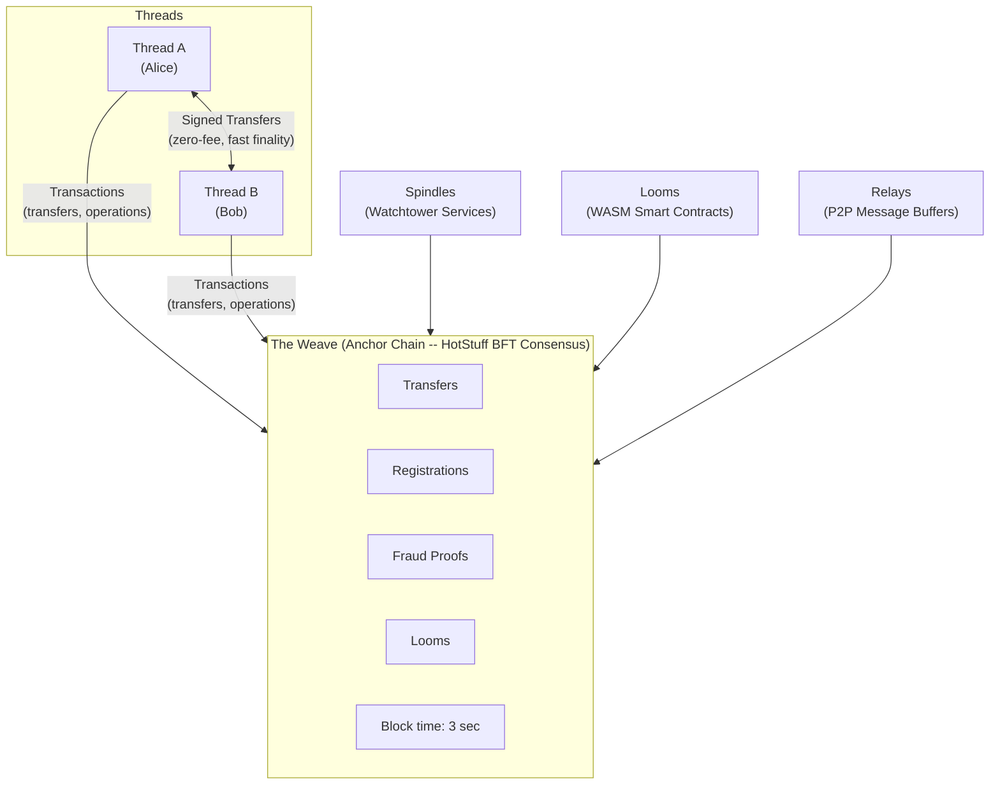
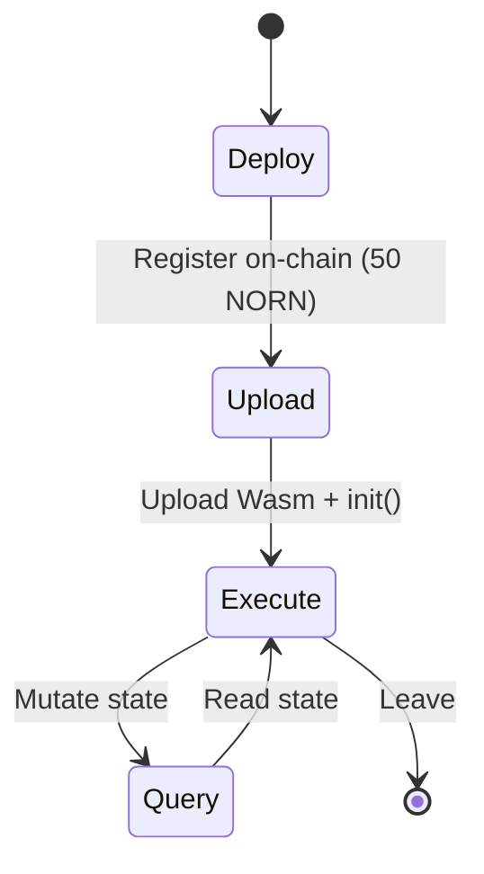

# The Norn Protocol

### A Radically Minimal Blockchain Where the Chain Just Watches

**Version 1.0 -- February 2026**

> *"Your thread. Your fate. The chain just watches."*

---

## Table of Contents

1. [Abstract](#1-abstract)
2. [Introduction -- The Problem with Current Blockchains](#2-introduction--the-problem-with-current-blockchains)
3. [Design Philosophy -- Thread-Centric State](#3-design-philosophy--thread-centric-state)
4. [Protocol Architecture](#4-protocol-architecture)
5. [Token Economics](#5-token-economics)
6. [Consensus -- HotStuff BFT](#6-consensus--hotstuff-bft)
7. [Security Model](#7-security-model)
8. [Smart Contracts (Looms)](#8-smart-contracts-looms)
9. [Privacy Model](#9-privacy-model)
10. [Performance Analysis](#10-performance-analysis)
11. [Comparison with Existing Protocols](#11-comparison-with-existing-protocols)
12. [Technology Stack](#12-technology-stack)
13. [Wallet and Developer Experience](#13-wallet-and-developer-experience)
14. [Roadmap](#14-roadmap)
15. [References](#15-references)

---

## 1. Abstract

Norn is a thread-centric blockchain protocol that reimagines the relationship between users and the chain. Rather than treating accounts as entries in a global ledger, Norn gives every user a personal cryptographic chain with sovereign control. You hold the thread. Every account is a *Thread* -- a personal cryptographic chain that only you can sign. Your state is replicated across the network for availability, but only your signature can authorize changes. Transfers are signed by the sender and validated by the network. Clients can independently verify their balances using Merkle proofs against the on-chain state root. This architecture achieves what no existing protocol can deliver simultaneously: zero-fee transfers, fast finality in ~3 second blocks, lightweight full nodes with minimal storage requirements, and cryptographic state verification that lets clients prove their balances without trusting the node. For complex multi-party logic, WASM smart contracts called *Looms* provide WebAssembly-powered programmability with fraud proof guarantees. The result is a protocol where the chain is a lightweight validator and arbiter -- it validates state transitions and guarantees correctness, but only your key controls your state.

---

## 2. Introduction -- The Problem with Current Blockchains

### 2.1 The State of the Art

A decade and a half into the blockchain era, the industry faces a sobering reality: no production blockchain simultaneously delivers high throughput, low cost, strong decentralization, meaningful privacy, and accessible hardware requirements. Every existing protocol makes deep trade-offs.

**Bitcoin** pioneered decentralized consensus but processes roughly 7 transactions per second. Finality requires approximately 60 minutes (6 confirmations). Transaction fees during periods of demand regularly exceed $10-50. Running a full node requires over 550 GB of storage and growing. Bitcoin proved that decentralized money is possible; it did not prove that it is practical for everyday commerce.

**Ethereum** expanded the design space with general-purpose smart contracts but achieves only approximately 30 transactions per second on its base layer. Finality takes roughly 15 minutes. Gas fees fluctuate wildly, ranging from $0.50 during quiet periods to over $50 during congestion. The full chain state exceeds 1 TB. Layer-2 rollups improve throughput but introduce complexity, bridge risks, and fragmented liquidity.

**Solana** pushed throughput to approximately 5,000 transactions per second by aggressive hardware requirements and a novel proof-of-history mechanism. Sub-second finality is impressive. But Solana validators require data-center-grade hardware -- high-core-count CPUs, 256 GB or more of RAM, NVMe storage measured in terabytes -- making the network accessible only to well-funded operators. The chain state exceeds 100 TB. This is decentralization in name only; the validator set is constrained by economics to a narrow set of professional operators.

**The Lightning Network** improved Bitcoin's scalability through payment channels, achieving theoretically unlimited throughput between channel partners. But it introduced significant complexity: channel management, liquidity provisioning, routing failures, watchtower requirements, and the need for on-chain transactions to open and close channels. The user experience remains too complex for mainstream adoption.

### 2.2 The Fundamental Problem

These protocols differ enormously in their technical details, but they share a common architectural assumption: **all transactions must pass through global consensus**. Whether the consensus mechanism is proof-of-work, proof-of-stake, or proof-of-history, the bottleneck is the same. Every node in the network must see, validate, and store every transaction.

This is the equivalent of requiring every contract, every handshake, every exchange of value in an economy to be ratified by a parliament before it takes effect. It is not merely inefficient -- it is architecturally wrong.

Consider how value exchange works in the physical world. When Alice hands Bob a $20 bill for a cup of coffee, no central authority witnesses the transaction. The exchange is bilateral, private, and instant. The legal system (courts, police, regulators) exists as a backstop for disputes, not as a prerequisite for every exchange.

Norn applies this insight to digital value. The protocol separates state ownership from state validation. Each user has a personal cryptographic chain (a Thread) that only their private key can authorize changes to. The network replicates state for availability and validates every transition for correctness. The chain exists as a validator and arbiter: it guarantees correctness, resolves disputes, and anchors state -- but only your signature controls your money.

### 2.3 What Norn Delivers

By inverting the traditional blockchain architecture, Norn achieves properties that are impossible under the global-consensus model:

- **Zero-fee transfers.** Transfers carry no protocol fee. Only operations like name registration, token creation, and contract deployment carry a small fee.

- **Fast finality.** Transactions confirm in ~3 second blocks on the Weave. No probabilistic finality, no extended confirmation wait.

- **Lightweight full nodes.** Memory-bounded data structures and efficient state management keep resource requirements low. A full node starts under 2 GB of RAM.

- **State verification.** Clients can independently verify their balances using Merkle proofs against the on-chain state root. You don't need to trust the node -- you can prove your state cryptographically.

- **Thread-centric state ownership.** Each user's state lives in their own Thread -- a personal cryptographic chain. State is replicated across the network for availability, but only the owner's signature can authorize changes.

---

## 3. Design Philosophy -- Thread-Centric State

### 3.1 Six Principles

The Norn Protocol is built on six foundational principles that guide every design decision.

**Principle 1: Simplicity over cleverness.** The protocol avoids novel cryptographic constructions, untested consensus mechanisms, and clever optimizations that trade auditability for performance. Every component uses well-understood, battle-tested primitives: Ed25519 for signatures, BLAKE3 for hashing, HotStuff for consensus. Complexity is the enemy of security.

**Principle 2: User sovereignty.** Users own their state cryptographically. A Thread -- the complete history of a user's state transitions -- is replicated across the network for availability, but only the owner's Ed25519 signature can authorize changes. No validator, operator, or third party can freeze, censor, or modify a user's state without their cryptographic consent. The user's private key is the sole authority over their Thread.

**Principle 3: Minimal on-chain footprint.** The anchor chain (the Weave) is a lightweight validator. It validates state transitions, maintains a sparse Merkle tree of balances for state verification, and records transactions. Memory-bounded data structures keep the chain small, fast, and cheap to operate.

**Principle 4: Lightweight-first design.** Full nodes should run on resource-constrained devices. Decentralization is meaningless if participation requires expensive hardware. Every design decision is filtered through the question: "Can modest hardware handle this?"

**Principle 5: Progressive trust.** For small, frequent transactions between known parties, no chain interaction is needed at all. For larger or higher-risk transactions, users can demand on-chain commitments and Spindle monitoring. For complex multi-party interactions, Looms provide smart contract guarantees. Trust requirements scale with transaction importance, not with protocol mandate.

**Principle 6: Economic game theory over cryptographic complexity.** Rather than relying on complex zero-knowledge proofs or multi-party computation to enforce correctness, Norn uses economic incentives. Cheating is detectable and punishable. The expected cost of fraud (stake slashing, reputation loss) exceeds the expected gain. Honest behavior is the Nash equilibrium.

### 3.2 What Norn Is Not

Clarity about what Norn is *not* is as important as clarity about what it is.

**Norn is not a world computer.** It does not aspire to execute arbitrary programs on a globally replicated state machine in the manner of Ethereum's EVM. Norn's smart contracts (Looms) are WASM programs with fraud proof guarantees. The current implementation executes Looms on every validator; future optimistic execution modes will allow off-chain execution with on-chain dispute resolution.

**Norn is not a heavy-chain protocol.** While the Weave does contain full transaction data (transfers, token operations, contract deployments), memory-bounded data structures and efficient state management keep the chain lightweight compared to protocols like Ethereum or Solana.

**Norn is not a blockchain for speculation.** The protocol is designed for real economic activity: payments, commerce, contracts. The fee structure -- zero for transfers, minimal for chain commitments -- discourages the rent-seeking that dominates existing blockchains and encourages genuine use.

---

## 4. Protocol Architecture

Norn's architecture consists of six core components that work together to separate transaction execution from dispute resolution.



### 4.1 Threads -- Personal State Chains

A Thread is a user's personal state history. It is the foundational data structure of the Norn Protocol.

Every user has exactly one Thread, identified by a 20-byte address derived from the BLAKE3 hash of their Ed25519 public key. Thread state is replicated across the network for availability -- every validator maintains every thread's state. However, only the owner's Ed25519 signature can authorize changes, providing cryptographic sovereignty over state.

A Thread consists of two parts:

**The Thread Header** is a fixed-size (208 bytes) structure that summarizes the current state. It contains:

- `thread_id`: The 20-byte address identifying this Thread.
- `owner`: The 32-byte Ed25519 public key that controls this Thread.
- `version`: A monotonically increasing counter (u64) incremented with every state change.
- `state_hash`: A 32-byte BLAKE3 hash of the full Thread State.
- `last_knot_hash`: The hash of the most recent Knot applied to this Thread.
- `prev_header_hash`: The hash of the previously committed header, forming a hash chain.
- `timestamp`: Unix timestamp of the latest state change.
- `signature`: A 64-byte Ed25519 signature by the Thread owner over all preceding fields.

**The Thread State** is the full mutable state of the user's account:

- `balances`: A map of token identifiers to amounts (supporting the native NORN token and user-issued tokens).
- `assets`: A map of asset identifiers to opaque data (supporting NFTs and non-fungible items).
- `looms`: A map of Loom identifiers to Loom-specific participation data.
- `nonce`: A replay-protection counter, incremented with each Knot.

Thread state is maintained by validators and anchored on-chain via its BLAKE3 hash in the sparse Merkle tree. This enables lightweight state verification: clients can prove their balances using Merkle proofs against the on-chain state root without trusting any individual node.

### 4.2 Knots -- Atomic State Transitions

A Knot is the atomic unit of state change in Norn. It records a signed state transition that updates Thread state.

The term "Knot" evokes the tying together of Threads -- a deliberate metaphor. When Alice sends Bob 10 NORN, their Threads are knotted together: both Threads' states change atomically as the network validates and applies the transfer.

A Knot contains:

- `id`: A 32-byte unique identifier computed as `BLAKE3(all fields except signatures)`.
- `knot_type`: The category of operation -- `Transfer`, `MultiTransfer`, or `LoomInteraction`.
- `timestamp`: When the Knot was created.
- `expiry`: An optional expiration timestamp. If the Knot has not been submitted by this time, it is void.
- `before_states`: Each participant's Thread state snapshot *before* the Knot (thread ID, public key, version, state hash).
- `after_states`: Each participant's Thread state snapshot *after* the Knot.
- `payload`: The operation-specific data (transfer amount, token ID, sender, recipient, memo for transfers; Loom interaction details for Loom operations).
- `signatures`: Ed25519 signature from the sender.

**Finality is fast.** Once submitted, a Knot is validated by the network and included in the next block (~3 seconds). The sender's cryptographic signature authorizes the transfer; the network validates and applies it.

**Knot Types:**

| Type | Description | Participants |
|------|-------------|-------------|
| `Transfer` | Simple two-party token transfer with optional memo (up to 256 bytes) | 2 |
| `MultiTransfer` | Batch of up to 64 transfers in a single atomic operation | 2+ |
| `LoomInteraction` | Deposit into, withdraw from, or update state within a Loom | 2+ |

### 4.3 The Weave -- The Anchor Chain

The Weave is Norn's block chain: an ordered sequence of blocks containing validated transactions. It provides ordering, state anchoring, and dispute resolution.

A Weave Block contains:

- **Transfers**: Token transfers between threads (sender, recipient, amount, optional memo).
- **Token Operations**: Token definitions, mints, and burns for the NT-1 fungible token standard.
- **Name Registrations**: NornNames registrations, mapping human-readable names to addresses.
- **Loom Deploys**: Smart contract deployments and their associated metadata.
- **Fraud Proofs**: Evidence of protocol violations (double-signing, stale commits, invalid Loom transitions), submitted by anyone.
- **Merkle Roots**: Separate Merkle roots for different transaction types, enabling lightweight verification.

The Weave produces a new block every 3 seconds. Blocks are proposed and validated by a set of validators running HotStuff BFT consensus.

### 4.4 Looms -- WASM Smart Contracts

Looms are Norn's answer to smart contracts.

A Loom is a WebAssembly (Wasm) program with fraud proof guarantees. The metaphor extends the textile theme: if Threads are individual strands of state and Knots tie them together, then Looms are the structures on which complex, multi-party patterns are woven.

In the current implementation, Looms execute on every validator during block processing -- every node downloads the WASM bytecode and re-executes every state transition. Fraud proof infrastructure exists (types, validation logic, and Spindle watchtowers) to support a future optimistic execution mode where Looms could execute off-chain with on-chain dispute resolution.

**How Looms work:**

1. **Deployment.** An operator deploys a Loom by registering its configuration on-chain (costs 50 NORN, burned). The deployment is included in a WeaveBlock and propagated to all nodes.
2. **Upload.** The operator uploads Wasm bytecode to the node, which initializes the contract by calling `init()`.
3. **Execute.** Participants submit inputs via RPC. The node executes the Wasm code, producing state transitions that are applied to the Loom's key-value state.
4. **Query.** Anyone can perform read-only queries against the Loom's current state without modifying it.
5. **Join/Leave.** Users can join or leave a Loom as participants.

**Fraud proof guarantee:** Because the Loom's Wasm bytecode and its input/output history are deterministic, any participant can challenge a disputed state transition by re-executing the code with the same inputs. If the re-execution produces a different state hash, the operator is proven fraudulent and slashed. This infrastructure is built and tested, designed for future optimistic execution modes.

**Example applications:**

- **Escrow services**: Time-locked token release with multi-party approval.
- **Automated Market Makers (AMMs)**: Decentralized token exchange with constant-product formulas.
- **Lending protocols**: Collateralized lending with liquidation logic.
- **Gaming**: Turn-based or state-channel games with verifiable outcomes.
- **DAOs**: Multi-signature governance with proposal and voting logic.
- **Token issuance**: Custom tokens with programmable supply, vesting, and distribution rules.

### 4.5 Spindles -- Watchtower Services

Spindles are watchtower services that monitor the network for invalid operations. The name continues the textile metaphor: a spindle holds and guards thread.

A Spindle monitors the Weave, watching for:

- **Double-signing**: A thread owner creating two conflicting knots at the same version number.
- **Stale commits**: A thread owner committing outdated state that omits recent transactions.
- **Invalid Loom transitions**: An operator posting a state transition that doesn't match deterministic re-execution.

When a Spindle detects suspicious activity, it constructs and submits the appropriate fraud proof to the Weave, protecting network integrity.

Spindles are economically incentivized through fraud proof bounties: a portion of the slashed stake from a proven cheater is awarded to the Spindle that submitted the proof.

Spindles operate with rate limiting to prevent abuse and are registered on the network through signed registration messages, making their availability discoverable through the relay network.

### 4.6 Relays -- P2P Message Buffers

Relays are the networking backbone of the Norn Protocol, providing asynchronous message delivery between Threads via the libp2p protocol stack.

Relays handle block propagation, state synchronization, and peer discovery. When a node produces a block, relays distribute it across the network. They also facilitate initial state sync for new nodes joining the network.

Relays handle:

- **Transaction propagation**: Broadcasting signed transactions to the network for inclusion in blocks.
- **Block propagation**: New Weave blocks are broadcast to all connected peers.
- **Consensus messages**: HotStuff protocol messages between validators.
- **Spindle alerts**: Notifications of suspicious activity.
- **State sync**: New nodes request missing blocks from peers via `StateRequest`/`StateResponse` messages, enabling rapid catch-up to the current chain tip.
- **Discovery**: Peer discovery via Kademlia DHT, with GossipSub for topic-based message propagation.

The relay layer is designed for QUIC transport, providing multiplexed, encrypted connections with low latency and NAT traversal capabilities. The current implementation uses TCP via libp2p; QUIC transport is planned for a future release. Nodes interact with the relay through a `RelayHandle` -- a cloneable channel-based interface that allows any component (RPC server, consensus engine, block producer) to broadcast messages to the P2P network without direct access to the libp2p swarm.

---

## 5. Token Economics

### 5.1 The NORN Token

The native token of the Norn Protocol is **NORN**. The smallest indivisible unit is the **nit**, with 1 NORN equal to 10^12 nits (twelve decimal places of precision).

Amounts are represented internally as unsigned 128-bit integers (`u128`), providing a range sufficient to represent up to 1 billion NORN with full nit-level precision without overflow.

| Parameter | Value |
|-----------|-------|
| Token name | NORN |
| Base unit | nit |
| Decimals | 12 |
| 1 NORN | 1,000,000,000,000 nits (10^12) |
| Maximum supply | 1,000,000,000 NORN (1 billion) |
| Internal representation | u128 |

The native token is identified by a special 32-byte zero identifier (`[0x00; 32]`), distinguishing it from user-issued tokens which carry unique 32-byte hashes.

### 5.2 Fee Structure

Norn's fee model is radically different from existing blockchains.

**Transfers are free.** Transfers incur zero protocol fees. There is no gas, no base fee, no tip. Alice can send Bob 10 NORN at zero cost. This is possible because the chain's validation overhead for transfers is minimal -- it validates the signature, checks the balance, and updates the state.

**Certain operations carry fees.** Operations that create persistent on-chain state carry fees:

| Operation | Fee | Destination |
|-----------|-----|-------------|
| Name registration | 1 NORN | Burned |
| Token creation | 10 NORN | Burned |
| Loom deployment | 50 NORN | Burned |

These fees serve as anti-spam measures and contribute to deflationary tokenomics. A dynamic fee mechanism inspired by Ethereum's EIP-1559 adjusts the base fee based on chain utilization:

- If block utilization exceeds 50%: the fee multiplier increases by 12.5%.
- If block utilization is below 50%: the fee multiplier decreases by 12.5%.
- The multiplier is clamped between 0.1x and 10x.

This creates a self-regulating fee market that discourages spam during high demand while keeping costs minimal during normal operation.

### 5.3 Validator Rewards

Validators earn revenue from fees collected in each block (name registrations, token creations, loom deployments). There is **no block reward inflation** -- the NORN supply is fixed at genesis. This makes the token model inherently deflationary since fees are burned rather than redistributed.

Fraud proof bounties provide an additional revenue stream: when a fraud proof is accepted and a cheater's stake is slashed, a portion of the slashed amount is awarded to the submitter. This creates a vigilant ecosystem of Spindles and watchers actively monitoring for misbehavior.

### 5.4 Staking

Three categories of actors stake NORN to participate in the protocol:

**Validators** stake NORN to participate in HotStuff consensus and propose/validate Weave blocks. A minimum stake is required (configurable via genesis parameters). Validators are selected in proportion to their stake, and they earn a share of commitment fees. Misbehavior (double-signing, extended downtime, censorship, proposing invalid blocks) results in stake slashing. Unstaking is subject to a bonding period, during which the stake remains locked and slashable.

**Loom Operators** stake NORN as a bond against fraudulent state transitions. If a Loom operator posts an invalid state, their stake is slashed and distributed to the challenger and the affected participants.

**Spindle Operators** stake NORN to register as watchtowers. This prevents Sybil attacks on the Spindle network and provides economic accountability for Spindle services.

### 5.5 NornNames -- Consensus-Level Name Registry

NornNames is Norn's native name system, allowing users to register human-readable names (e.g., `alice`, `my-wallet`) that map to their address. Name registration costs 1 NORN, which is **burned** (removed from circulation), making it a deflationary mechanism. Names are:

- 3--32 characters long, lowercase alphanumeric with hyphens (no leading/trailing hyphens).
- Globally unique and first-come, first-served.
- **Consensus-level**: registrations are included in `WeaveBlock`s with a dedicated Merkle root (`name_registrations_root`), propagated via P2P gossip, and applied to state on every node when blocks are processed. This ensures names are globally consistent across the network without relying on local-only state.
- Resolvable in wallet transfer commands: `norn wallet transfer --to alice --amount 10` resolves `alice` to its registered address automatically.

This provides a user-friendly identity layer without requiring an external name service or smart contract.

### 5.5a NT-1 Fungible Token Standard

Norn supports protocol-level custom fungible tokens via the **NT-1** standard. Anyone can create a new token by submitting a `TokenDefinition` to the network and paying a 10 NORN creation fee (burned). Token operations are consensus-level:

- **Create:** Define a token with name, symbol, decimals, max supply, and optional initial supply. The token ID is deterministically computed as `BLAKE3(creator || name || symbol || decimals || max_supply || timestamp)`. Symbol uniqueness is enforced at the consensus level.
- **Mint:** The token creator (and only the creator) can mint new tokens to any address, up to the declared max supply (0 = unlimited).
- **Burn:** Any token holder can burn their own tokens, permanently reducing the token's circulating supply.

Token definitions, mints, and burns are included in `WeaveBlock`s with dedicated Merkle roots, propagated via P2P gossip, and applied to state on every node. This ensures token state is globally consistent without relying on smart contracts.

The wallet CLI supports token operations: `create-token`, `mint-token`, `burn-token`, `token-info`, `list-tokens`, `token-balances`. Tokens can be referenced by symbol (e.g., `WBTC`) or hex token ID. Custom tokens work seamlessly with existing `balance` and `transfer` commands via the `--token` flag, which accepts symbols, `NORN`/`native`, or hex IDs.

### 5.6 Supply Distribution and Vesting

NORN has a fixed maximum supply of **1,000,000,000 NORN** (1 billion), enforced at the protocol level. The `credit()` function in the state manager rejects any operation that would push the total circulating supply above this cap. There is no inflation mechanism -- all NORN in existence is either allocated at genesis or earned from existing fee pools.

The genesis allocation distributes the supply across seven categories, each designed to align long-term incentives:

| Category | Allocation | Amount (NORN) | Vesting |
|---|---|---|---|
| Founder & Core Team | 15% | 150,000,000 | 4-year linear, 1-year cliff |
| Ecosystem Development | 20% | 200,000,000 | Controlled release over 5 years |
| Validator Rewards | 30% | 300,000,000 | Block rewards over 10+ years |
| Community & Grants | 15% | 150,000,000 | Governance-controlled |
| Treasury Reserve | 10% | 100,000,000 | DAO-governed after decentralization |
| Initial Liquidity | 5% | 50,000,000 | Available at launch |
| Testnet Participants | 5% | 50,000,000 | Airdrop at mainnet launch |

**Vesting rationale.** The founder allocation's 4-year linear vesting with a 1-year cliff ensures sustained alignment with the protocol's long-term success. No founder tokens are accessible in the first year, and thereafter tokens unlock gradually over the remaining three years. The ecosystem fund releases over five years, providing sustained resources for developer grants, partnerships, and infrastructure without creating sell pressure.

**Deflationary mechanics.** Three mechanisms reduce the circulating supply over time:

1. **NornNames burn.** Each name registration permanently burns 1 NORN, creating deflationary pressure proportional to network adoption.
2. **Token creation burn.** Each NT-1 token creation permanently burns 10 NORN, creating a meaningful cost for token issuance and further reducing supply.
3. **Validator fee redistribution.** Commitment fees collected each epoch are redistributed to validators proportional to their stake, rewarding network participants while maintaining deflationary pressure from name and token burns above.

Because there is no block reward inflation and the supply cap is enforced at the protocol level, NORN's supply can only decrease over time through burn mechanisms. This makes the token model structurally deflationary.

**Genesis allocation processing.** At node startup, if the state is fresh (block height 0) and a genesis configuration file specifies allocations, the node processes each allocation by crediting the specified amount to the target address. This is the only mechanism by which new supply enters circulation -- all subsequent token movement occurs through transfers, staking, and fee distribution within the fixed supply.

---

## 6. Consensus -- HotStuff BFT

### 6.1 Why HotStuff

Norn uses HotStuff BFT (Byzantine Fault Tolerant) consensus for the Weave. The choice is deliberate and reflects Norn's design principles:

- **Simplicity.** HotStuff's three-phase protocol is among the simplest BFT consensus algorithms, making it auditable and less prone to implementation bugs than more complex alternatives.
- **Proven correctness.** HotStuff has formal safety and liveness proofs published in peer-reviewed academic literature (Yin et al., 2019).
- **Linear message complexity.** Each phase requires O(n) messages (where n is the validator count), compared to O(n^2) for PBFT. This makes it practical for larger validator sets.
- **Pipeline-friendly.** HotStuff's phases can be pipelined: while one block is in the Commit phase, the next can already be in Prepare. This maximizes throughput without sacrificing safety.

### 6.2 Three-Phase Protocol

HotStuff operates in a sequence of *views*, each led by a designated leader (selected by Delegated Proof-of-Stake weighted by validator stake). Each view progresses through three phases:

**Phase 1: Prepare.** The leader proposes a new block, bundling pending commitments, registrations, fraud proofs, and Loom anchors from the mempool. The proposal includes a justification -- a Quorum Certificate (QC) from the previous round. Validators verify the block and send signed `PrepareVote` messages to the leader.

**Phase 2: PreCommit.** Upon collecting 2f+1 PrepareVotes (where f is the maximum number of Byzantine faults), the leader forms a Prepare QC and broadcasts it. Validators verify the QC and respond with `PreCommitVote` messages. At this point, the block is *locked* -- honest validators will not vote for a conflicting block in this view.

**Phase 3: Commit.** Upon collecting 2f+1 PreCommitVotes, the leader forms a PreCommit QC and broadcasts it. Validators verify and respond with `CommitVote` messages. Upon collecting 2f+1 CommitVotes, the block is finalized and appended to the Weave.

**Quorum Certificates** are the core proof artifacts. A QC for a given phase contains the view number, block hash, phase identifier, and the 2f+1 votes that form the quorum. QCs serve as transferable, cryptographically verifiable proofs of consensus progress.

### 6.3 View Change and Liveness

If a leader fails (crashes, is malicious, or is unreachable), validators detect the timeout and initiate a view change:

1. Each validator broadcasts a `TimeoutVote` containing the timed-out view number and the highest QC it knows about.
2. Upon collecting 2f+1 timeout votes, the new leader (the next in the rotation) forms a `ViewChangeProof` and proposes a new block in the new view, carrying forward the highest QC from any timeout voter.

This mechanism ensures liveness: the protocol continues making progress as long as 2f+1 validators are honest and connected, even if up to f validators are Byzantine.

### 6.4 Validator Selection

Validators are selected through Delegated Proof of Stake. Any account holder can stake NORN to become a validator, provided they meet the minimum stake threshold (configurable at genesis). The active validator set is sorted by stake in descending order, and leader rotation follows this ordering.

**Validator requirements are minimal by design.** Memory-bounded data structures and efficient state management keep resource requirements low. A full validator node starts under 2 GB of RAM. As the network grows and the number of accounts increases, resource requirements will scale accordingly, but the architecture is designed to remain lightweight relative to comparable protocols.

### 6.5 Finality

- **Transaction finality**: ~3 seconds. Once a transaction is included in a block, it is applied to state.
- **Deep finality**: 10 blocks at 3-second block time = **30 seconds**. After this depth, a block is considered irreversible.

### 6.6 Slashing Conditions

| Violation | Penalty | Detection |
|-----------|---------|-----------|
| Double-signing (signing two conflicting blocks in the same view) | 100% of stake | Any node can submit the two conflicting signatures |
| Extended downtime (missing too many consecutive rounds) | Configurable (set at genesis) | Tracked by the consensus protocol |
| Censorship (systematically excluding valid commitments) | Configurable (set at genesis) | Statistical analysis of block contents |
| Invalid block proposal (proposing a block with invalid state transitions) | Configurable (set at genesis) | Re-execution by any validator |

All slashing parameters are configurable through the genesis configuration, allowing the network to adjust penalties as it matures.

---

## 7. Security Model

### 7.1 Fraud Proofs as the Security Backbone

Norn's security rests on a simple principle: **cheating must be detectable and punishable**. Rather than preventing fraud through consensus over every transaction (expensive and slow), Norn detects fraud after the fact through cryptographic proofs and punishes it through economic penalties.

Three types of fraud proofs are supported:

**DoubleKnot.** A Thread owner creates two conflicting Knots at the same version number -- for example, sending the same tokens to two different recipients. Anyone who possesses both Knots can submit them as a fraud proof. The proof is trivially verifiable: if both Knots share the same Thread ID and version but differ in content, fraud is proven.

**StaleCommit.** A Thread owner commits an outdated state to the Weave, omitting recent Knots -- effectively trying to "undo" transactions by committing a pre-transaction state. The proof includes the stale commitment header and the Knots that should have been included. Verification checks that the commitment's version is behind the known state.

**InvalidLoomTransition.** A Loom operator posts a state transition that does not match the deterministic re-execution of the Wasm bytecode. The challenger provides the initial state, inputs, and bytecode; the Weave re-executes the code and compares the result to the claimed output hash.

### 7.2 Challenge Period

All fraud proofs must be submitted within a **24-hour challenge period** following a commitment or Loom state anchor. This window is unified for both Thread commitments and Loom anchors, simplifying the security model.

The 24-hour window is chosen as a balance between security (giving honest parties sufficient time to detect and respond to fraud) and usability (limiting how long third parties must wait before treating a commitment as final for high-value interactions).

For everyday transfers, finality is fast (~3 second blocks). The challenge period applies to on-chain commitments and Loom anchors, affecting scenarios where third parties rely on the committed state.

### 7.3 Game-Theoretic Security

Norn's security ultimately rests on a game-theoretic argument: the expected loss from cheating exceeds the expected gain.

Consider a double-spend attempt. Alice creates two Knots at version N: one sending 100 NORN to Bob, another sending 100 NORN to Carol. To succeed, Alice must:

1. Ensure neither Bob nor Carol (nor their Spindles) detects the conflicting Knot within 24 hours.
2. Commit the favorable state to the Weave before a fraud proof is submitted.
3. Avoid any Spindle in the network observing both Knots.

The probability of success decreases exponentially with the number of watchers. If even one honest Spindle observes both Knots, it submits a DoubleKnot fraud proof, and Alice's committed state is invalidated and her bond is slashed.

The expected payoff for cheating is:

```
E[cheat] = P(success) * gain - P(failure) * (stake_slashed + reputation_loss)
```

For any non-trivial value of slashed stake and any reasonable density of Spindles, `E[cheat] < 0`. Honest behavior is the dominant strategy.

### 7.4 Attack Analysis

| Attack Vector | Mitigation | Severity |
|---------------|-----------|----------|
| **Double-spend** | DoubleKnot fraud proof; Spindle monitoring; economic penalty exceeds gain | High (but detectable) |
| **State withholding** | Users maintain their own Thread state; Spindles hold backup copies; unilateral exits from Looms | Medium |
| **Stale commitment** | StaleCommit fraud proof; Spindle monitoring with 24-hour challenge window | Medium |
| **Relay censorship** | Multiple independent relays; libp2p peer discovery via DHT; users can self-host relays | Low |
| **Loom operator cheating** | InvalidLoomTransition fraud proof; deterministic re-execution; operator stake slashing | High (but provable) |
| **Loom operator disappearance** | Unilateral exit via last anchored state; challenge period withdrawal | Medium |
| **Validator collusion** | Requires >1/3 of total stake; slashing for double-signing; social recovery via hard fork for extreme cases | Critical threshold: 33% |
| **Long-range attack** | Finality depth of 10 blocks; checkpointing; social consensus | Low |
| **Eclipse attack** | Diverse peer connections via Kademlia DHT; multiple relay connections per Spindle (up to 50) | Medium |
| **Sybil attack** | Stake requirements for validators, Loom operators, and Spindles | Low |
| **Dust attack** | Maximum 1,000 uncommitted Knots per Thread; minimum fraud proof stake of 1 NORN | Low |

### 7.5 Security Assumptions

The protocol's security relies on the following cryptographic and operational assumptions:

1. **Ed25519 is secure.** The Elliptic Curve Digital Signature Algorithm over Curve25519 resists existential forgery under chosen-message attacks. (RFC 8032)
2. **BLAKE3 is collision-resistant.** It is computationally infeasible to find two distinct inputs that produce the same 256-bit hash. (O'Connor et al., 2020)
3. **Honest supermajority of validators.** At least 2/3 of total validator stake is controlled by honest participants. This is the standard BFT assumption.
4. **Timely fraud proof submission.** At least one honest party (the user or their Spindle) is online and able to submit fraud proofs within the 24-hour challenge window.

---

## 8. Smart Contracts (Looms)

### 8.1 WASM Execution with Fraud Proof Guarantees

Looms are WASM smart contracts that currently execute on every validator during block processing. Fraud proof infrastructure exists to support a future optimistic execution mode.

**Current model:** Every validator downloads the WASM bytecode and re-executes every state transition during block processing. This provides strong consistency guarantees -- all validators agree on the resulting state.

**Future optimistic model:** The fraud proof types, validation logic, and Spindle watchtower infrastructure are built and tested, designed for a future mode where Looms execute on a single operator's machine with on-chain challenge capability. This model, inspired by optimistic rollups, would provide:

- **Scalability.** Execution happens once (on the operator's machine), not on every validator.
- **Privacy.** Only the operator and participants see the inputs and state.
- **Security.** If the operator cheats, anyone can prove it by re-executing the code deterministically.

**Properties shared by both models:**

- **Flexibility.** Any computation expressible in WebAssembly can be a Loom. There is no EVM-specific language or instruction set limitation.
- **Determinism.** Given the same bytecode, initial state, and inputs, execution always produces the same output. This is essential for fraud proof verification.

### 8.2 WebAssembly Runtime

Looms run in a sandboxed WebAssembly environment powered by the **wasmtime** runtime. Key characteristics:

- **Deterministic execution.** Given the same bytecode, initial state, and inputs, execution always produces the same output. This is essential for fraud proof verification.
- **Gas metering.** Execution is metered using wasmtime's fuel mechanism. Each Wasm instruction consumes 1 unit of gas. State reads cost 100 gas plus 1 gas per byte. State writes cost 200 gas plus 2 gas per byte. Token transfers cost 500 gas. Logging costs 50 gas. The default gas limit is 10,000,000 per execution.
- **Memory limits.** Wasm modules are limited to 16 MB of memory, preventing resource exhaustion attacks.
- **No non-deterministic operations.** Floating-point operations, system calls, and random number generation are not available in the sandboxed environment, ensuring reproducibility.

| Gas Operation | Cost |
|---------------|------|
| Wasm instruction | 1 |
| State read | 100 + 1/byte |
| State write | 200 + 2/byte |
| Token transfer | 500 |
| Log emission | 50 |
| Default gas limit | 10,000,000 |

### 8.3 Host Functions

Loom contracts interact with the Norn Protocol through a set of host functions exposed in the `norn` namespace:

| Function | Signature | Description |
|----------|-----------|-------------|
| `norn_log` | `(msg_ptr, msg_len) -> ()` | Emit a log message for debugging and auditing. |
| `norn_state_get` | `(key_ptr, key_len, out_ptr, out_max_len) -> i32` | Read a value from the Loom's key-value state. Returns value length, -1 if not found, -2 if buffer too small. |
| `norn_state_set` | `(key_ptr, key_len, val_ptr, val_len) -> ()` | Write a value to the Loom's key-value state. |
| `norn_transfer` | `(from_ptr, to_ptr, token_ptr, amount) -> ()` | Queue a token transfer. The `from` address must match the contract caller (enforcing authorization). |
| `norn_sender` | `(out_ptr) -> ()` | Write the 20-byte address of the current caller to memory. |
| `norn_block_height` | `() -> i64` | Return the current Weave block height. |
| `norn_timestamp` | `() -> i64` | Return the current block timestamp (Unix seconds). |

### 8.4 Loom Lifecycle



1. **Deploy**: Operator registers Loom on-chain by submitting a `LoomRegistration` (costs 50 NORN, burned). The deployment is included in a WeaveBlock.
2. **Upload**: Operator uploads Wasm bytecode to the node, which initializes the contract by calling `init()`.
3. **Execute**: Participants submit inputs via RPC. The node executes the Wasm code, producing state transitions applied to the Loom's key-value state.
4. **Query**: Anyone can perform read-only queries against the Loom's current state.
5. **Join/Leave**: Users can join or leave a Loom as participants.

### 8.5 Dispute Resolution

When a participant suspects an operator of posting an invalid state transition, the dispute resolution process is:

1. **Challenge.** The challenger submits a `LoomChallenge` to the Weave, identifying the disputed transition and providing the initial state, inputs, and their public key.
2. **Re-execution.** The Weave (or any verifier) re-executes the Wasm bytecode with the provided initial state and inputs using the same deterministic runtime.
3. **Comparison.** If the re-execution produces a different state hash than the operator claimed, the transition is proven invalid.
4. **Penalty.** The operator's stake is slashed. The challenger receives a bounty.

This mechanism works because WebAssembly execution is fully deterministic: the same bytecode, the same initial state, and the same inputs will always produce the same output on any compliant Wasm runtime.

---

## 9. Privacy Model

### 9.1 Privacy Characteristics

Norn's privacy model is similar to other transparent blockchains: the network validates transfers and maintains state, so transfer details (sender, recipient, amount) are visible to nodes and stored in blocks.

**Thread-centric state.** Balances are stored per-thread rather than in a global account tree. State proofs allow clients to verify their own balances without exposing others' state.

| What the Weave stores permanently | What requires direct queries |
|-----------------------------------|--------------------------------|
| Transfers (sender, recipient, amount) | Individual balance lookups |
| Block headers and state roots | Aggregate account analytics |
| Token operations and name registrations | |
| Fraud proof evidence | |

### 9.2 Privacy Comparison

| Privacy Property | Bitcoin | Ethereum | Solana | Norn |
|-----------------|---------|----------|--------|------|
| Transfer details visible to nodes | Yes | Yes | Yes | Yes |
| Full tx history on-chain permanently | Yes | Yes | Yes | Yes |
| State verification without full sync | No | No | No | Yes (Merkle proofs) |
| Transaction graph analyzable | Yes | Yes | Yes | Yes |

### 9.3 Privacy Limitations and Future Enhancements

Norn's current privacy model has known limitations:

- **Commitment timing analysis.** An observer can see when commitments are made and potentially infer activity patterns.
- **Public key linkability.** Thread registrations link public keys to addresses. Repeated use of the same Thread is linkable.
- **Loom participant visibility.** Loom entry and exit operations are visible on-chain (though internal Loom interactions are not).

Future protocol enhancements under research:

- **Commitment blinding.** Randomized commitment timing and padding to mask activity patterns.
- **Stealth addresses.** One-time addresses derived from Diffie-Hellman key exchange, unlinking recipients from their public identities.
- **Private Looms.** Looms where participant entry and exit are shielded using cryptographic commitments.
- **Decoy commitments.** Dummy commitments submitted at random intervals to obscure real commitment patterns.

---

## 10. Performance Analysis

### 10.1 Transfer Throughput

Transfer throughput is bounded by the network's validation capacity. The node validates the sender's signature, checks the balance, updates both threads' state, and updates the sparse Merkle tree. On modern hardware, this takes approximately 100-200 microseconds per transfer, yielding a theoretical single-node maximum of approximately 5,000-10,000 transfers per second.

In practice, throughput is bounded by block time (3 seconds) and the number of transfers that can be included per block. The current implementation processes transfers submitted via RPC and includes them in the next block.

### 10.2 Weave Throughput

The Weave produces blocks every 3 seconds. Each block contains the full set of transactions (transfers, token operations, name registrations, contract deployments) submitted during that interval. Throughput is bounded by block size and validation capacity.

### 10.3 Finality Latency

| Operation | Finality Time |
|-----------|--------------|
| Transfer | **~3 seconds** (next block) |
| Deep finality | **30 seconds** (10 blocks x 3 seconds) |
| Fraud proof challenge window | **24 hours** (for dispute resolution) |

### 10.4 Resource Requirements

Norn's efficient state management translates to low hardware requirements at current network scale:

| Resource | Full Node (starting) |
|----------|---------------------|
| CPU | Any modern multi-core processor |
| RAM | ~2 GB (grows with number of accounts) |
| Storage | SQLite or RocksDB, grows with chain history |
| Bandwidth | 10 Mbps |

For comparison, an Ethereum full node requires 16+ GB of RAM and 2+ TB of SSD storage. A Solana validator requires 256+ GB of RAM and enterprise-grade NVMe storage. Norn's requirements are significantly lower, though they will scale with network growth. Memory-bounded data structures (block archive max 1,000, transfer log max 10K, dedup sets max 50K) help contain resource usage.

### 10.5 On-Chain State Size

The Weave's state consists primarily of:

- **Thread states**: Per-address state (balances, nonce, version) maintained in memory by every validator, with persistence to disk.
- **Merkle tree**: Sparse Merkle Tree with 32 bytes per leaf for state verification proofs.
- **Validator set**: A few kilobytes for the active validator list.
- **Fee state**: Negligible (a few hundred bytes).
- **Block headers**: Fixed-size headers with Merkle roots.

State grows linearly with the number of accounts. Memory-bounded collections (block archive capped at 1,000, transfer log at 10K) prevent unbounded growth in auxiliary data structures.

### 10.6 Transaction Cost

| Operation | Cost |
|-----------|------|
| Transfer | **$0.00** (free) |
| Name registration | 1 NORN (burned) |
| Token creation | 10 NORN (burned) |
| Loom deployment | 50 NORN (burned) |
| Loom execution/query | Free (gas metered but no fee) |

In practice, the cost of using Norn for everyday payments is effectively zero. Fees apply only to operations that create persistent on-chain state.

---

## 11. Comparison with Existing Protocols

| Property | Bitcoin | Ethereum | Solana | Lightning Network | Norn |
|----------|---------|----------|--------|-------------------|------|
| **Transfer TPS** | ~7 | ~30 | ~5,000 | ~1,000,000+ | **~5,000-10,000** |
| **Finality** | ~60 min | ~15 min | ~0.4 sec | Instant (channel) | **~3 sec** (block) |
| **Transfer cost** | $1-50 | $0.50-50 | $0.001 | ~$0 | **$0** |
| **Lightweight node** | No | No | No | Partial | **Yes** |
| **State verification** | Full node | Full node | Full node | N/A | **Merkle proofs** |
| **Smart contracts** | Limited (Script) | Yes (EVM) | Yes (SVM) | Limited (HTLCs) | **Yes (Wasm Looms)** |
| **Consensus** | PoW (Nakamoto) | PoS (Gasper) | PoS + PoH | N/A | **HotStuff BFT (DPoS)** |
| **Channel management** | N/A | N/A | N/A | Required (complex) | **Not required** |
| **Offline protection** | Full nodes | Full nodes | Full nodes | Watchtowers (limited) | **Spindles** |

### Key Differentiators

**Versus Bitcoin and Ethereum:** Norn achieves higher throughput and lower cost through its thread-centric architecture and zero-fee transfers. The lightweight validation model (signature check, balance check, state update) enables fast block processing.

**Versus Solana:** Norn achieves comparable performance without requiring data-center hardware. Solana's approach (faster global consensus) demands expensive infrastructure. Norn's lightweight design keeps hardware requirements accessible.

**Versus Lightning Network:** Norn eliminates the need for payment channels, channel funding transactions, routing, and channel rebalancing. Any two Norn users can transact directly by submitting transfers to the network. There is no routing problem and no channel management overhead.

---

## 12. Technology Stack

Norn is built entirely in Rust, chosen for its memory safety guarantees, high performance, and ability to compile to WebAssembly (enabling future browser and mobile SDK development).

### 12.1 Core Technologies

| Component | Technology | Purpose |
|-----------|-----------|---------|
| **Language** | Rust | Memory-safe systems programming; no garbage collector; compiles to native and Wasm |
| **Consensus** | HotStuff BFT | Custom Rust implementation with pipelined phases |
| **Networking** | libp2p | TCP transport (QUIC planned), GossipSub pubsub, Kademlia DHT, encrypted connections |
| **Smart Contracts** | WebAssembly (wasmtime) | Deterministic execution with fuel-based gas metering |
| **Serialization** | borsh | Binary Object Representation Serializer for Hashing -- deterministic, canonical, compact |
| **Hashing** | BLAKE3 | 256-bit cryptographic hash; faster than SHA-256 while maintaining security |
| **Signatures** | Ed25519 (ed25519-dalek) | Compact 64-byte signatures, 32-byte public keys; high performance |
| **Key Exchange** | X25519 | Elliptic curve Diffie-Hellman for encrypted relay communication |
| **Symmetric Encryption** | XChaCha20-Poly1305 | Authenticated encryption for wallet keystore and relay message encryption |
| **Key Derivation** | Argon2id | Memory-hard password hashing for wallet keystore encryption |
| **Validator Storage** | RocksDB | High-performance embedded key-value store for validator nodes |
| **Device Storage** | SQLite | Lightweight embedded database for resource-constrained nodes |
| **Merkle Trees** | Custom Sparse Merkle Tree | 32 bytes per leaf; efficient proof generation and verification |

### 12.2 Workspace Architecture

The codebase is organized as a Rust workspace with nine crates, each with a clearly defined responsibility:

```
norn-chain/
├── norn-types/       Shared type definitions (primitives, Thread, Knot, Weave, Loom,
│                     consensus, fraud proof, genesis, network message types)
│
├── norn-crypto/      Cryptographic operations (Ed25519 keys, BLAKE3 hashing,
│                     Merkle trees, BIP-39 seeds, SLIP-0010 HD derivation,
│                     address generation, XChaCha20 encryption)
│
├── norn-thread/      Thread management (Thread chain, Knot creation/validation,
│                     state management, version tracking)
│
├── norn-storage/     Storage abstraction (KvStore trait, memory backend,
│                     SQLite backend, RocksDB backend, Merkle store,
│                     Thread store, Weave store)
│
├── norn-relay/       P2P networking (libp2p behaviour, protocol codec,
│                     peer discovery, relay service, Spindle registry,
│                     peer management)
│
├── norn-weave/       Anchor chain (block production, commitment processing,
│                     HotStuff consensus engine, dynamic fees, fraud proof
│                     verification, leader election, mempool, registration
│                     processing, staking)
│
├── norn-loom/        Smart contract runtime (Wasm runtime, host functions,
│                     gas metering, Loom lifecycle management, dispute
│                     resolution, Loom state management, SDK)
│
├── norn-spindle/     Watchtower service (Weave monitoring, fraud proof
│                     construction, rate limiting, service orchestration)
│
└── norn-node/        Full node binary (CLI interface, node configuration,
                      genesis handling, JSON-RPC server, wallet CLI,
                      metrics, tooling)
```

This modular architecture ensures that each component can be tested, audited, and upgraded independently. The `norn-types` crate serves as the shared foundation, containing only data structures and no logic, preventing circular dependencies.

---

## 13. Wallet and Developer Experience

### 13.1 Wallet CLI

Norn ships with a full-featured command-line wallet supporting 24 subcommands for complete account management:

- **Key management**: Create, import (from seed phrase), list, and delete wallets.
- **Transfers**: Send NORN to any address or NornName with optional memo.
- **Thread management**: View Thread state, version history, and balance.
- **Weave interaction**: Submit commitments, query block status, view fee state.
- **NornNames**: Register human-readable names (e.g., `alice`), resolve names to addresses, and list owned names. Names can be used directly in transfer commands instead of hex addresses.
- **Backup and recovery**: Export seed phrases, encrypted keystore backup.

### 13.2 Encrypted Keystore

Private keys are never stored in plaintext. The wallet uses a two-layer encryption scheme:

1. **Key Derivation**: The user's password is processed through **Argon2id** (a memory-hard key derivation function resistant to GPU and ASIC brute-force attacks) to produce a 256-bit encryption key.
2. **Encryption**: The private key material is encrypted using **XChaCha20-Poly1305**, an authenticated encryption scheme that provides both confidentiality and integrity.

Keystore files are stored in `~/.norn/wallets/` with a versioned format (currently v2). The v2 format uses Argon2id KDF; the legacy v1 format used BLAKE3-based key derivation. The wallet automatically detects the keystore version and applies the correct KDF.

### 13.3 Key Generation and Recovery

- **BIP-39 Seed Phrases**: 24-word mnemonic phrases (256 bits of entropy) for human-readable backup and recovery.
- **SLIP-0010 HD Derivation**: Hierarchical Deterministic key derivation for Ed25519, enabling a single seed to generate multiple keypairs deterministically. The derivation path uses a Norn-specific coin type (`0x4E4F524E`, the hexadecimal encoding of "NORN").
- **Social Recovery (Planned)**: Shamir's Secret Sharing to split seed phrases across trusted contacts, enabling recovery without a single point of failure.

### 13.4 JSON-RPC API

The node exposes a JSON-RPC API for programmatic interaction, supporting:

- Thread state queries
- Commitment submission
- Block and transaction lookups
- Fee estimation
- Network status
- NornNames registration, resolution, and listing
- API key authentication for access control

### 13.5 Planned Developer Tools

| Tool | Status | Description |
|------|--------|-------------|
| TypeScript SDK | **Complete** | `@norn-protocol/sdk` -- wallet primitives, transaction builders, RPC client, WebSocket subscriptions |
| Block Explorer | **Complete** | Next.js 15 web app for browsing blocks, transactions, accounts, tokens, and contracts |
| Web Wallet | **Complete** | Passkey-secured browser wallet for managing NORN, tokens, names, and contracts |
| Wallet Extension | **Complete** | Chrome extension for sending/receiving NORN, managing accounts, and registering names |
| Loom SDK | **Complete** | `norn-sdk` crate -- `#[norn_contract]` proc macro, storage primitives, stdlib (Ownable, Pausable, Norn20) |
| WebSocket Subscriptions | **Complete** | Real-time event streaming for blocks, transfers, tokens, looms, and pending transactions |
| Mobile Wallet (Flutter) | Planned | Native mobile wallet with Rust FFI for cryptographic operations |

---

## 14. Roadmap

### 14.1 Completed Phases

The Norn Protocol has completed six development phases, representing a fully functional core implementation:

| Phase | Name | Status | Highlights |
|-------|------|--------|------------|
| **Phase 0** | Foundation | Complete | Ed25519 key management, BLAKE3 hashing, Thread/Knot types, borsh serialization, BIP-39 seeds, SLIP-0010 HD derivation |
| **Phase 1** | Networking | Complete | libp2p integration, TCP transport (QUIC planned), relay service, P2P Knot exchange, GossipSub, Kademlia DHT |
| **Phase 2** | Weave | Complete | HotStuff BFT consensus, block production, Sparse Merkle Tree, commitment processing, fraud proof verification, EIP-1559-style dynamic fees, DPoS staking with bonding periods and slashing |
| **Phase 3** | Loom Runtime | Complete | wasmtime integration, Wasm execution with fuel metering, host functions (state, transfers, context), Loom lifecycle (deploy, join, execute, anchor, leave), dispute resolution via re-execution |
| **Phase 4** | Spindle Service | Complete | Weave monitoring, fraud proof construction and submission, rate limiting, service orchestration |
| **Phase 5** | Node | Complete | Full node binary, JSON-RPC server, wallet CLI (24 subcommands), encrypted keystore (Argon2id + XChaCha20), genesis configuration and bootstrapping, metrics |
| **Phase 6** | Production Readiness | Complete | Comprehensive test suite (476+ tests including end-to-end, wallet, regression, name registry, and consensus/validation tests), code hardening, error handling improvements, Clippy compliance |

### 14.2 Next Milestones

| Milestone | Description | Target |
|-----------|-------------|--------|
| **Public Testnet** | Persistent multi-node testnet with real P2P networking, public faucet, and block explorer | H1 2026 |
| **Mobile Wallet** | Flutter-based mobile wallet with Rust FFI for key management and signing | H1 2026 |
| **WebSocket Support** | Real-time event subscriptions for commitments, blocks, and fraud proof alerts | H1 2026 |
| **Social Recovery** | Shamir's Secret Sharing for seed phrase distribution across trusted contacts | H2 2026 |
| **Security Audit #1** | Independent security audit of core cryptographic and consensus code | H2 2026 |
| **Security Audit #2** | Independent security audit of Loom runtime and fraud proof system | H2 2026 |
| **TypeScript SDK** | Wasm-compiled SDK for browser and Node.js developers | H2 2026 |
| **Loom Developer Toolkit** | SDK, CLI, and documentation for writing and deploying Loom contracts | H2 2026 |
| **Mainnet Launch** | Production launch with genesis validator set and initial token distribution | 2027 |

### 14.3 Long-Term Vision

The long-term vision for Norn extends beyond the core protocol:

- **Privacy enhancements**: Stealth addresses, commitment blinding, and private Looms to strengthen the default privacy model.
- **Cross-chain bridges**: Secure bridges to existing blockchains (Ethereum, Bitcoin) for asset portability.
- **Decentralized identity**: Thread-based identity with verifiable credentials and selective disclosure.
- **IoT integration**: Leveraging the lightweight-first design for Internet-of-Things microtransactions where device constraints make traditional blockchains impractical.
- **Formal verification**: Mathematical proof of core protocol properties (safety, liveness, economic security bounds).

---

## 15. References

1. **Yin, M., Malkhi, D., Reiter, M. K., Gueta, G. G., and Abraham, I.** "HotStuff: BFT Consensus with Linearity and Responsiveness." *Proceedings of the 2019 ACM Symposium on Principles of Distributed Computing (PODC)*, 2019. DOI: 10.1145/3293611.3331591

2. **Josefsson, S. and Liusvaara, I.** "Edwards-Curve Digital Signature Algorithm (EdDSA)." *RFC 8032*, Internet Engineering Task Force, January 2017. https://tools.ietf.org/html/rfc8032

3. **O'Connor, J., Aumasson, J.-P., Neves, S., and Wilcox-O'Hearn, Z.** "BLAKE3 -- one function, fast everywhere." 2020. https://github.com/BLAKE3-team/BLAKE3-specs/blob/master/blake3.pdf

4. **Palatinus, M., Rusnak, P., Voisine, A., and Bowe, S.** "Mnemonic code for generating deterministic keys." *BIP-39*, Bitcoin Improvement Proposals, 2013. https://github.com/bitcoin/bips/blob/master/bip-0039.mediawiki

5. **SatoshiLabs.** "Universal private key derivation from master private key." *SLIP-0010*, SatoshiLabs Improvement Proposals. https://github.com/satoshilabs/slips/blob/master/slip-0010.md

6. **Buterin, V., Conner, E., Dudley, R., Slipper, M., and Norden, I.** "Fee market change for ETH 1.0 chain." *EIP-1559*, Ethereum Improvement Proposals, April 2019. https://eips.ethereum.org/EIPS/eip-1559

7. **Protocol Labs.** "libp2p Specification." https://github.com/libp2p/specs

8. **W3C and ECMA International.** "WebAssembly Specification." https://webassembly.github.io/spec/

9. **Borsh Authors.** "Binary Object Representation Serializer for Hashing." https://borsh.io/

10. **Bernstein, D. J., Duif, N., Lange, T., Schwabe, P., and Yang, B.-Y.** "High-speed high-security signatures." *Journal of Cryptographic Engineering*, 2(2):77-89, 2012.

11. **Biryukov, A., Dinu, D., and Khovratovich, D.** "Argon2: new generation of memory-hard functions for password hashing and other applications." *2016 IEEE European Symposium on Security and Privacy (EuroS&P)*, 2016.

12. **Bernstein, D. J.** "The Poly1305-AES message-authentication code." *Fast Software Encryption (FSE)*, Springer, 2005.

---

*The Norn Protocol is open-source software. The complete implementation is available for review, audit, and contribution.*

*Your thread. Your fate. The chain just watches.*
