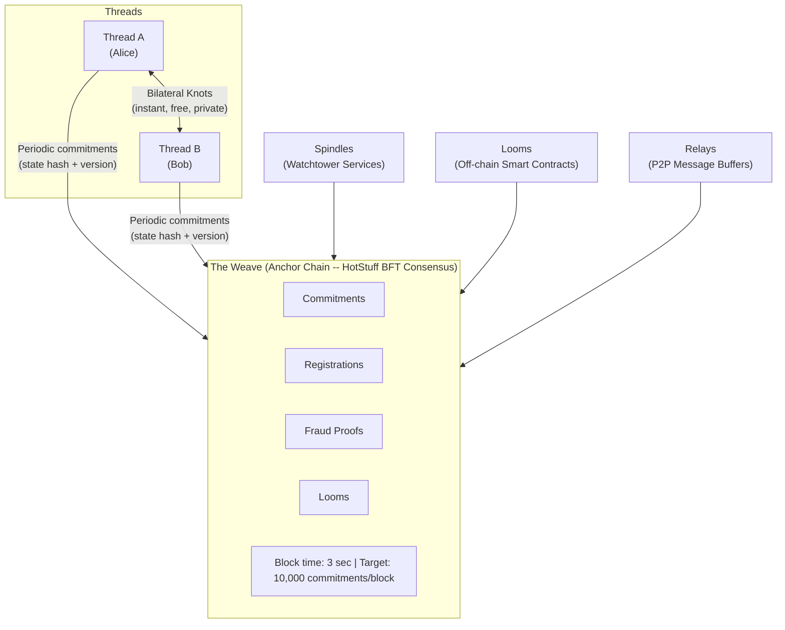
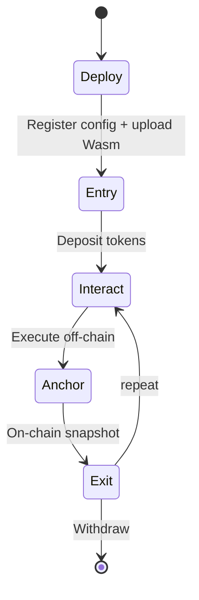

# The Norn Protocol

### A Radically Minimal Blockchain Where the Chain Just Watches

**Version 1.0 -- February 2026**

> *"Your thread. Your fate. The chain just watches."*

---

## Table of Contents

1. [Abstract](#1-abstract)
2. [Introduction -- The Problem with Current Blockchains](#2-introduction--the-problem-with-current-blockchains)
3. [Design Philosophy -- The Courtroom Model](#3-design-philosophy--the-courtroom-model)
4. [Protocol Architecture](#4-protocol-architecture)
5. [Token Economics](#5-token-economics)
6. [Consensus -- HotStuff BFT](#6-consensus--hotstuff-bft)
7. [Security Model](#7-security-model)
8. [Smart Contracts (Looms)](#8-smart-contracts-looms)
9. [Privacy Model](#9-privacy-model)
10. [Performance Analysis](#10-performance-analysis)
11. [Comparison with Existing Protocols](#11-comparison-with-existing-protocols)
12. [Technology Stack](#12-technology-stack)
13. [Wallet and Developer Experience](#13-wallet-and-developer-experience)
14. [Roadmap](#14-roadmap)
15. [References](#15-references)

---

## 1. Abstract

Norn is a radically minimal blockchain protocol that reimagines the relationship between users and the chain. Rather than forcing every transaction through global consensus -- the bottleneck that limits every existing blockchain -- Norn treats the chain as a **courtroom**, not a bank. Users transact directly with each other using cryptographic signatures, maintaining their own personal state histories called *Threads*. The chain intervenes only when there is a dispute, processing fraud proofs rather than transactions. This architectural inversion achieves what no existing protocol can deliver simultaneously: unlimited bilateral throughput that scales with user count rather than block size, phone-runnable full nodes with minimal storage requirements, zero-fee peer-to-peer transfers, privacy by default since the chain never sees transaction details, and instant bilateral finality the moment both parties sign. For complex multi-party logic, off-chain smart contracts called *Looms* provide WebAssembly-powered programmability with on-chain fraud proof guarantees. The result is a protocol where the vast majority of economic activity happens off-chain by design, with the anchor chain serving as a minimal, efficient arbiter of last resort.

---

## 2. Introduction -- The Problem with Current Blockchains

### 2.1 The State of the Art

A decade and a half into the blockchain era, the industry faces a sobering reality: no production blockchain simultaneously delivers high throughput, low cost, strong decentralization, meaningful privacy, and accessible hardware requirements. Every existing protocol makes deep trade-offs.

**Bitcoin** pioneered decentralized consensus but processes roughly 7 transactions per second. Finality requires approximately 60 minutes (6 confirmations). Transaction fees during periods of demand regularly exceed $10-50. Running a full node requires over 550 GB of storage and growing. Bitcoin proved that decentralized money is possible; it did not prove that it is practical for everyday commerce.

**Ethereum** expanded the design space with general-purpose smart contracts but achieves only approximately 30 transactions per second on its base layer. Finality takes roughly 15 minutes. Gas fees fluctuate wildly, ranging from $0.50 during quiet periods to over $50 during congestion. The full chain state exceeds 1 TB. Layer-2 rollups improve throughput but introduce complexity, bridge risks, and fragmented liquidity.

**Solana** pushed throughput to approximately 5,000 transactions per second by aggressive hardware requirements and a novel proof-of-history mechanism. Sub-second finality is impressive. But Solana validators require data-center-grade hardware -- high-core-count CPUs, 256 GB or more of RAM, NVMe storage measured in terabytes -- making the network accessible only to well-funded operators. The chain state exceeds 100 TB. This is decentralization in name only; the validator set is constrained by economics to a narrow set of professional operators.

**The Lightning Network** improved Bitcoin's scalability through payment channels, achieving theoretically unlimited throughput between channel partners. But it introduced significant complexity: channel management, liquidity provisioning, routing failures, watchtower requirements, and the need for on-chain transactions to open and close channels. The user experience remains too complex for mainstream adoption.

### 2.2 The Fundamental Problem

These protocols differ enormously in their technical details, but they share a common architectural assumption: **all transactions must pass through global consensus**. Whether the consensus mechanism is proof-of-work, proof-of-stake, or proof-of-history, the bottleneck is the same. Every node in the network must see, validate, and store every transaction.

This is the equivalent of requiring every contract, every handshake, every exchange of value in an economy to be ratified by a parliament before it takes effect. It is not merely inefficient -- it is architecturally wrong.

Consider how value exchange works in the physical world. When Alice hands Bob a $20 bill for a cup of coffee, no central authority witnesses the transaction. The exchange is bilateral, private, and instant. The legal system (courts, police, regulators) exists as a backstop for disputes, not as a prerequisite for every exchange.

Norn applies this insight to digital value. The protocol separates the act of transacting from the act of settling disputes. Users transact directly, bilaterally, with cryptographic signatures replacing physical handshakes. The chain exists as a court of last resort: a minimal, efficient mechanism for resolving the rare disputes that arise.

### 2.3 What Norn Delivers

By inverting the traditional blockchain architecture, Norn achieves properties that are impossible under the global-consensus model:

- **Unlimited bilateral throughput.** Two parties can exchange value as fast as they can sign messages. There is no block size limit, no gas auction, no mempool congestion. Throughput scales linearly with the number of user pairs, not with chain capacity.

- **Phone-runnable full nodes.** The anchor chain (the Weave) processes only commitments, registrations, and fraud proofs -- not raw transactions. This keeps the on-chain state minimal. A full node runs on a modern smartphone with 2 GB of RAM and 50 GB of storage.

- **Zero-fee peer-to-peer transfers.** Bilateral transactions (Knots) are exchanged directly between parties and incur no on-chain fee. Only periodic commitments to the anchor chain carry a small dynamic fee.

- **Privacy by default.** The chain never sees transaction details, balances, or counterparties. It sees only cryptographic commitments -- hashes of state. Bilateral transactions are known only to the participants.

- **Instant bilateral finality.** A transaction is final the moment all parties have signed the Knot. There is no confirmation time, no block wait, no probabilistic finality.

---

## 3. Design Philosophy -- The Courtroom Model

### 3.1 Six Principles

The Norn Protocol is built on six foundational principles that guide every design decision.

**Principle 1: Simplicity over cleverness.** The protocol avoids novel cryptographic constructions, untested consensus mechanisms, and clever optimizations that trade auditability for performance. Every component uses well-understood, battle-tested primitives: Ed25519 for signatures, BLAKE3 for hashing, HotStuff for consensus. Complexity is the enemy of security.

**Principle 2: User sovereignty.** Users own their state. A Thread -- the complete history of a user's state transitions -- is stored on the user's own device, not on a remote server. No validator, operator, or third party can freeze, censor, or modify a user's state without their cryptographic consent. The user's private key is the sole authority over their Thread.

**Principle 3: Minimal on-chain footprint.** The anchor chain (the Weave) should process the absolute minimum data necessary for security. It does not store balances. It does not execute transactions. It does not maintain a global state tree of every account. It stores only Merkle roots: compact 32-byte hashes that commit to off-chain state. This keeps the chain small, fast, and cheap to operate.

**Principle 4: Phone-first design.** If a full node cannot run on a modern smartphone, the protocol has failed. Decentralization is meaningless if participation requires expensive hardware. Every design decision is filtered through the question: "Can a phone handle this?"

**Principle 5: Progressive trust.** For small, frequent transactions between known parties, no chain interaction is needed at all. For larger or higher-risk transactions, users can demand on-chain commitments and Spindle monitoring. For complex multi-party interactions, Looms provide smart contract guarantees. Trust requirements scale with transaction importance, not with protocol mandate.

**Principle 6: Economic game theory over cryptographic complexity.** Rather than relying on complex zero-knowledge proofs or multi-party computation to enforce correctness, Norn uses economic incentives. Cheating is detectable and punishable. The expected cost of fraud (stake slashing, reputation loss) exceeds the expected gain. Honest behavior is the Nash equilibrium.

### 3.2 What Norn Is Not

Clarity about what Norn is *not* is as important as clarity about what it is.

**Norn is not a world computer.** It does not aspire to execute arbitrary programs on a globally replicated state machine. Ethereum's model of global computation is powerful but fundamentally unscalable. Norn's smart contracts (Looms) execute off-chain with on-chain fraud proof guarantees -- a deliberate trade-off of global composability for scalability and privacy.

**Norn is not a data availability layer.** The Weave does not store transaction data, blobs, or calldata. Off-chain data availability is the responsibility of the transacting parties and their Spindles (watchtowers). The chain stores only cryptographic commitments to state.

**Norn is not a blockchain for speculation.** The protocol is designed for real economic activity: payments, commerce, contracts. The fee structure -- zero for bilateral transfers, minimal for chain commitments -- discourages the rent-seeking that dominates existing blockchains and encourages genuine use.

---

## 4. Protocol Architecture

Norn's architecture consists of six core components that work together to separate transaction execution from dispute resolution.



### 4.1 Threads -- Personal State Chains

A Thread is a user's personal state history. It is the foundational data structure of the Norn Protocol.

Every user has exactly one Thread, identified by a 20-byte address derived from the BLAKE3 hash of their Ed25519 public key. The Thread is stored locally on the user's device -- their phone, laptop, or any hardware they control. It is never uploaded to the chain in its entirety.

A Thread consists of two parts:

**The Thread Header** is a fixed-size (208 bytes) structure that summarizes the current state. It contains:

- `thread_id`: The 20-byte address identifying this Thread.
- `owner`: The 32-byte Ed25519 public key that controls this Thread.
- `version`: A monotonically increasing counter (u64) incremented with every state change.
- `state_hash`: A 32-byte BLAKE3 hash of the full Thread State.
- `last_knot_hash`: The hash of the most recent Knot applied to this Thread.
- `prev_header_hash`: The hash of the previously committed header, forming a hash chain.
- `timestamp`: Unix timestamp of the latest state change.
- `signature`: A 64-byte Ed25519 signature by the Thread owner over all preceding fields.

**The Thread State** is the full mutable state of the user's account:

- `balances`: A map of token identifiers to amounts (supporting the native NORN token and user-issued tokens).
- `assets`: A map of asset identifiers to opaque data (supporting NFTs and non-fungible items).
- `looms`: A map of Loom identifiers to Loom-specific participation data.
- `nonce`: A replay-protection counter, incremented with each Knot.

The Thread State is never stored on-chain. Only its BLAKE3 hash appears in commitments to the Weave. This is the key insight that enables Norn's minimal chain footprint: the Weave verifies *that* a state exists (via its hash) without needing to know *what* the state contains.

### 4.2 Knots -- Atomic State Transitions

A Knot is the atomic unit of state change in Norn. It records a bilateral or multilateral agreement between Thread participants.

The term "Knot" evokes the tying together of Threads -- a deliberate metaphor. When Alice sends Bob 10 NORN, their Threads are temporarily knotted together: both Threads' states change atomically, and both parties sign the result.

A Knot contains:

- `id`: A 32-byte unique identifier computed as `BLAKE3(all fields except signatures)`.
- `knot_type`: The category of operation -- `Transfer`, `MultiTransfer`, or `LoomInteraction`.
- `timestamp`: When the Knot was created.
- `expiry`: An optional expiration timestamp (default: 1 hour). If the counterparty has not co-signed by this time, the Knot is void.
- `before_states`: Each participant's Thread state snapshot *before* the Knot (thread ID, public key, version, state hash).
- `after_states`: Each participant's Thread state snapshot *after* the Knot.
- `payload`: The operation-specific data (transfer amount, token ID, sender, recipient, memo for transfers; Loom interaction details for Loom operations).
- `signatures`: Ed25519 signatures from all participants, one per participant.

**Finality is instant.** Once all required parties have signed a Knot, the state transition is final. There is no block confirmation to wait for, no probabilistic finality window, no chain latency. The cryptographic signatures constitute irrevocable agreement.

**Knot Types:**

| Type | Description | Participants |
|------|-------------|-------------|
| `Transfer` | Simple two-party token transfer with optional memo (up to 256 bytes) | 2 |
| `MultiTransfer` | Batch of up to 64 transfers in a single atomic operation | 2+ |
| `LoomInteraction` | Deposit into, withdraw from, or update state within a Loom | 2+ |

### 4.3 The Weave -- The Anchor Chain

The Weave is Norn's anchor chain: a minimal blockchain that provides ordering, commitment anchoring, and dispute resolution. It is deliberately not a transaction processing chain. It is a *commitment* processing chain.

A Weave Block contains:

- **Commitment Updates**: Thread owners periodically submit a commitment -- a signed attestation of their current version and state hash -- to anchor their off-chain state on-chain. Up to 10,000 commitments per block.
- **Registrations**: New Thread registrations, establishing a public key's presence on the network.
- **Fraud Proofs**: Evidence of protocol violations (double-signing, stale commits, invalid Loom transitions), submitted by anyone.
- **Loom Anchors**: Periodic state snapshots from Loom operators, anchoring off-chain smart contract state.
- **Merkle Roots**: Separate Merkle roots for commitments, registrations, anchors, and fraud proofs -- enabling lightweight verification.

The Weave produces a new block every 3 seconds. Blocks are proposed and validated by a set of validators running HotStuff BFT consensus. After 10 blocks (30 seconds), a commitment achieves finality depth and is considered irreversible.

The critical insight is what the Weave does *not* contain: transaction details, token balances, counterparty information, or transfer amounts. The Weave sees only hashes and public keys. This is not a limitation but a feature -- it is the foundation of Norn's privacy model.

### 4.4 Looms -- Off-Chain Smart Contracts

Looms are Norn's answer to smart contracts, designed for the off-chain-first paradigm.

A Loom is a WebAssembly (Wasm) program that runs off-chain, facilitated by an operator, with on-chain fraud proof guarantees. The metaphor extends the textile theme: if Threads are individual strands of state and Knots tie them together, then Looms are the structures on which complex, multi-party patterns are woven.

**How Looms work:**

1. **Deployment.** An operator deploys a Loom by registering its configuration and Wasm bytecode. The bytecode hash is recorded on-chain for dispute resolution.
2. **Entry (Deposit).** Users join a Loom by creating a `LoomInteraction` Knot of type `Deposit`, locking tokens from their Thread into the Loom's custody.
3. **Interaction.** Participants interact with the Loom by submitting inputs to the operator, who executes the Wasm code and produces state transitions. Each transition records the before-state hash, after-state hash, inputs, and outputs.
4. **Anchoring.** The operator periodically anchors the Loom's state hash to the Weave, creating a public, verifiable checkpoint.
5. **Exit.** Users can exit cooperatively (the operator processes a withdrawal) or unilaterally (by submitting the last anchored state to the Weave and withdrawing after the challenge period).

**Fraud proof guarantee:** Because the Loom's Wasm bytecode and its input/output history are deterministic, any participant can challenge a disputed state transition by re-executing the code with the same inputs. If the re-execution produces a different state hash, the operator is proven fraudulent and slashed.

**Example applications:**

- **Escrow services**: Time-locked token release with multi-party approval.
- **Automated Market Makers (AMMs)**: Decentralized token exchange with constant-product formulas.
- **Lending protocols**: Collateralized lending with liquidation logic.
- **Gaming**: Turn-based or state-channel games with verifiable outcomes.
- **DAOs**: Multi-signature governance with proposal and voting logic.
- **Token issuance**: Custom tokens with programmable supply, vesting, and distribution rules.

### 4.5 Spindles -- Watchtower Services

Spindles are watchtower services that protect users when they are offline. The name continues the textile metaphor: a spindle holds and guards thread.

A Spindle monitors the Weave on behalf of its clients, watching for:

- **Fraudulent commitments**: A counterparty committing a stale or conflicting state to the Weave.
- **Loom operator misbehavior**: An operator posting an invalid state transition.
- **Missed challenge windows**: Ensuring that fraud proofs are submitted before the 24-hour challenge period expires.

When a Spindle detects suspicious activity, it constructs and submits the appropriate fraud proof to the Weave, protecting its client's interests even while the client's device is powered off.

Spindles are economically incentivized through fraud proof bounties: a portion of the slashed stake from a proven cheater is awarded to the Spindle that submitted the proof.

Spindles operate with rate limiting to prevent abuse and are registered on the network through signed registration messages, making their availability discoverable through the relay network.

### 4.6 Relays -- P2P Message Buffers

Relays are the networking backbone of the Norn Protocol, providing asynchronous message delivery between Threads via the libp2p protocol stack.

When Alice wants to send Bob a Knot, she does not need Bob to be online at that exact moment. She sends the Knot proposal to the relay network, which buffers the message until Bob comes online and retrieves it. Bob reviews the Knot, co-signs it if he agrees, and sends the response back through the relay.

Relays handle:

- **Knot proposals and responses**: The bilateral negotiation of state transitions.
- **Commitment broadcasts**: Propagation of commitment updates to the Weave.
- **Block propagation**: New Weave blocks are broadcast to all connected peers.
- **Consensus messages**: HotStuff protocol messages between validators.
- **Spindle alerts**: Notifications of suspicious activity.
- **State sync**: New nodes request missing blocks from peers via `StateRequest`/`StateResponse` messages, enabling rapid catch-up to the current chain tip.
- **Discovery**: Peer discovery via Kademlia DHT, with GossipSub for topic-based message propagation.

The relay layer uses QUIC for transport, providing multiplexed, encrypted connections with low latency and NAT traversal capabilities. Nodes interact with the relay through a `RelayHandle` -- a cloneable channel-based interface that allows any component (RPC server, consensus engine, block producer) to broadcast messages to the P2P network without direct access to the libp2p swarm.

---

## 5. Token Economics

### 5.1 The NORN Token

The native token of the Norn Protocol is **NORN**. The smallest indivisible unit is the **nit**, with 1 NORN equal to 10^12 nits (twelve decimal places of precision).

Amounts are represented internally as unsigned 128-bit integers (`u128`), providing a range sufficient to represent up to 1 billion NORN with full nit-level precision without overflow.

| Parameter | Value |
|-----------|-------|
| Token name | NORN |
| Base unit | nit |
| Decimals | 12 |
| 1 NORN | 1,000,000,000,000 nits (10^12) |
| Maximum supply | 1,000,000,000 NORN (1 billion) |
| Internal representation | u128 |

The native token is identified by a special 32-byte zero identifier (`[0x00; 32]`), distinguishing it from user-issued tokens which carry unique 32-byte hashes.

### 5.2 Fee Structure

Norn's fee model is radically different from existing blockchains because it reflects the protocol's architectural separation between off-chain transactions and on-chain commitments.

**Peer-to-peer transfers are free.** Bilateral Knots between two parties incur zero protocol fees. There is no gas, no base fee, no tip. Alice can send Bob 10 NORN, and the only cost is the computational effort to sign the Knot (negligible on any modern device). This is possible because bilateral Knots do not touch the chain -- they are purely off-chain.

**Weave commitments carry dynamic fees.** When a user commits their Thread state to the Weave, they pay a small fee that adjusts dynamically based on chain utilization. This fee mechanism is inspired by Ethereum's EIP-1559, adapted for Norn's commitment-based model:

```
fee = base_fee * fee_multiplier / 1000 * commitment_count
```

The `fee_multiplier` adjusts each block based on utilization:

- If block utilization exceeds 50%: the multiplier increases by 12.5%.
- If block utilization is below 50%: the multiplier decreases by 12.5%.
- The multiplier is clamped between 0.1x (100/1000) and 10x (10000/1000).

This creates a self-regulating fee market: during low demand, commitment fees approach the minimum. During high demand, fees rise to discourage spam and prioritize genuine commitments. Importantly, since commitments are periodic (users do not need to commit after every Knot), the effective per-transaction cost is the commitment fee amortized over all Knots since the last commitment.

### 5.3 Validator Rewards

Validators earn revenue from commitment fees collected in each block. There is **no block reward inflation** -- the NORN supply is fixed at genesis. This makes the token model inherently deflationary if any tokens are burned or permanently locked.

Fraud proof bounties provide an additional revenue stream: when a fraud proof is accepted and a cheater's stake is slashed, a portion of the slashed amount is awarded to the submitter. This creates a vigilant ecosystem of Spindles and watchers actively monitoring for misbehavior.

### 5.4 Staking

Three categories of actors stake NORN to participate in the protocol:

**Validators** stake NORN to participate in HotStuff consensus and propose/validate Weave blocks. A minimum stake is required (configurable via genesis parameters). Validators are selected in proportion to their stake, and they earn a share of commitment fees. Misbehavior (double-signing, extended downtime, censorship, proposing invalid blocks) results in stake slashing. Unstaking is subject to a bonding period, during which the stake remains locked and slashable.

**Loom Operators** stake NORN as a bond against fraudulent state transitions. If a Loom operator posts an invalid state, their stake is slashed and distributed to the challenger and the affected participants.

**Spindle Operators** stake NORN to register as watchtowers. This prevents Sybil attacks on the Spindle network and provides economic accountability for Spindle services.

### 5.5 NornNames -- On-Chain Name Registry

NornNames is Norn's native name system, allowing users to register human-readable names (e.g., `alice`, `my-wallet`) that map to their address. Name registration costs 1 NORN, which is **burned** (removed from circulation), making it a deflationary mechanism. Names are:

- 3--32 characters long, lowercase alphanumeric with hyphens (no leading/trailing hyphens).
- Globally unique and first-come, first-served.
- Resolvable in wallet transfer commands: `norn-node wallet transfer --to alice --amount 10` resolves `alice` to its registered address automatically.

This provides a user-friendly identity layer without requiring an external name service or smart contract.

---

## 6. Consensus -- HotStuff BFT

### 6.1 Why HotStuff

Norn uses HotStuff BFT (Byzantine Fault Tolerant) consensus for the Weave. The choice is deliberate and reflects Norn's design principles:

- **Simplicity.** HotStuff's three-phase protocol is among the simplest BFT consensus algorithms, making it auditable and less prone to implementation bugs than more complex alternatives.
- **Proven correctness.** HotStuff has formal safety and liveness proofs published in peer-reviewed academic literature (Yin et al., 2019).
- **Linear message complexity.** Each phase requires O(n) messages (where n is the validator count), compared to O(n^2) for PBFT. This makes it practical for larger validator sets.
- **Pipeline-friendly.** HotStuff's phases can be pipelined: while one block is in the Commit phase, the next can already be in Prepare. This maximizes throughput without sacrificing safety.

### 6.2 Three-Phase Protocol

HotStuff operates in a sequence of *views*, each led by a designated leader (selected by Delegated Proof-of-Stake weighted by validator stake). Each view progresses through three phases:

**Phase 1: Prepare.** The leader proposes a new block, bundling pending commitments, registrations, fraud proofs, and Loom anchors from the mempool. The proposal includes a justification -- a Quorum Certificate (QC) from the previous round. Validators verify the block and send signed `PrepareVote` messages to the leader.

**Phase 2: PreCommit.** Upon collecting 2f+1 PrepareVotes (where f is the maximum number of Byzantine faults), the leader forms a Prepare QC and broadcasts it. Validators verify the QC and respond with `PreCommitVote` messages. At this point, the block is *locked* -- honest validators will not vote for a conflicting block in this view.

**Phase 3: Commit.** Upon collecting 2f+1 PreCommitVotes, the leader forms a PreCommit QC and broadcasts it. Validators verify and respond with `CommitVote` messages. Upon collecting 2f+1 CommitVotes, the block is finalized and appended to the Weave.

**Quorum Certificates** are the core proof artifacts. A QC for a given phase contains the view number, block hash, phase identifier, and the 2f+1 votes that form the quorum. QCs serve as transferable, cryptographically verifiable proofs of consensus progress.

### 6.3 View Change and Liveness

If a leader fails (crashes, is malicious, or is unreachable), validators detect the timeout and initiate a view change:

1. Each validator broadcasts a `TimeoutVote` containing the timed-out view number and the highest QC it knows about.
2. Upon collecting 2f+1 timeout votes, the new leader (the next in the rotation) forms a `ViewChangeProof` and proposes a new block in the new view, carrying forward the highest QC from any timeout voter.

This mechanism ensures liveness: the protocol continues making progress as long as 2f+1 validators are honest and connected, even if up to f validators are Byzantine.

### 6.4 Validator Selection

Validators are selected through Delegated Proof of Stake. Any account holder can stake NORN to become a validator, provided they meet the minimum stake threshold (configurable at genesis). The active validator set is sorted by stake in descending order, and leader rotation follows this ordering.

**Validator requirements are minimal by design.** The Weave processes commitments and fraud proofs, not raw transactions. The state it maintains is compact (Merkle roots, not account balances). As a result, a validator node can run on hardware equivalent to a modern smartphone: an ARM Cortex-A78 processor, 2 GB of RAM, and 50 GB of storage.

### 6.5 Finality

- **Bilateral Knot finality**: Instant. The moment all parties sign, the state transition is irreversible.
- **Weave commitment finality**: 10 blocks at 3-second block time = **30 seconds**. After this depth, a commitment is considered final and can be relied upon by third parties.

### 6.6 Slashing Conditions

| Violation | Penalty | Detection |
|-----------|---------|-----------|
| Double-signing (signing two conflicting blocks in the same view) | 100% of stake | Any node can submit the two conflicting signatures |
| Extended downtime (missing too many consecutive rounds) | Configurable (set at genesis) | Tracked by the consensus protocol |
| Censorship (systematically excluding valid commitments) | Configurable (set at genesis) | Statistical analysis of block contents |
| Invalid block proposal (proposing a block with invalid state transitions) | Configurable (set at genesis) | Re-execution by any validator |

All slashing parameters are configurable through the genesis configuration, allowing the network to adjust penalties as it matures.

---

## 7. Security Model

### 7.1 Fraud Proofs as the Security Backbone

Norn's security rests on a simple principle: **cheating must be detectable and punishable**. Rather than preventing fraud through consensus over every transaction (expensive and slow), Norn detects fraud after the fact through cryptographic proofs and punishes it through economic penalties.

Three types of fraud proofs are supported:

**DoubleKnot.** A Thread owner creates two conflicting Knots at the same version number -- for example, sending the same tokens to two different recipients. Anyone who possesses both Knots can submit them as a fraud proof. The proof is trivially verifiable: if both Knots share the same Thread ID and version but differ in content, fraud is proven.

**StaleCommit.** A Thread owner commits an outdated state to the Weave, omitting recent Knots -- effectively trying to "undo" transactions by committing a pre-transaction state. The proof includes the stale commitment header and the Knots that should have been included. Verification checks that the commitment's version is behind the known state.

**InvalidLoomTransition.** A Loom operator posts a state transition that does not match the deterministic re-execution of the Wasm bytecode. The challenger provides the initial state, inputs, and bytecode; the Weave re-executes the code and compares the result to the claimed output hash.

### 7.2 Challenge Period

All fraud proofs must be submitted within a **24-hour challenge period** following a commitment or Loom state anchor. This window is unified for both Thread commitments and Loom anchors, simplifying the security model.

The 24-hour window is chosen as a balance between security (giving honest parties sufficient time to detect and respond to fraud) and usability (limiting how long third parties must wait before treating a commitment as final for high-value interactions).

For everyday bilateral transactions, the challenge period is irrelevant -- Knot finality is instant. The challenge period applies only to on-chain commitments and Loom anchors, affecting scenarios where third parties rely on the committed state.

### 7.3 Game-Theoretic Security

Norn's security ultimately rests on a game-theoretic argument: the expected loss from cheating exceeds the expected gain.

Consider a double-spend attempt. Alice creates two Knots at version N: one sending 100 NORN to Bob, another sending 100 NORN to Carol. To succeed, Alice must:

1. Ensure neither Bob nor Carol (nor their Spindles) detects the conflicting Knot within 24 hours.
2. Commit the favorable state to the Weave before a fraud proof is submitted.
3. Avoid any Spindle in the network observing both Knots.

The probability of success decreases exponentially with the number of watchers. If even one honest Spindle observes both Knots, it submits a DoubleKnot fraud proof, and Alice's committed state is invalidated and her bond is slashed.

The expected payoff for cheating is:

```
E[cheat] = P(success) * gain - P(failure) * (stake_slashed + reputation_loss)
```

For any non-trivial value of slashed stake and any reasonable density of Spindles, `E[cheat] < 0`. Honest behavior is the dominant strategy.

### 7.4 Attack Analysis

| Attack Vector | Mitigation | Severity |
|---------------|-----------|----------|
| **Double-spend** | DoubleKnot fraud proof; Spindle monitoring; economic penalty exceeds gain | High (but detectable) |
| **State withholding** | Users maintain their own Thread state; Spindles hold backup copies; unilateral exits from Looms | Medium |
| **Stale commitment** | StaleCommit fraud proof; Spindle monitoring with 24-hour challenge window | Medium |
| **Relay censorship** | Multiple independent relays; libp2p peer discovery via DHT; users can self-host relays | Low |
| **Loom operator cheating** | InvalidLoomTransition fraud proof; deterministic re-execution; operator stake slashing | High (but provable) |
| **Loom operator disappearance** | Unilateral exit via last anchored state; challenge period withdrawal | Medium |
| **Validator collusion** | Requires >1/3 of total stake; slashing for double-signing; social recovery via hard fork for extreme cases | Critical threshold: 33% |
| **Long-range attack** | Finality depth of 10 blocks; checkpointing; social consensus | Low |
| **Eclipse attack** | Diverse peer connections via Kademlia DHT; multiple relay connections per Spindle (up to 50) | Medium |
| **Sybil attack** | Stake requirements for validators, Loom operators, and Spindles | Low |
| **Dust attack** | Maximum 1,000 uncommitted Knots per Thread; minimum fraud proof stake of 1 NORN | Low |

### 7.5 Security Assumptions

The protocol's security relies on the following cryptographic and operational assumptions:

1. **Ed25519 is secure.** The Elliptic Curve Digital Signature Algorithm over Curve25519 resists existential forgery under chosen-message attacks. (RFC 8032)
2. **BLAKE3 is collision-resistant.** It is computationally infeasible to find two distinct inputs that produce the same 256-bit hash. (O'Connor et al., 2020)
3. **Honest supermajority of validators.** At least 2/3 of total validator stake is controlled by honest participants. This is the standard BFT assumption.
4. **Timely fraud proof submission.** At least one honest party (the user or their Spindle) is online and able to submit fraud proofs within the 24-hour challenge window.

---

## 8. Smart Contracts (Looms)

### 8.1 Off-Chain Execution, On-Chain Guarantee

Looms represent a fundamentally different approach to smart contracts. Rather than executing code on every node in the network (as Ethereum's EVM does), Looms execute code off-chain on a single operator's machine. The on-chain guarantee comes not from redundant execution but from the ability to *challenge* any execution by deterministically re-running it.

This model, inspired by optimistic rollups, is adapted for Norn's Thread-based architecture. The key properties are:

- **Scalability.** Execution happens once (on the operator's machine), not thousands of times (on every validator). This is orders of magnitude more efficient.
- **Privacy.** Only the operator and participants see the inputs and state. The chain sees only the state hash.
- **Flexibility.** Any computation expressible in WebAssembly can be a Loom. There is no EVM-specific language or instruction set limitation.
- **Security.** If the operator cheats, anyone can prove it by re-executing the code. The operator's stake is slashed, and the fraudulent state is reverted.

### 8.2 WebAssembly Runtime

Looms run in a sandboxed WebAssembly environment powered by the **wasmtime** runtime. Key characteristics:

- **Deterministic execution.** Given the same bytecode, initial state, and inputs, execution always produces the same output. This is essential for fraud proof verification.
- **Gas metering.** Execution is metered using wasmtime's fuel mechanism. Each Wasm instruction consumes 1 unit of gas. State reads cost 100 gas plus 1 gas per byte. State writes cost 200 gas plus 2 gas per byte. Token transfers cost 500 gas. Logging costs 50 gas. The default gas limit is 10,000,000 per execution.
- **Memory limits.** Wasm modules are limited to 16 MB of memory, preventing resource exhaustion attacks.
- **No non-deterministic operations.** Floating-point operations, system calls, and random number generation are not available in the sandboxed environment, ensuring reproducibility.

| Gas Operation | Cost |
|---------------|------|
| Wasm instruction | 1 |
| State read | 100 + 1/byte |
| State write | 200 + 2/byte |
| Token transfer | 500 |
| Log emission | 50 |
| Default gas limit | 10,000,000 |

### 8.3 Host Functions

Loom contracts interact with the Norn Protocol through a set of host functions exposed in the `norn` namespace:

| Function | Signature | Description |
|----------|-----------|-------------|
| `norn_log` | `(msg_ptr, msg_len) -> ()` | Emit a log message for debugging and auditing. |
| `norn_state_get` | `(key_ptr, key_len, out_ptr, out_max_len) -> i32` | Read a value from the Loom's key-value state. Returns value length, -1 if not found, -2 if buffer too small. |
| `norn_state_set` | `(key_ptr, key_len, val_ptr, val_len) -> ()` | Write a value to the Loom's key-value state. |
| `norn_transfer` | `(from_ptr, to_ptr, token_ptr, amount) -> ()` | Queue a token transfer. The `from` address must match the contract caller (enforcing authorization). |
| `norn_sender` | `(out_ptr) -> ()` | Write the 20-byte address of the current caller to memory. |
| `norn_block_height` | `() -> i64` | Return the current Weave block height. |
| `norn_timestamp` | `() -> i64` | Return the current block timestamp (Unix seconds). |

### 8.4 Loom Lifecycle



1. **Deploy**: Operator registers Loom configuration (name, participant limits, accepted tokens) and uploads Wasm bytecode. The bytecode hash is stored on-chain.
2. **Entry**: Users join by creating a `LoomInteraction` Knot of type `Deposit`, transferring tokens from their Thread into the Loom.
3. **Interact**: Participants submit inputs to the operator. The operator runs the Wasm code, producing state transitions with before/after state hashes.
4. **Anchor**: The operator periodically commits the Loom's state hash to the Weave, creating a publicly verifiable checkpoint.
5. **Exit**: Users withdraw cooperatively (operator processes the withdrawal) or unilaterally (user submits the last anchored state and withdraws after the 24-hour challenge period).

### 8.5 Dispute Resolution

When a participant suspects an operator of posting an invalid state transition, the dispute resolution process is:

1. **Challenge.** The challenger submits a `LoomChallenge` to the Weave, identifying the disputed transition and providing the initial state, inputs, and their public key.
2. **Re-execution.** The Weave (or any verifier) re-executes the Wasm bytecode with the provided initial state and inputs using the same deterministic runtime.
3. **Comparison.** If the re-execution produces a different state hash than the operator claimed, the transition is proven invalid.
4. **Penalty.** The operator's stake is slashed. The challenger receives a bounty.

This mechanism works because WebAssembly execution is fully deterministic: the same bytecode, the same initial state, and the same inputs will always produce the same output on any compliant Wasm runtime.

---

## 9. Privacy Model

### 9.1 Privacy by Architecture

Norn achieves privacy not through complex cryptographic techniques (zero-knowledge proofs, ring signatures, or mixers) but through architectural design. The protocol simply does not put private data on-chain.

**Bilateral transactions are completely private.** When Alice sends Bob 10 NORN via a bilateral Knot, the only entities that know about the transaction are Alice and Bob (and optionally their Spindles). The Knot is exchanged directly between them through the relay network. No validator, no miner, no other node ever sees the transaction details.

**The Weave sees only commitments, not transactions.** When Alice periodically commits her Thread state to the Weave, the commitment contains:

| What the Weave sees | What the Weave does NOT see |
|---------------------|---------------------------|
| Alice's public key | Transaction amounts |
| Alice's current version number | Counterparty identities |
| A 32-byte state hash | Token balances |
| Commitment timing | Number or nature of transactions |
| Alice's signature | Memo contents |

An observer watching the Weave can see that Alice committed at version 42, but cannot determine whether she made 1 transaction or 1,000 since her last commitment, how much NORN she holds, or with whom she transacted.

### 9.2 Privacy Comparison

| Privacy Property | Bitcoin | Ethereum | Solana | Norn |
|-----------------|---------|----------|--------|------|
| Transaction amounts visible on-chain | Yes | Yes | Yes | No |
| Counterparties visible on-chain | Yes | Yes | Yes | No |
| Balance visible on-chain | Yes | Yes | Yes | No |
| Transaction graph analyzable | Yes | Yes | Yes | Only commitment timing |
| Requires mixing/tumbling for privacy | Yes | Yes | Yes | No |

### 9.3 Privacy Limitations and Future Enhancements

Norn's current privacy model has known limitations:

- **Commitment timing analysis.** An observer can see when commitments are made and potentially infer activity patterns.
- **Public key linkability.** Thread registrations link public keys to addresses. Repeated use of the same Thread is linkable.
- **Loom participant visibility.** Loom entry and exit operations are visible on-chain (though internal Loom interactions are not).

Future protocol enhancements under research:

- **Commitment blinding.** Randomized commitment timing and padding to mask activity patterns.
- **Stealth addresses.** One-time addresses derived from Diffie-Hellman key exchange, unlinking recipients from their public identities.
- **Private Looms.** Looms where participant entry and exit are shielded using cryptographic commitments.
- **Decoy commitments.** Dummy commitments submitted at random intervals to obscure real commitment patterns.

---

## 10. Performance Analysis

### 10.1 Bilateral Throughput: Unlimited

The most striking performance characteristic of Norn is that bilateral throughput has no protocol-imposed limit. Two parties can create Knots as fast as they can sign Ed25519 messages and exchange them over the network.

On modern hardware, Ed25519 signing takes approximately 50 microseconds. This translates to a theoretical maximum of approximately 20,000 Knots per second *per device*. Across the network, total bilateral throughput is:

```
Total bilateral TPS = (number of active user pairs) * (per-pair TPS)
```

With 1 million simultaneously active user pairs, each executing 10 Knots per second, the network processes 10 million bilateral state transitions per second -- with zero chain load. This is not a theoretical limit but a practical consequence of the architecture: bilateral Knots simply do not touch the chain.

### 10.2 Weave Throughput

The Weave is designed to process up to **10,000 commitments per 3-second block**, yielding approximately 3,333 commitments per second. Since each commitment can represent hundreds or thousands of underlying bilateral Knots, the effective transaction throughput anchored by the Weave is orders of magnitude higher than the commitment rate.

For example, if the average user commits after 100 Knots, 10,000 commitments per block represents up to 1,000,000 underlying transactions anchored per block.

### 10.3 Finality Latency

| Operation | Finality Time |
|-----------|--------------|
| Bilateral Knot | **Instant** (upon co-signing) |
| Weave commitment | **30 seconds** (10 blocks x 3 seconds) |
| Loom state anchor | **30 seconds** (commitment finality depth) |
| Fraud proof challenge window | **24 hours** (for third-party reliance) |

### 10.4 Resource Requirements

Norn's minimal on-chain footprint translates directly to minimal hardware requirements:

| Resource | Validator Node | Light Client (Phone) |
|----------|---------------|---------------------|
| CPU | ARM Cortex-A78 or equivalent | Any modern smartphone SoC |
| RAM | 2 GB | 512 MB |
| Storage | 50 GB | 1 GB (own Thread only) |
| Bandwidth | 10 Mbps | 1 Mbps |
| Power | Battery-powered viable | Battery-powered by definition |

For comparison, an Ethereum full node requires 16+ GB of RAM and 2+ TB of SSD storage. A Solana validator requires 256+ GB of RAM and enterprise-grade NVMe storage. Norn's requirements are approximately 100x lower.

### 10.5 On-Chain State Size

The Weave's state consists primarily of:

- **Thread commitments**: 32 bytes (state hash) per registered Thread, stored in a Sparse Merkle Tree.
- **Validator set**: A few kilobytes for the active validator list.
- **Fee state**: Negligible (a few hundred bytes).
- **Block headers**: Fixed-size headers with Merkle roots.

With 10 million registered Threads, the commitment state requires approximately 320 MB of Merkle tree data -- comfortably within smartphone storage constraints. This is in stark contrast to Ethereum's world state, which stores full account balances, contract storage, and nonce values for every account.

### 10.6 Transaction Cost

| Operation | Cost |
|-----------|------|
| Bilateral Knot (Transfer) | **$0.00** (free) |
| Weave commitment | Minimal (dynamic, EIP-1559-style fee) |
| Loom interaction | Gas cost (paid to operator, not to chain) |
| Thread registration | One-time commitment fee |

In practice, the cost of using Norn for everyday payments is effectively zero. The only chain fee is the periodic commitment, which at low utilization approaches the minimum base fee -- fractions of a cent.

---

## 11. Comparison with Existing Protocols

| Property | Bitcoin | Ethereum | Solana | Lightning Network | Norn |
|----------|---------|----------|--------|-------------------|------|
| **Bilateral TPS** | ~7 | ~30 | ~5,000 | ~1,000,000+ | **Unlimited** |
| **On-chain TPS** | ~7 | ~30 | ~5,000 | N/A | ~10,000 commitments/block |
| **Finality** | ~60 min | ~15 min | ~0.4 sec | Instant (channel) | **Instant** (bilateral) / 30 sec (Weave) |
| **Transaction cost** | $1-50 | $0.50-50 | $0.001 | ~$0 | **$0** (bilateral) / minimal (Weave) |
| **Phone full node** | No | No | No | Partial | **Yes** |
| **Privacy** | Pseudonymous | Pseudonymous | Pseudonymous | Better | **Private by default** |
| **Smart contracts** | Limited (Script) | Yes (EVM) | Yes (SVM) | Limited (HTLCs) | **Yes (Wasm Looms)** |
| **Chain size (full)** | ~550 GB | ~1 TB+ | ~100 TB+ | N/A | **Minimal** (~hundreds of MB) |
| **Consensus** | PoW (Nakamoto) | PoS (Gasper) | PoS + PoH | N/A | **HotStuff BFT (DPoS)** |
| **Channel management** | N/A | N/A | N/A | Required (complex) | **Not required** |
| **Routing problem** | N/A | N/A | N/A | Yes (significant) | **None** (direct P2P) |
| **Offline protection** | Full nodes | Full nodes | Full nodes | Watchtowers (limited) | **Spindles** (comprehensive) |

### Key Differentiators

**Versus Bitcoin and Ethereum:** Norn achieves orders-of-magnitude higher throughput and lower cost by not forcing bilateral transactions through global consensus. Bitcoin and Ethereum are optimized for global agreement; Norn is optimized for bilateral exchange.

**Versus Solana:** Norn achieves comparable or superior performance without requiring data-center hardware. Solana's approach (faster global consensus) hits a ceiling imposed by network latency and hardware costs. Norn's approach (bilateral execution with minimal consensus) has no such ceiling.

**Versus Lightning Network:** Norn eliminates the need for payment channels, channel funding transactions, routing, and channel rebalancing. Any two Norn users can transact directly without pre-existing channels. There is no routing problem because there is no routing -- transactions are bilateral and direct.

---

## 12. Technology Stack

Norn is built entirely in Rust, chosen for its memory safety guarantees, high performance, and ability to compile to WebAssembly (enabling future browser and mobile SDK development).

### 12.1 Core Technologies

| Component | Technology | Purpose |
|-----------|-----------|---------|
| **Language** | Rust | Memory-safe systems programming; no garbage collector; compiles to native and Wasm |
| **Consensus** | HotStuff BFT | Custom Rust implementation with pipelined phases |
| **Networking** | libp2p | QUIC transport, GossipSub pubsub, Kademlia DHT, encrypted connections |
| **Smart Contracts** | WebAssembly (wasmtime) | Deterministic off-chain execution with fuel-based gas metering |
| **Serialization** | borsh | Binary Object Representation Serializer for Hashing -- deterministic, canonical, compact |
| **Hashing** | BLAKE3 | 256-bit cryptographic hash; faster than SHA-256 while maintaining security |
| **Signatures** | Ed25519 (ed25519-dalek) | Compact 64-byte signatures, 32-byte public keys; high performance |
| **Key Exchange** | X25519 | Elliptic curve Diffie-Hellman for encrypted relay communication |
| **Symmetric Encryption** | XChaCha20-Poly1305 | Authenticated encryption for wallet keystore and relay message encryption |
| **Key Derivation** | Argon2id | Memory-hard password hashing for wallet keystore encryption |
| **Validator Storage** | RocksDB | High-performance embedded key-value store for validator nodes |
| **Device Storage** | SQLite | Lightweight embedded database for phone and desktop nodes |
| **Merkle Trees** | Custom Sparse Merkle Tree | 32 bytes per leaf; efficient proof generation and verification |

### 12.2 Workspace Architecture

The codebase is organized as a Rust workspace with nine crates, each with a clearly defined responsibility:

```
norn-chain/
├── norn-types/       Shared type definitions (primitives, Thread, Knot, Weave, Loom,
│                     consensus, fraud proof, genesis, network message types)
│
├── norn-crypto/      Cryptographic operations (Ed25519 keys, BLAKE3 hashing,
│                     Merkle trees, BIP-39 seeds, SLIP-0010 HD derivation,
│                     address generation, XChaCha20 encryption)
│
├── norn-thread/      Thread management (Thread chain, Knot creation/validation,
│                     state management, version tracking)
│
├── norn-storage/     Storage abstraction (KvStore trait, memory backend,
│                     SQLite backend, RocksDB backend, Merkle store,
│                     Thread store, Weave store)
│
├── norn-relay/       P2P networking (libp2p behaviour, protocol codec,
│                     peer discovery, relay service, Spindle registry,
│                     peer management)
│
├── norn-weave/       Anchor chain (block production, commitment processing,
│                     HotStuff consensus engine, dynamic fees, fraud proof
│                     verification, leader election, mempool, registration
│                     processing, staking)
│
├── norn-loom/        Smart contract runtime (Wasm runtime, host functions,
│                     gas metering, Loom lifecycle management, dispute
│                     resolution, Loom state management, SDK)
│
├── norn-spindle/     Watchtower service (Weave monitoring, fraud proof
│                     construction, rate limiting, service orchestration)
│
└── norn-node/        Full node binary (CLI interface, node configuration,
                      genesis handling, JSON-RPC server, wallet CLI,
                      metrics, tooling)
```

This modular architecture ensures that each component can be tested, audited, and upgraded independently. The `norn-types` crate serves as the shared foundation, containing only data structures and no logic, preventing circular dependencies.

---

## 13. Wallet and Developer Experience

### 13.1 Wallet CLI

Norn ships with a full-featured command-line wallet supporting 20 subcommands for complete account management:

- **Key management**: Create, import (from seed phrase), list, and delete wallets.
- **Transfers**: Send NORN to any address or NornName with optional memo.
- **Thread management**: View Thread state, version history, and balance.
- **Weave interaction**: Submit commitments, query block status, view fee state.
- **NornNames**: Register human-readable names (e.g., `alice`), resolve names to addresses, and list owned names. Names can be used directly in transfer commands instead of hex addresses.
- **Backup and recovery**: Export seed phrases, encrypted keystore backup.

### 13.2 Encrypted Keystore

Private keys are never stored in plaintext. The wallet uses a two-layer encryption scheme:

1. **Key Derivation**: The user's password is processed through **Argon2id** (a memory-hard key derivation function resistant to GPU and ASIC brute-force attacks) to produce a 256-bit encryption key.
2. **Encryption**: The private key material is encrypted using **XChaCha20-Poly1305**, an authenticated encryption scheme that provides both confidentiality and integrity.

Keystore files are stored in `~/.norn/wallets/` with a versioned format (currently v2). The v2 format uses Argon2id KDF; the legacy v1 format used BLAKE3-based key derivation. The wallet automatically detects the keystore version and applies the correct KDF.

### 13.3 Key Generation and Recovery

- **BIP-39 Seed Phrases**: 24-word mnemonic phrases (256 bits of entropy) for human-readable backup and recovery.
- **SLIP-0010 HD Derivation**: Hierarchical Deterministic key derivation for Ed25519, enabling a single seed to generate multiple keypairs deterministically. The derivation path uses a Norn-specific coin type (`0x4E4F524E`, the hexadecimal encoding of "NORN").
- **Social Recovery (Planned)**: Shamir's Secret Sharing to split seed phrases across trusted contacts, enabling recovery without a single point of failure.

### 13.4 JSON-RPC API

The node exposes a JSON-RPC API for programmatic interaction, supporting:

- Thread state queries
- Commitment submission
- Block and transaction lookups
- Fee estimation
- Network status
- NornNames registration, resolution, and listing
- API key authentication for access control

### 13.5 Planned Developer Tools

| Tool | Status | Description |
|------|--------|-------------|
| Mobile Wallet (Flutter) | Planned | Native mobile wallet with Rust FFI for cryptographic operations |
| TypeScript SDK | Planned | Wasm-compiled bindings for browser and Node.js integration |
| Loom SDK | Planned | Developer toolkit for writing, testing, and deploying Loom smart contracts |
| Loom CLI | Planned | Command-line tools for Loom deployment, interaction, and monitoring |
| WebSocket Subscriptions | Planned | Real-time event streaming for commitment, block, and fraud proof notifications |

---

## 14. Roadmap

### 14.1 Completed Phases

The Norn Protocol has completed six development phases, representing a fully functional core implementation:

| Phase | Name | Status | Highlights |
|-------|------|--------|------------|
| **Phase 0** | Foundation | Complete | Ed25519 key management, BLAKE3 hashing, Thread/Knot types, borsh serialization, BIP-39 seeds, SLIP-0010 HD derivation |
| **Phase 1** | Networking | Complete | libp2p integration, QUIC transport, relay service, P2P Knot exchange, GossipSub, Kademlia DHT |
| **Phase 2** | Weave | Complete | HotStuff BFT consensus, block production, Sparse Merkle Tree, commitment processing, fraud proof verification, EIP-1559-style dynamic fees, DPoS staking with bonding periods and slashing |
| **Phase 3** | Loom Runtime | Complete | wasmtime integration, Wasm execution with fuel metering, host functions (state, transfers, context), Loom lifecycle (deploy, join, execute, anchor, leave), dispute resolution via re-execution |
| **Phase 4** | Spindle Service | Complete | Weave monitoring, fraud proof construction and submission, rate limiting, service orchestration |
| **Phase 5** | Node | Complete | Full node binary, JSON-RPC server, wallet CLI (20 subcommands), encrypted keystore (Argon2id + XChaCha20), genesis configuration and bootstrapping, metrics |
| **Phase 6** | Production Readiness | Complete | Comprehensive test suite (476+ tests including end-to-end, wallet, regression, name registry, and consensus/validation tests), code hardening, error handling improvements, Clippy compliance |

### 14.2 Next Milestones

| Milestone | Description | Target |
|-----------|-------------|--------|
| **Public Testnet** | Persistent multi-node testnet with real P2P networking, public faucet, and block explorer | H1 2026 |
| **Mobile Wallet** | Flutter-based mobile wallet with Rust FFI for key management and signing | H1 2026 |
| **WebSocket Support** | Real-time event subscriptions for commitments, blocks, and fraud proof alerts | H1 2026 |
| **Social Recovery** | Shamir's Secret Sharing for seed phrase distribution across trusted contacts | H2 2026 |
| **Security Audit #1** | Independent security audit of core cryptographic and consensus code | H2 2026 |
| **Security Audit #2** | Independent security audit of Loom runtime and fraud proof system | H2 2026 |
| **TypeScript SDK** | Wasm-compiled SDK for browser and Node.js developers | H2 2026 |
| **Loom Developer Toolkit** | SDK, CLI, and documentation for writing and deploying Loom contracts | H2 2026 |
| **Mainnet Launch** | Production launch with genesis validator set and initial token distribution | 2027 |

### 14.3 Long-Term Vision

The long-term vision for Norn extends beyond the core protocol:

- **Privacy enhancements**: Stealth addresses, commitment blinding, and private Looms to strengthen the default privacy model.
- **Cross-chain bridges**: Secure bridges to existing blockchains (Ethereum, Bitcoin) for asset portability.
- **Decentralized identity**: Thread-based identity with verifiable credentials and selective disclosure.
- **IoT integration**: Leveraging the phone-first design for Internet-of-Things microtransactions where device constraints make traditional blockchains impractical.
- **Formal verification**: Mathematical proof of core protocol properties (safety, liveness, economic security bounds).

---

## 15. References

1. **Yin, M., Malkhi, D., Reiter, M. K., Gueta, G. G., and Abraham, I.** "HotStuff: BFT Consensus with Linearity and Responsiveness." *Proceedings of the 2019 ACM Symposium on Principles of Distributed Computing (PODC)*, 2019. DOI: 10.1145/3293611.3331591

2. **Josefsson, S. and Liusvaara, I.** "Edwards-Curve Digital Signature Algorithm (EdDSA)." *RFC 8032*, Internet Engineering Task Force, January 2017. https://tools.ietf.org/html/rfc8032

3. **O'Connor, J., Aumasson, J.-P., Neves, S., and Wilcox-O'Hearn, Z.** "BLAKE3 -- one function, fast everywhere." 2020. https://github.com/BLAKE3-team/BLAKE3-specs/blob/master/blake3.pdf

4. **Palatinus, M., Rusnak, P., Voisine, A., and Bowe, S.** "Mnemonic code for generating deterministic keys." *BIP-39*, Bitcoin Improvement Proposals, 2013. https://github.com/bitcoin/bips/blob/master/bip-0039.mediawiki

5. **SatoshiLabs.** "Universal private key derivation from master private key." *SLIP-0010*, SatoshiLabs Improvement Proposals. https://github.com/satoshilabs/slips/blob/master/slip-0010.md

6. **Buterin, V., Conner, E., Dudley, R., Slipper, M., and Norden, I.** "Fee market change for ETH 1.0 chain." *EIP-1559*, Ethereum Improvement Proposals, April 2019. https://eips.ethereum.org/EIPS/eip-1559

7. **Protocol Labs.** "libp2p Specification." https://github.com/libp2p/specs

8. **W3C and ECMA International.** "WebAssembly Specification." https://webassembly.github.io/spec/

9. **Borsh Authors.** "Binary Object Representation Serializer for Hashing." https://borsh.io/

10. **Bernstein, D. J., Duif, N., Lange, T., Schwabe, P., and Yang, B.-Y.** "High-speed high-security signatures." *Journal of Cryptographic Engineering*, 2(2):77-89, 2012.

11. **Biryukov, A., Dinu, D., and Khovratovich, D.** "Argon2: new generation of memory-hard functions for password hashing and other applications." *2016 IEEE European Symposium on Security and Privacy (EuroS&P)*, 2016.

12. **Bernstein, D. J.** "The Poly1305-AES message-authentication code." *Fast Software Encryption (FSE)*, Springer, 2005.

---

*The Norn Protocol is open-source software. The complete implementation is available for review, audit, and contribution.*

*Your thread. Your fate. The chain just watches.*
